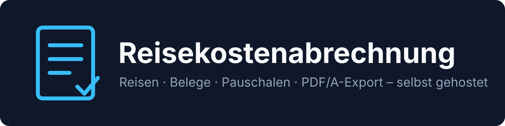

<p align="center">
  
</p>

<p align="center">
  <a href="https://github.com/BlackDark/vc-reisekostenabrechnung/actions/workflows/ci.yml"></a>
  
  
</p>

# Reisekostenabrechnung

Self-hosted web app (PWA) for a German **Reisekostenabrechnung** (travel expense claim): record business trips, capture a **Beleg** (receipt) with the phone camera, calculate the **Verpflegungspauschale** (meal allowance) and **Kilometerpauschale** (mileage allowance), and file a reviewable **Abrechnung** (expense claim) as PDF/A with every receipt. German and English, multiple users, sign-in with a password, OIDC (for example Pocket ID), or reverse-proxy headers.

> **Status:** milestone M1 (walking skeleton). See [milestones](docs/MILESTONES.md).

## Screenshots

| | Desktop | Mobile |
|---|---|---|
| Trips | _coming with M9_ | _coming with M9_ |
| Capture a Beleg | _coming with M9_ | _coming with M9_ |
| Abrechnung | _coming with M9_ | _coming with M9_ |

<!-- From M9, replace with e.g.  /  -->

Screenshots come from the CI screenshot tour (artifact `screenshots`) and are copied with `pnpm screenshots:readme`, starting with milestone M9.

## Quickstart

Requires Docker with Compose v2. The repository is public, so the quickstart does not need a token.

```sh
mkdir reisekosten && cd reisekosten
for f in docker-compose.yml .env.example; do
  curl -fsSL -o "$f" "https://raw.githubusercontent.com/BlackDark/vc-reisekostenabrechnung/main/deploy/$f"
done
cp .env.example .env            # set at least APP_BASE_URL
docker compose up -d
docker compose logs app | grep -i setup   # setup token for the first Admin, until a user exists
```

Then open `APP_BASE_URL` in a browser (TLS terminates at your reverse proxy). Missing required values fail Compose with `… fehlt`. For a Litestream backup, also download `docker-compose.backup.yml` and `litestream.yml`, then run `docker compose -f docker-compose.yml -f docker-compose.backup.yml up -d`.

Every setting (OIDC, header auth, S3, AI, …) is listed in [SPEC.md, section 11](docs/SPEC.md#11-konfiguration-umgebungsvariablen).

## Documentation

- [Specification](docs/SPEC.md) – domain model, calculation rules, API, security, operations, CI/CD (German)
- [Milestones](docs/MILESTONES.md)
- [Glossary](GLOSSARY.md) and [architecture decisions](docs/adr/)
- Research: [tax rules](docs/research/steuer-reisekosten.md), [stack](docs/research/stack.md), [receipt compression](docs/research/beleg-kompression.md)

## Development

Go 1.27, Node 24 and pnpm, Svelte 5, SQLite. Lint with golangci-lint and Biome. `make check` runs the local checks. Commits and pull request titles follow [Conventional Commits](https://www.conventionalcommits.org/). release-please opens the release pull request.

## Disclaimer

**Not tax advice.** The app applies the published allowances and rules as accurately as it can (see the rate tables). It does not replace the employer's review or professional tax advice. The user remains responsible for the correctness of an Abrechnung.
