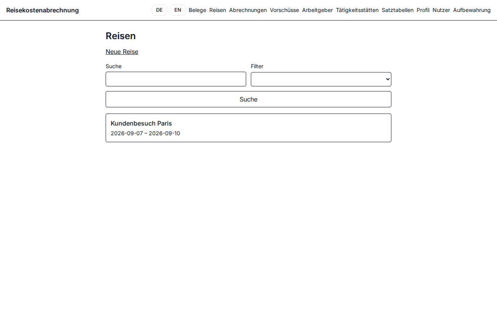
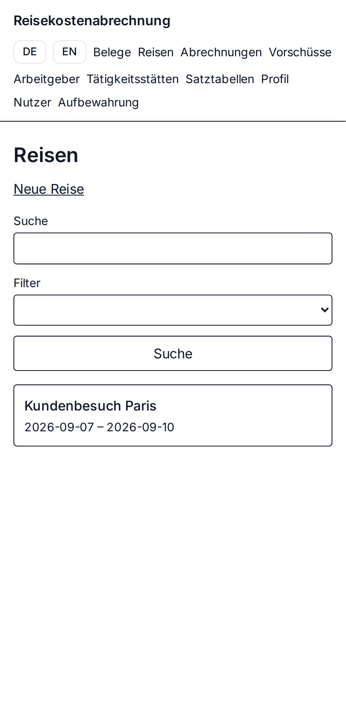
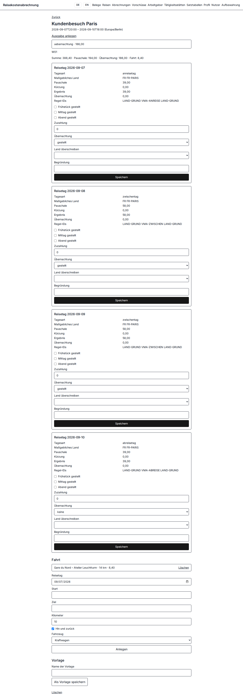
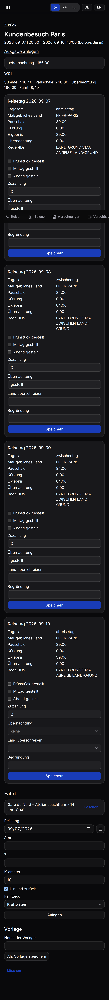
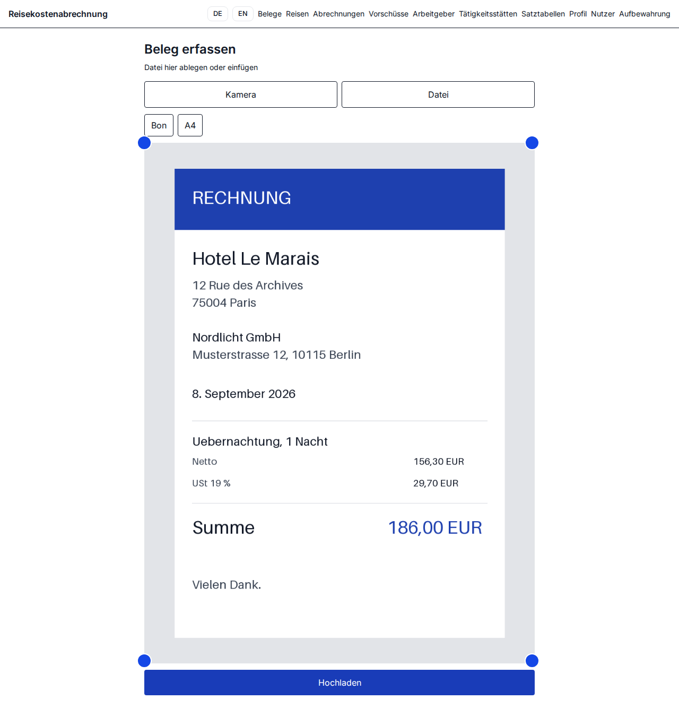
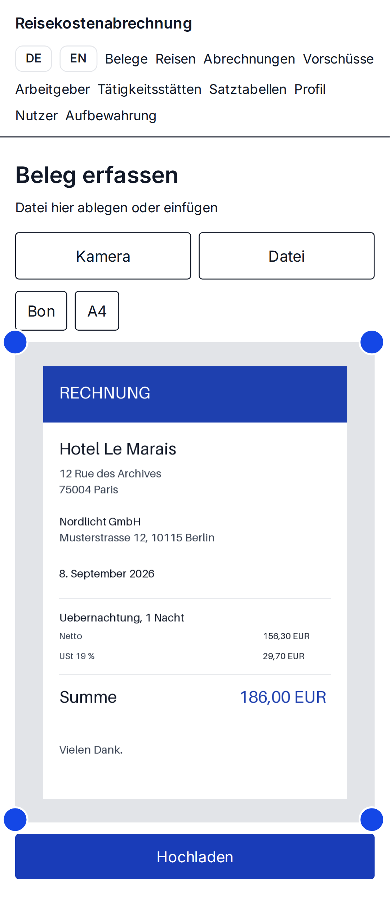
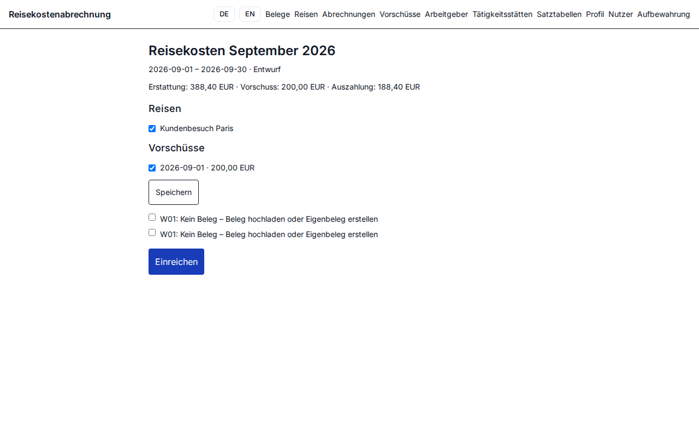
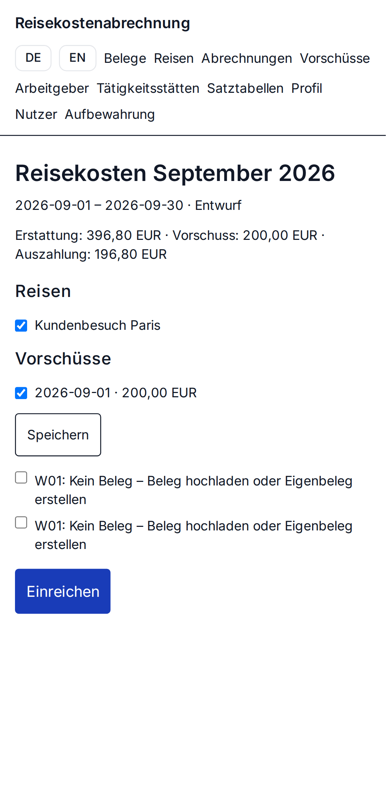

<p align="center">
  
</p>

<p align="center">
  <a href="https://github.com/BlackDark/vc-reisekostenabrechnung/actions/workflows/ci.yml"></a>
  
  
</p>

# Reisekostenabrechnung

Self-hosted web app for a German **Reisekostenabrechnung** (travel expense claim). Record a business trip, capture a **Beleg** (receipt) with the phone camera, apply the **Verpflegungspauschale** (meal allowance) and **Kilometerpauschale** (mileage allowance), and file an **Abrechnung** the employer can review: a PDF/A-3b with every receipt attached.

German and English. Several people, each seeing only their own trips. Sign in with a password, with OIDC (Pocket ID is the example), or with a header from a reverse proxy you trust.

The interface is light. There is no dark theme.

## What it does

- Trips at home and abroad, with the country for each day taken from the stops (**Ortswechsel**) and the year's **Satztabelle** (rate table).
- Meal, overnight, and mileage allowances, and a reduction when the employer provided a meal.
- Receipt photos, PDFs, and e-invoice XML. Photos are deskewed and stored as an archive image after you confirm them. Optional reading of a receipt only suggests fields, and only after you opt in.
- A claim as PDF/A-3b, plus ZIP, CSV, and JSON. The same snapshot renders the same bytes.
- **Aufbewahrung** (retention) until 31 December of year *J* + 8. An admin deletes files only after that date, with the **Ablaufhemmung** warning confirmed and a reason kept in the audit log.
- Backup with `reisekosten backup`, or Litestream as UID 65532.

## Screenshots

Taken by the Playwright tour (`e2e/tests/seiten.spec.ts`) with a sample employer, a trip to Paris, a hotel receipt, and a September claim. Desktop is 1280×800. Mobile is a Pixel 7.

| | Desktop | Mobile |
|---|---|---|
| Trips |  |  |
| A trip, with allowances |  |  |
| Capture a Beleg |  |  |
| Abrechnung |  |  |

The same pass writes every route, desktop and mobile, under [docs/assets/screenshots](docs/assets/screenshots). CI uploads that set as the `screenshots` artifact. Refresh the copies in the repo with `pnpm screenshots:readme`.

## Quickstart

Docker with Compose v2. The repository is public, so the download does not need a token.

```sh
mkdir reisekosten && cd reisekosten
for f in docker-compose.yml .env.example; do
  curl -fsSL -o "$f" "https://raw.githubusercontent.com/BlackDark/vc-reisekostenabrechnung/main/deploy/$f"
done
cp .env.example .env            # set at least APP_BASE_URL
docker compose up -d
docker compose logs app | grep -i setup
```

Open `APP_BASE_URL`. The log line is the setup token for the first admin, until a user exists. Missing required values fail Compose with `fehlt`. More detail, including Litestream: [Installation](docs/installation.md).

## Further reading

- [Installation](docs/installation.md)
- [Configuration](docs/configuration.md), the environment variables
- [Authentication](docs/authentication.md), password, OIDC with Pocket ID, trusted header
- [Operations](docs/operations.md), backup, restore, retention
- [Development](docs/development.md)
- [Tax rules, in short](docs/tax-rules.md)
- [Specification](docs/SPEC.md), [milestones](docs/MILESTONES.md), [glossary](GLOSSARY.md), [architecture decisions](docs/adr/)

## Disclaimer

**Not tax advice.** The app applies the published allowances and rules as accurately as it can. It does not replace the employer's review or a tax adviser. You remain responsible for the correctness of an Abrechnung.
