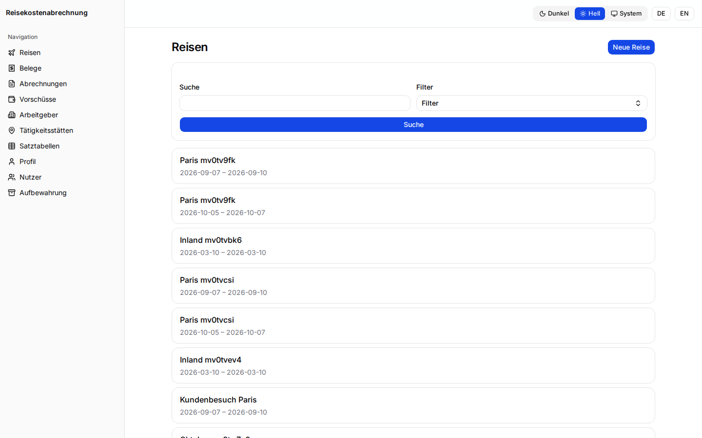
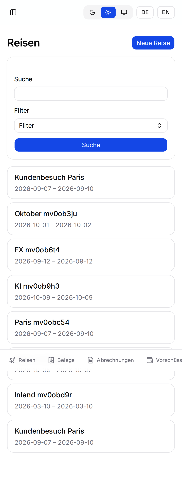
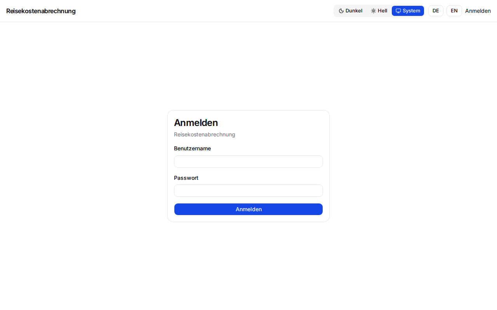
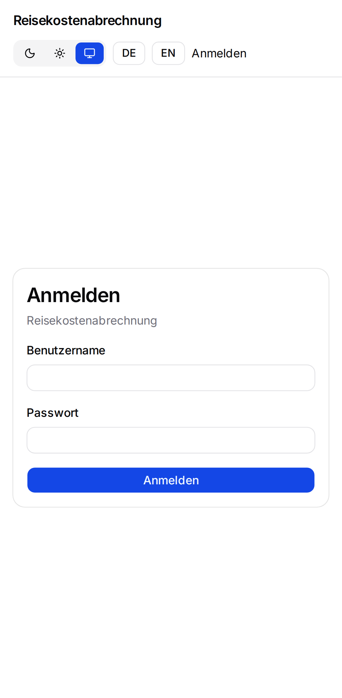

<p align="center">
  
</p>

<p align="center">
  <a href="https://github.com/BlackDark/vc-reisekostenabrechnung/actions/workflows/ci.yml"></a>
  
  
</p>

# Reisekostenabrechnung

Self-hosted web app for a German **Reisekostenabrechnung** (travel expense claim). Record a business trip, capture a **Beleg** (receipt), apply the meal and mileage allowances, and file an **Abrechnung** the employer can review: a PDF/A-3b with every receipt attached.

German and English. Each person sees only their own trips. [Features](docs/features.md) lists what the app covers.

## Screenshots

Desktop frames are 1440×900. Mobile frames are 390×844. How to refresh them is in [Development](docs/development.md).

| | Desktop | Mobile |
|---|---|---|
| Trips |  |  |
| A trip, with allowances |  |  |
| Capture a Beleg |  |  |
| Abrechnung |  |  |
| Trips, light theme |  |  |
| Sign-in, light theme |  |  |

## Quickstart

Docker with Compose v2. The repository is public, so the download does not need a token.

```sh
mkdir reisekosten && cd reisekosten
for f in docker-compose.yml .env.example; do
  curl -fsSL -o "$f" "https://raw.githubusercontent.com/BlackDark/vc-reisekostenabrechnung/main/deploy/$f"
done
cp .env.example .env            # set at least APP_BASE_URL
docker compose up -d
docker compose logs app | grep -i setup
```

Open `APP_BASE_URL`. The log line is the setup token for the first admin, until a user exists. [Installation](docs/installation.md) covers Litestream and the rest.

## Further reading

- [Features](docs/features.md)
- [Installation](docs/installation.md)
- [Configuration](docs/configuration.md), the environment variables
- [Authentication](docs/authentication.md), password, OIDC with Pocket ID, trusted header
- [Operations](docs/operations.md), backup, restore, retention
- [Development](docs/development.md)
- [Tax rules, in short](docs/tax-rules.md)
- [Specification](docs/SPEC.md), [milestones](docs/MILESTONES.md), [glossary](GLOSSARY.md), [architecture decisions](docs/adr/)

## Disclaimer

**Not tax advice.** The app applies the published allowances. It does not replace the employer's review or a tax adviser. You remain responsible for the correctness of an Abrechnung. [Tax rules, in short](docs/tax-rules.md).
