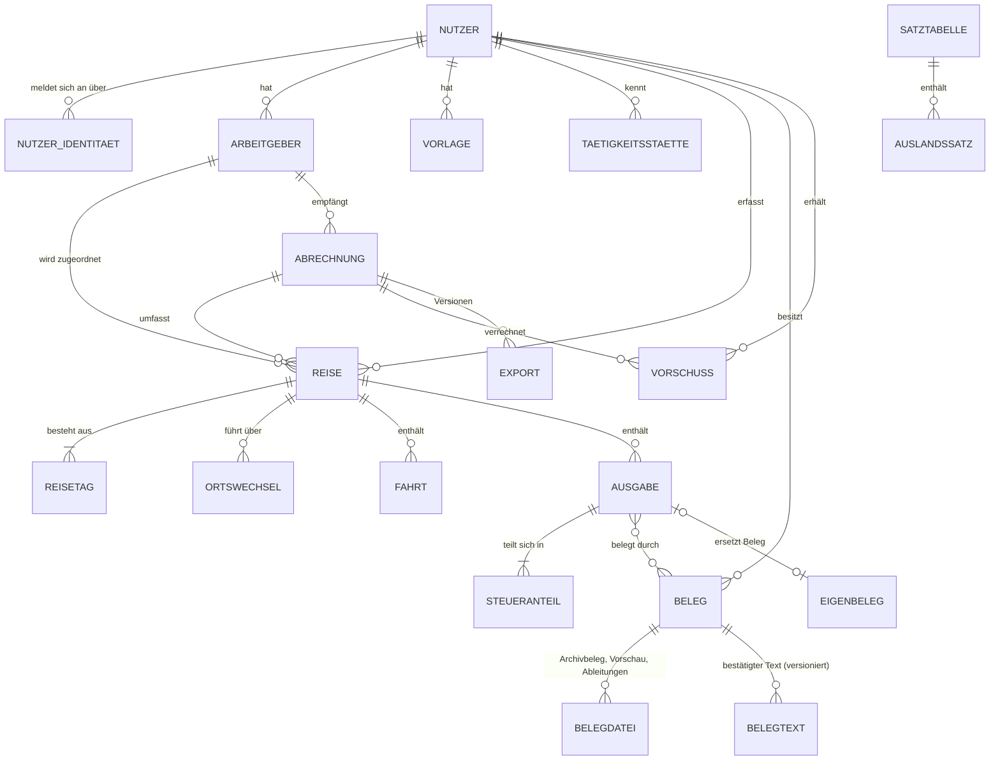
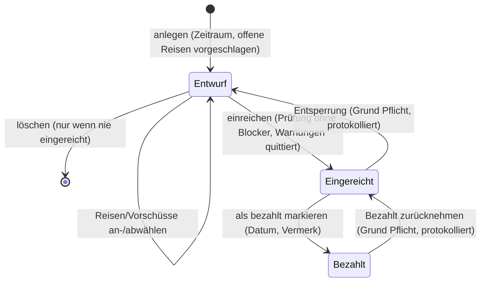

# Spezifikation: Reisekostenabrechnung (vc-reisekostenabrechnung)

> **Status:** Entwurf zur Umsetzung · **Stand:** 09.10.2026 · **Repo:** `git@github.com:BlackDark/vc-reisekostenabrechnung.git` (öffentlich)
> **Grundlage:** Grill-Interview Runde 1–3 (Q1–Q35), [`GLOSSARY.md`](../GLOSSARY.md), ADRs unter [`docs/adr/`](adr/), Recherchen [`steuer-reisekosten.md`](research/steuer-reisekosten.md) (im Folgenden **[R]**), [`stack.md`](research/stack.md) (**[S]**), [`beleg-kompression.md`](research/beleg-kompression.md) (**[K]**).
> **Kein Steuerrat.** Die Rechenregeln bilden die zitierten Vorschriften ab; die fachliche Verantwortung für eine Abrechnung bleibt beim Nutzer.

**Sprachregeln dieses Dokuments**

- Fachbegriffe sind die des Glossars, fett beim ersten Auftreten, sonst wörtlich (Reise, Reisetag, Ausgabe, Beleg, Archivbeleg, Abrechnung …). Die „_Avoid_“-Liste des Glossars gilt für UI-Texte (de), Code-Bezeichner und Datenbank.
- **MUSS** = verbindlich für v1, **SOLL** = umsetzen, wenn ohne Mehraufwand möglich, **KANN** = optional.
- Geldbeträge sind immer **ganzzahlige Cent** (`int64`), Prozentsätze ganzzahlig in Hundertstel-Prozent (`1900` = 19 %), Wechselkurse als Dezimal-String mit bis zu 6 Nachkommastellen.
- Zeitpunkte werden als RFC-3339-Zeitstempel **plus IANA-Zeitzone** gespeichert (`2026-09-07T20:00:00+02:00`, `Europe/Berlin`), weil die Steuerregeln auf **Ortszeit** abstellen ([R] 2.3, 9.2).

## 0. Entscheidungsübersicht (Interview → Spec)

| Frage | Entscheidung (verbindlich) | Abschnitt |
|---|---|---|
| Q1 | Primärfall: Geschäftsführer lässt sich vom Arbeitgeber erstatten (ADR 0001); andere Konstellationen später, Modell verbaut sie nicht | 1, 3.2 (Arbeitgeber.konstellation), 21 |
| Q2 | Mehrbenutzerfähig, strikt getrennte Daten, Rolle Admin, kein Freigabe-Workflow | 2 |
| Q3 | Arbeitgeber als eigenes Objekt; einer ist Standard, mehrere möglich | 3.2 |
| Q4 | Abrechnung = festgeschriebenes Dokument; Sperre beim Einreichen; **Entsperrung protokolliert**; Status **Bezahlt** bestätigbar (ADR 0002) | 3.4, 7 |
| Q5 | Offline-Erfassung: niedrige Priorität → Später-Liste | 13, 21 |
| Q6 | KI-Auslesen über beliebigen OpenAI-kompatiblen Endpunkt, standardmäßig aus, nur Vorschläge | 6 |
| Q7 | Fremdwährung mit EZB-Kurs am Belegdatum, überschreibbar | 4.10 |
| Q8 | Projekt als optionales Freitextfeld mit Autovervollständigung | 3.2 |
| Q9 | Nur deutsches Steuerrecht | 1 |
| Q10 | Jede Ausgabe gehört zu genau einer Reise | 3.3 |
| Q11 | Reise gehört zum Abrechnungszeitraum ihres Enddatums; offene Reisen werden vorgeschlagen, einzeln abwählbar | 7.1 |
| Q12 | Nur selbst bezahlte Ausgaben; **kein „Bezahlt von“-Feld**; gestellte Mahlzeiten je Reisetag; Vorschüsse werden abgezogen | 3.2, 4.7, 4.15 |
| Q13 | Satztabellen je Jahr ausgeliefert; Admin sieht, überschreibt einzelne Werte, importiert neues Jahr per CSV | 3.2, 4.1, 9 |
| Q14 | v1-Umfang inkl. Bewirtung als fünfte Kostenart; ohne doppelte Haushaltsführung, Fahrtenbuch, private Reiseverlängerung | 1, 4 |
| Q15 | Go-Backend, Standardbibliothek-Router, `sqlc`, `goose` | 15 |
| Q16 | SQLite (WAL, cgo-frei); Schema/Abfragen im gemeinsamen SQL-Subset mit Postgres (ADR 0003) | 3.6, 15 |
| Q17/Q27 | Svelte 5 + shadcn-svelte + Tailwind 4 als reine Vite-SPA (ADR 0004) | 15 |
| Q18 | Ein Container, Go liefert SPA aus; API spec-first per OpenAPI | 9, 16 |
| Q19/Q29 | Beleg-Pipeline: Ecken im Browser, Bereinigung auf dem Server, Farb-AVIF als Archivbeleg, JPEG-Kopie für PDF (ADR 0005, *proposed*) | 5 |
| Q20 | Dateispeicher lokales Volume oder S3-kompatibel, nur EU | 12 |
| Q21/Q30 | Sessions per HttpOnly-Cookie, Argon2id, OIDC mit PKCE, Gruppen-Claims, Header-Auth hinter `TRUSTED_PROXIES`, alles per ENV | 10, 11 |
| Q22 | Export: Typst-PDF mit Belegen + ZIP (PDF, Originalbelege, CSV, JSON); DATEV später | 7 |
| Q23/Q31 | Multi-Arch (amd64 + arm64) **Pflicht**; ein Multi-Stage-Dockerfile, Cross-Compile ohne QEMU, distroless nonroot | 17 |
| Q24/Q28 | Kein ESLint: Biome (inkl. Svelte-Templates), `svelte-check` (TS 6), `golangci-lint`, Go-Tests, Vitest, Playwright gegen das gebaute Image; `renovate.json5` | 18, 19, 20 |
| Q25 | Privates Repo `BlackDark/vc-reisekostenabrechnung` | – |
| Q26 | v1: Vorlagen, Duplikaterkennung per Prüfsumme, Warnungen (fehlender Beleg, Rechnung > 250 € nicht auf Arbeitgeber, Dreimonatsfrist); später: Routing-km, E-Rechnung-Parsing, DATEV | 8, 21 |
| Q32 | Typst für PDF | 7.3 |
| Q33 | pnpm + Node 24 LTS | 15 |
| Q34 | Texterkennung in v1 nur über KI-Endpunkt; `tesseract.js` später | 6, 21 |
| Q35 | UI **Deutsch und Englisch ab v1** | 14 |

## 1. Ziel und Nicht-Ziele

### 1.1 Ziel

Eine selbst gehostete, installierbare Web-App (PWA), mit der ein **Nutzer** seine beruflichen **Reisen** am Handy und im Browser erfasst, **Belege** fotografiert oder hochlädt und daraus GoBD-taugliche **Abrechnungen** gegenüber seinem **Arbeitgeber** erzeugt, mit korrekt berechneten **Pauschalen** nach deutschem Steuerrecht (Stand 2024–2026, jährlich fortschreibbar), MwSt-Aufschlüsselung je **Steueranteil** und einem prüffähigen **Export** (PDF/A-3 + ZIP).

Qualitätsziele, in dieser Reihenfolge:

1. **Rechenrichtigkeit**: jede Pauschale ist auf eine Vorschrift und einen Satztabellenwert zurückführbar; Golden-Tests (4.16) sichern das ab.
2. **Unveränderbarkeit und Nachvollziehbarkeit** (GoBD): Archivbelege und eingereichte Abrechnungen sind unveränderbar, jede Änderung ist protokolliert.
3. **Schnelle Erfassung am Handy**: Beleg fotografieren → bestätigen in < 30 s.
4. **Leichtgewichtiger Betrieb**: ein Container, eine SQLite-Datei, ein Datei-Volume; Multi-Arch.

### 1.2 Nicht-Ziele (v1)

- Andere Rechtsräume als Deutschland (Q9); Auslandsreisen nur als Reiseziel.
- Steuerliche Konstellationen außer Arbeitgebererstattung (Werbungskosten, Selbstständige/Betriebsausgaben) – Datenmodell bereitet vor (ADR 0001), Rechenregeln nicht.
- Doppelte Haushaltsführung, Fahrtenbuch für Dienstwagen, private Reiseverlängerung mit Kostenaufteilung (Q14).
- Freigabe-Workflow, Mehrstufen-Genehmigung, Buchhaltungsfunktionen (Kontierung, DATEV).
- Offline-Bearbeitung und -Export (Q5); Offline-Erfassung steht auf der Später-Liste.
- Lohnsteuerliche Folgeberechnungen (Pauschalversteuerung § 40 EStG, Sachbezugsbewertung) – nur Hinweise.
- Automatisches Buchen durch KI (Q6).
- Horizontale Skalierung (ADR 0003).

## 2. Nutzer und Rollen

| Rolle | Darf | Darf nicht |
|---|---|---|
| **Nutzer** | eigene Arbeitgeber, Vorlagen, Tätigkeitsstätten, Reisen, Ausgaben, Belege, Fahrten, Vorschüsse, Abrechnungen verwalten; eigene Exporte und eigenes Protokoll sehen; Sprache und KI-Nutzung einstellen; Satztabellen lesen | Daten anderer Nutzer sehen (auch nicht als Admin) |
| **Admin** | zusätzlich: Nutzer anlegen, deaktivieren, Rollen vergeben, Identitäten verknüpfen; Satztabellen überschreiben, importieren, aktivieren; Admin-Protokoll und Systemstatus sehen; Aufbewahrungsfristen-Bericht | Reisen, Belege, Abrechnungen anderer Nutzer einsehen oder ändern |

- Es gibt **keine Selbstregistrierung** (Q21). Konten entstehen durch: Ersteinrichtung (10.6), Anlage durch Admin, oder automatisch beim ersten OIDC-/Header-Login, wenn der Nutzer in der erlaubten Gruppe ist (Q30).
- Die Rolle Admin kommt aus dem lokalen Flag **oder** aus der Gruppenmitgliedschaft (`OIDC_ADMIN_GROUP` / `HEADER_AUTH_ADMIN_GROUP`), die bei jedem Login neu ausgewertet wird. Der lokale Flag kann nur von einem anderen Admin entzogen werden; der letzte aktive Admin kann sich nicht selbst entziehen.
- Nutzer werden nicht gelöscht, sondern **deaktiviert** (Aufbewahrungspflicht, 12.4).

## 3. Domänenmodell

### 3.1 Übersicht



Zusätzlich: `WECHSELKURS` (Cache), `AUDIT_EREIGNIS` (append-only), `JOB` (Hintergrundaufträge), `SESSION`.

**Neue Spec-Begriffe** (nicht im Glossar, Kandidaten für die nächste Glossarrunde, siehe 22): **Ortswechsel** (Ankunft an einem Ort mit Ortszeit, Land und Verkehrsmittel), **Belegnummer**, **Abrechnungsnummer**, **Belegdatei**, **Unterkunft** (Art der Übernachtung in der Nacht nach einem Reisetag), **Warnung**.

**Code-Benennung:** Domänentypen und Tabellen tragen die Glossarbegriffe in ASCII (`reise`, `reisetag`, `ausgabe`, `steueranteil`, `beleg`, `abrechnung`, `vorschuss`, `satztabelle`, `arbeitgeber`, `nutzer`, `vorlage`, `fahrt`, `taetigkeitsstaette`, `ortswechsel`, `eigenbeleg`; Umlaute als ae/oe/ue/ss). Technische Infrastruktur bleibt englisch (`session`, `job`, `storage`, `audit`). IDs sind UUIDv7 (zeitlich sortierbar, als `TEXT` gespeichert).

### 3.2 Entitäten

Alle Entitäten haben `id`, `erstellt_am`, `geaendert_am`; veränderbare Entitäten zusätzlich `version` (optimistische Sperre, API-Feld + `If-Match`).

**Nutzer**

| Feld | Typ | Regeln |
|---|---|---|
| `anzeigename` | Text | Pflicht |
| `email` | Text | eindeutig (case-insensitiv), optional bei Header-Auth |
| `benutzername` | Text | eindeutig; Login-Name für Passwort und Header-Auth |
| `passwort_hash` | Text? | Argon2id-PHC-String; `NULL` = kein Passwort-Login |
| `ist_admin_lokal` | Bool | |
| `admin_ueber_gruppe` | Bool | wird bei jedem Login aus Gruppen gesetzt |
| `sprache` | `de`\|`en` | Default aus `DEFAULT_LOCALE` |
| `personalnummer` | Text? | erscheint im Export ([R] 7.4) |
| `ki_erlaubt` | Bool | Nutzer-Opt-in, nur wirksam wenn `AI_ENABLED` |
| `aktiv` | Bool | deaktivierte Nutzer können sich nicht anmelden |
| `letzte_anmeldung` | Zeitstempel? | |

**Nutzer-Identität** (`nutzer_identitaet`): `nutzer_id`, `art` (`oidc`\|`header`), `aussteller` (OIDC-Issuer bzw. `header`), `subjekt` (OIDC `sub` bzw. Header-Benutzername), `zuletzt_gesehen`. Eindeutig über (`art`, `aussteller`, `subjekt`).

**Arbeitgeber**

| Feld | Typ | Regeln |
|---|---|---|
| `nutzer_id` | FK | |
| `name`, `anschrift` | Text | Pflicht; Briefkopf im Export; Abgleich „Rechnung lautet auf Arbeitgeber“ |
| `ust_id`, `steuernummer` | Text? | informativ im Export |
| `logo_datei_id` | FK? | optionales Logo (PNG/JPEG; eigene Tabelle `datei`, kein Beleg im Glossarsinn) |
| `ist_standard` | Bool | genau ein Standard unter den nicht archivierten Arbeitgebern (Invariante I3) |
| `konstellation` | Enum | v1 nur `arbeitgebererstattung`; vorbereitet: `werbungskosten`, `betriebsausgaben` (ADR 0001) |
| `abrechnungsnummer_praefix` | Text | Default `RK` |
| `archiviert` | Bool | nicht mehr auswählbar, bleibt für Altbestände |

**Vorlage**: `nutzer_id`, `name`, `art` (`reise`\|`fahrt`), `daten` (JSON: Anlass, Projekt, Arbeitgeber, Ortswechsel mit Zielen, Tätigkeitsstätte, typische Dauer; bzw. Start, Ziel, km, Fahrzeugart, Hin- und Rückfahrt). Anwenden erzeugt eine neue Reise/Fahrt, die danach unabhängig ist.

**Projekt**: keine eigene Tabelle (Q8). Freitextfeld `reise.projekt`; Autovervollständigung über `SELECT DISTINCT projekt` der eigenen Reisen (letzte 24 Monate zuerst).

**Tätigkeitsstätte**: `nutzer_id`, `bezeichnung`, `anschrift`, `land_iso`, `satzort` (Schlüssel in der Satztabelle, z. B. `FR-PARIS`), `kunde` (Text?). Grundlage der Dreimonatsfrist-Prüfung ([R] 1.3: verschiedene Kunden = verschiedene Tätigkeitsstätten).

**Reise**

| Feld | Typ | Regeln |
|---|---|---|
| `nutzer_id`, `arbeitgeber_id` | FK | Arbeitgeber Pflicht, Default = Standard |
| `anlass` | Text | Pflicht, Reisezweck ([R] 7.4) |
| `projekt` | Text? | Q8 |
| `beginn` | Zeitstempel + Zone | Verlassen der Wohnung oder ersten Tätigkeitsstätte |
| `ende` | Zeitstempel + Zone | Rückkehr; `ende > beginn` |
| `abrechnung_id` | FK? | gesetzt, sobald die Reise in einer Abrechnung steht |
| `notiz` | Text? | |
| `vorlage_id` | FK? | Herkunft, informativ |

Abgeleiteter Status: `offen` (keine Abrechnung), `in_entwurf` (Abrechnung im Status Entwurf), `gesperrt` (Abrechnung Eingereicht oder Bezahlt).

**Ortswechsel** (geordnet je Reise): `reihenfolge`, `abfahrt` (Zeitstempel + Zone, optional), `ankunft` (Zeitstempel + Zone, Pflicht), `verkehrsmittel` (`pkw`\|`bahn`\|`flug`\|`schiff`\|`bus`\|`sonstiges`), `land_iso`, `satzort` (Default „im Übrigen“ bzw. ganzes Land), `ort` (Text), `taetigkeitsstaette_id?` (gesetzt = am Zielort wird beruflich gearbeitet), `zwischenlandung_mit_uebernachtung` (Bool, nur Flug). Eine Inlandsreise braucht mindestens einen Ortswechsel (Ziel). Die Rückkehr ist durch `reise.ende` beschrieben; die Rückfahrt wird nicht als Ortswechsel erfasst, außer sie führt über ein weiteres Land mit Ankunft vor 24 Uhr.

**Reisetag** (je Kalendertag der Reise genau einer; wird beim Speichern der Reise erzeugt/abgeglichen)

| Feld | Typ | Regeln |
|---|---|---|
| `reise_id`, `datum` | FK, Datum | eindeutig je Reise; Datum in Ortszeit |
| `massgebliches_land_vorschlag` | `land_iso` + `satzort` | berechnet (4.6) |
| `massgebliches_land_manuell` | `land_iso` + `satzort`? | Überschreibung, nur mit `begruendung` |
| `fruehstueck_gestellt`, `mittag_gestellt`, `abend_gestellt` | Bool | Gestellte Mahlzeiten (Q12) |
| `zuzahlung_fruehstueck`, `zuzahlung_mittag`, `zuzahlung_abend` | Cent | Entgelt des Nutzers für die gestellte Mahlzeit (§ 9 Abs. 4a S. 10 EStG) |
| `mahlzeit_quelle` | JSON | woher ein Häkchen kommt (`manuell`, `uebernachtung:<ausgabe_id>`, `bewirtung:<ausgabe_id>`, `verpflegung:<ausgabe_id>`), damit automatische Vorschläge nachvollziehbar und abwählbar sind |
| `unterkunft` | Enum | Nacht **nach** diesem Tag: `keine` (Heimkehr, letzter Tag), `beleg` (Übernachtungs-Ausgabe), `pauschale` (privat, ohne Beleg), `gestellt` (Arbeitgeber hat direkt gebucht/bezahlt), `verkehrsmittel` (Nachtzug/-flug/Schiff ohne eigene Kosten) |
| `verpflegung_ausgeschlossen` | Bool + `grund` | z. B. nach Ablauf der Dreimonatsfrist (4.14) |

**Fahrt** (Kilometerpauschale, nur Privatfahrzeug): `reise_id`, `datum`, `start`, `ziel`, `zweck?`, `fahrzeugart` (`kraftwagen`\|`anderes_motorfahrzeug`), `km` (ganze km, > 0), `hin_und_zurueck` (Bool → km × 2 in der Berechnung, getrennte Zeile im Export), `vorlage_id?`.

**Ausgabe**

| Feld | Typ | Regeln |
|---|---|---|
| `reise_id` | FK | Pflicht (Q10) |
| `kostenart` | Enum | `fahrtkosten`\|`verpflegung`\|`uebernachtung`\|`reisenebenkosten`\|`bewirtung` |
| `datum` | Datum | Leistungs-/Belegdatum, muss in [Reisebeginn − 30 Tage, Reiseende + 30 Tage] liegen (Vorabbuchungen, nachträgliche Rechnungen) |
| `leistender` | Text | Händler/Hotel/Beförderer |
| `beschreibung` | Text? | |
| `waehrung` | ISO 4217 | Default `EUR` |
| `betrag` | Cent (Belegwährung) | Bruttobetrag laut Beleg, > 0 |
| `kurs`, `kurs_quelle`, `kurs_datum` | Dezimal, Enum, Datum | nur bei Fremdwährung (4.10); Quelle `ezb`\|`manuell`\|`belastung` |
| `betrag_eur` | Cent | abgeleitet bzw. bei Quelle `belastung` eingegeben |
| `rechnungsart` | Enum | `kleinbetragsrechnung`\|`rechnung`\|`fahrausweis`\|`e_rechnung`\|`eigenbeleg` |
| `rechnung_auf_arbeitgeber` | Bool | für Vorsteuer und Warnung W02 |
| `verkehrsmittel` | Enum? | nur Fahrtkosten: `bahn`, `flug`, `oepnv`, `taxi`, `mietwagen`, `dienstwagen_kraftstoff`, `sonstiges` |
| `uebernachtung_naechte` | Datum[] | nur Übernachtung: welche Nächte (Reisetag-Daten) die Rechnung abdeckt |
| `fruehstueck_enthalten` | Bool | nur Übernachtung; setzt Vorschlag „Frühstück gestellt“ am Folgetag jeder Nacht (4.8) |
| `mahlzeit` | Enum? | nur Verpflegung: `fruehstueck`\|`mittag`\|`abend` (4.7) |
| `bewirtung` | JSON? | nur Bewirtung: `anlass`, `teilnehmer[]` (Name, Firma), `ort`, `bewirtender` (Default Nutzer), `trinkgeld` (Cent), `bestaetigt_am`, `bestaetigt_von` (digitaler Eigenbeleg, 4.12) |

**Steueranteil** (1..n je Ausgabe): `satz` (Hundertstel-%), `steuerland` (`DE` oder ISO-Land der ausländischen USt), `netto`, `steuer`, `brutto` (Cent, Belegwährung), `netto_eur`, `steuer_eur`, `brutto_eur`. Ein Anteil ohne USt (z. B. Trinkgeld, steuerfreier Flug) hat `satz = 0`. Regeln in 4.11.

**Eigenbeleg** (0..1 je Ausgabe): `grund_fehlender_beleg`, `zahlungsempfaenger`, `art_der_leistung`, `erstellt_am`, `bestaetigt_am`, `bestaetigt_von` ([R] 7.5). Erscheint als eigene Seite im Export; ersetzt keinen TSE-Bewirtungsbeleg ([R] 7.5).

**Beleg**

| Feld | Typ | Regeln |
|---|---|---|
| `nutzer_id` | FK | |
| `belegnummer` | Text | `JJJJ-NNNN`, fortlaufend je Nutzer und Jahr der Bestätigung, wird bei Bestätigung vergeben, nie wiederverwendet (GoBD Rz. 77, [R] 7.2) |
| `typ` | Enum | `foto`\|`pdf`\|`e_rechnung_xml`\|`e_rechnung_hybrid` (ZUGFeRD-PDF) |
| `status` | Enum | `hochgeladen` → `in_aufbereitung` → `zur_bestaetigung` → `bestaetigt`; Nebenzweige `fehlgeschlagen`, `storniert` |
| `seiten` | Int | Fotos: Anzahl Seiten (Vorder-/Rückseite); PDF: Seitenzahl |
| `sha256_original` | Hex | Hash der hochgeladenen Datei (Duplikaterkennung, W04) |
| `pipeline_version`, `pipeline_parameter` | Text, JSON | Ecken, Profil (`bon`\|`a4`), Codec, Qualität ([K] 5) |
| `bestaetigt_am`, `bestaetigt_von` | | Sichtkontrolle des Archivbelegs ([K] 1) |
| `storno_grund`, `storniert_am` | | |
| `aufbewahren_bis` | Datum | 12.4 |

**Belegdatei** (`belegdatei`): `beleg_id`, `variante` (`erfassung`\|`archiv`\|`vorschau`\|`export_jpeg`\|`original`), `seite`, `speicher_schluessel`, `mime`, `bytes`, `sha256`, `unveraenderbar` (Bool). Der **Archivbeleg** ist die Menge der Belegdateien mit Variante `archiv` (Fotos, AVIF je Seite) bzw. `original` (PDF/XML im Empfangsformat).

**Belegtext** (versioniert): `beleg_id`, `version`, `quelle` (`ki`\|`manuell`), `felder` (JSON), `volltext`, `bestaetigt_am`, `bestaetigt_von`. Nur bestätigte Versionen sind GoBD-relevant (GoBD Rz. 131, [K] 1).

**Satztabelle** (je Kalenderjahr)

| Feld | Inhalt 2024 / 2025 / 2026 | Quelle |
|---|---|---|
| `jahr`, `status` | `entwurf`\|`aktiv`; ausgelieferte Jahre sind `aktiv` | |
| `quelle` | BMF-Schreiben (Datum, Fundstelle) | [R] 2.1 |
| `vma_inland_24h` | 2800 | [R] 1.1 |
| `vma_inland_8h` (An-/Abreisetag, > 8 h) | 1400 | [R] 1.1 |
| `kuerzung_fruehstueck_pct`, `kuerzung_hauptmahlzeit_pct` | 2000, 4000 | [R] 1.4 |
| `uebernachtung_inland_pauschale` | 2000 | [R] 4 |
| `km_kraftwagen`, `km_anderes_motorfahrzeug` | 30, 20 (Cent/km) | [R] 3.1 |
| `sachbezug_fruehstueck`, `sachbezug_hauptmahlzeit` | 217/413 · 230/440 · 237/457 | [R] 1.4 |
| `uebliche_mahlzeit_grenze` | 6000 | [R] 1.4 |
| `kleinbetragsgrenze` | 25000 | [R] 6.3 |
| `bewirtung_abzug_pct` | 7000 | [R] 6.6 |
| `ust_saetze` | JSON-Liste gültiger DE-Sätze mit Bezeichnung (0, 7, 19 %; Hinweis Gastronomie-Speisen 7 % ab 2026) | [R] 6.1 |
| `aufbewahrung_jahre` | 8 | [R] 7.1 |
| `ersatzlaender` | JSON: nicht erfasste Länder → `LU`; Mikronesien → Philippinen; Antigua und Barbuda, Dominica, Grenada, Guyana, St. Kitts und Nevis, St. Lucia, St. Vincent und die Grenadinen, Suriname → Trinidad und Tobago; Überseegebiete → Mutterland | [R] 2.2 |
| `flug_zwischentage_land`, `schiff_land` | `AT`, `LU` | [R] 2.3 |

**Auslandssatz** (je Satztabelle): `land_iso`, `land_name_de` (wie im BMF-Schreiben), `satzort` (Schlüssel, `''` = ganzes Land bzw. „im Übrigen“), `ort_name`, `vma_24h`, `vma_8h`, `uebernachtung` (Cent). Ausgeliefert aus `docs/research/data/auslandspauschalen_{2024,2025,2026}.csv`, ergänzt um `land_iso` über eine gepflegte Zuordnungstabelle `satztabellen/laender.csv` (deutscher BMF-Name ↔ ISO 3166-1; Abschnitt 2.5 in [R]: das PDF enthält keine ISO-Codes).

**Satzüberschreibung** (`satz_override`): `jahr`, `feld` bzw. (`land_iso`, `satzort`, `feld`), `alter_wert`, `neuer_wert`, `grund`, `admin_id`, `zeitpunkt`. Wirksamer Wert = Override vor ausgeliefertem Wert.

**Wechselkurs** (Cache): `datum`, `waehrung`, `kurs` (Einheiten Fremdwährung je 1 EUR), `quelle` (`ezb`), `abgerufen_am`.

**Abrechnung**

| Feld | Typ | Regeln |
|---|---|---|
| `nutzer_id`, `arbeitgeber_id` | FK | alle enthaltenen Reisen haben diesen Arbeitgeber |
| `abrechnungsnummer` | Text? | `<Präfix>-JJJJ-NNN`, beim ersten Einreichen vergeben, fortlaufend je Nutzer und Arbeitgeber |
| `zeitraum_art` | Enum | `tag`\|`woche`\|`monat`\|`quartal`\|`frei` |
| `von`, `bis` | Datum | `von ≤ bis`; Woche = ISO-Woche Mo–So |
| `titel` | Text | Default z. B. „Reisekosten Oktober 2026“ / „Travel expenses October 2026“ |
| `status` | Enum | `entwurf`\|`eingereicht`\|`bezahlt` (Abrechnungsstatus) |
| `eingereicht_am`, `bezahlt_am`, `bezahlt_vermerk` | | |
| `export_sprache` | `de`\|`en` | Default Nutzersprache |
| `aktuelle_export_version` | Int | 0 = noch nie eingereicht |
| `quittierte_warnungen` | JSON | Warnungscodes + Objekt, die beim Einreichen bestätigt wurden |

**Vorschuss**: `nutzer_id`, `arbeitgeber_id`, `datum`, `betrag` (Cent EUR), `notiz`, `abrechnung_id?` (gesetzt, wenn verrechnet; ein Vorschuss wird genau einmal verrechnet).

**Export**: `abrechnung_id`, `version` (1, 2, …), `anlass` (`einreichung`\|`einreichung_nach_entsperrung`), `erstellt_am`, `pdf_schluessel`, `pdf_sha256`, `zip_schluessel`, `zip_sha256`, `snapshot` (JSON, identisch zu `abrechnung.json` im ZIP), `ersetzt_durch_version?`, `status` (`in_erstellung`\|`fertig`\|`fehlgeschlagen`).

**Audit-Ereignis** (append-only): `zeitpunkt`, `akteur_nutzer_id?`, `akteur_art` (`nutzer`\|`admin`\|`system`), `aktion`, `objekt_typ`, `objekt_id`, `vorher` (JSON), `nachher` (JSON), `grund?`, `ip`, `vorgaenger_hash`, `hash` (SHA-256 über Vorgänger-Hash + kanonisches JSON des Ereignisses → Hash-Kette, Manipulation erkennbar).

### 3.3 Invarianten

| # | Invariante |
|---|---|
| I1 | Jede Ausgabe und jede Fahrt gehört zu genau einer Reise (Q10); jede Reise gehört genau einem Nutzer und einem Arbeitgeber dieses Nutzers. |
| I2 | Ein Nutzer sieht und ändert nur eigene Objekte; jede Store-Abfrage ist mit `nutzer_id` parametrisiert (keine Abfrage ohne Mandantenfilter, per Test erzwungen, 20). |
| I3 | Genau ein nicht archivierter Arbeitgeber je Nutzer ist Standard, sobald mindestens ein nicht archivierter existiert. Sind alle archiviert, gibt es keinen Standard. |
| I4 | Reisetage einer Reise decken lückenlos alle Kalendertage von `beginn` bis `ende` (Ortszeit) ab. |
| I5 | Σ `steueranteil.brutto` = `ausgabe.betrag` (Belegwährung) und Σ `brutto_eur` = `betrag_eur`. |
| I6 | Eine Reise steht in höchstens einer Abrechnung; ihr Enddatum liegt in [`von`, `bis`] der Abrechnung (Q11); Arbeitgeber identisch. |
| I7 | Ist die Abrechnung einer Reise `eingereicht` oder `bezahlt`, sind Reise, Reisetage, Ortswechsel, Fahrten, Ausgaben, Steueranteile, Eigenbelege und Belegzuordnungen **schreibgeschützt** (Server lehnt mit `409 reise_gesperrt` ab). |
| I8 | Belegdateien mit `unveraenderbar = true` (Archivbeleg, Original, Export-Dateien) werden nie überschrieben; der Speicher-Adapter kennt für sie nur `Put-if-absent`; Löschen nur über den Aufbewahrungsprozess (12.4). |
| I9 | Ein bestätigter Beleg kann nicht gelöscht, nur storniert werden, und nur, wenn er keiner Ausgabe in einer gesperrten Reise zugeordnet ist. Unbestätigte Belege dürfen gelöscht werden. |
| I10 | Ein Export wird nie verändert; Entsperrung + erneutes Einreichen erzeugt Version n+1, Version n bleibt abrufbar und wird als „ersetzt“ markiert (ADR 0002). |
| I11 | Eingereichte Abrechnungen rechnen mit dem **Snapshot** der beim Einreichen wirksamen Satztabellenwerte; spätere Overrides ändern sie nicht. |
| I12 | Ein Vorschuss wird höchstens einer Abrechnung zugeordnet und nur einer mit demselben Arbeitgeber. |
| I13 | Belegnummern und Abrechnungsnummern sind lückenlos fortlaufend und werden nie wiederverwendet (Vergabe in derselben Transaktion wie die Bestätigung bzw. das erste Einreichen). |
| I14 | Jede zustandsändernde Operation erzeugt in derselben DB-Transaktion ein Audit-Ereignis. |

### 3.4 Abrechnungsstatus und Übergänge



| Übergang | Vorbedingung | Wirkung |
|---|---|---|
| anlegen | Zeitraum gültig | Vorschlag aller **offenen** Reisen des Arbeitgebers mit Enddatum im Zeitraum + aller unverrechneten Vorschüsse des Arbeitgebers mit Datum ≤ `bis` |
| einreichen | keine Blocker (8), alle Warnungen quittiert, mind. 1 Reise | Reisen gesperrt; Abrechnungsnummer (beim ersten Mal); Snapshot; Job „Export erstellen“ (Version n+1). Der Abrechnungsstatus wechselt erst auf Eingereicht, wenn der Export fertig ist; bis dahin bleibt er Entwurf mit gesetztem Job-Merkmal `einreichung_laeuft` (kein eigener Status, Glossar kennt nur drei); schlägt der Export fehl, wird die Sperre zurückgenommen und der Fehler angezeigt |
| Entsperrung | Status `eingereicht`; Grund (≥ 10 Zeichen) | Status `entwurf`; Reisen wieder bearbeitbar; vorhandene Exporte bleiben; Audit-Ereignis `abrechnung.entsperrt` mit Grund; im nächsten Export erscheint ein Protokollabschnitt |
| als bezahlt markieren | Status `eingereicht` | `bezahlt_am` (Pflicht, ≤ heute), `bezahlt_vermerk?`; keine Dateiänderung |
| Bezahlt zurücknehmen | Status `bezahlt`; Grund | Status `eingereicht` (danach ggf. Entsperrung) |
| löschen | Status `entwurf` und `aktuelle_export_version = 0` | Reisen und Vorschüsse werden wieder offen |

Wer: nur der Eigentümer-Nutzer. Ein Admin hat keinen Zugriff auf fremde Abrechnungen (2).

### 3.5 Sperren und Unveränderbarkeit im Überblick

| Objekt | Änderbar bis | Danach |
|---|---|---|
| Archivbeleg (Belegdateien `archiv`/`original`) | nie (ab Upload bzw. Erzeugung) | Neuaufbereitung vor Bestätigung erzeugt neue Dateien, alte werden verworfen (noch kein Archivbeleg, weil unbestätigt) |
| Beleg-Metadaten (Zuordnung, Belegtext) | bis Sperre der Reise | Belegtext neue Version statt Änderung |
| Reise samt Inhalt | bis Einreichen | nur nach Entsperrung |
| Export | nie | neue Version |
| Satztabelle | jederzeit durch Admin (protokolliert) | wirkt nicht auf eingereichte Abrechnungen (I11) |
| Audit-Ereignis | nie | – |

### 3.6 Persistenz-Regeln (ADR 0003)

- SQLite über `modernc.org/sqlite`, DSN-Pragmas `journal_mode(WAL)`, `busy_timeout(5000)`, `foreign_keys(1)`, `synchronous(NORMAL)`; eine Schreib-Verbindung (Pool mit `MaxOpenConns=1` für Writes) plus Lese-Pool.
- Portables DDL: `TEXT`, `BIGINT`, `BOOLEAN`, `TIMESTAMP`; Geld in Cent als `BIGINT`; kein `STRICT`, keine SQLite-Spezialfunktionen, kein `BETWEEN` mit `sqlc.arg()` (sqlc #3974), JSON nur als `TEXT` (Auswertung in Go). `RETURNING` und `ON CONFLICT` sind erlaubt.
- `sqlc` nur mit Engine `sqlite`; der CI-Job „codegen“ erzeugt zusätzlich probeweise das `postgresql`-Paket in ein Temp-Verzeichnis und kompiliert es (Portabilitätswächter, [S] 3.4).
- Migrationen mit `goose`, eingebettet, nur vorwärts in Produktion; jede Migration hat einen Test (leere DB → aktuelle Version, Vorversion mit Testdaten → aktuelle Version).

## 4. Berechnungsregeln

Alle Regeln gelten für die Konstellation `arbeitgebererstattung` (ADR 0001). Für andere Konstellationen liefert die Berechnung in v1 den Fehler `konstellation_nicht_unterstuetzt`; die Stellen, an denen sie abweichen würden, sind mit **[K≠]** markiert ([R] 9.4).

### 4.1 Grundsätze

1. **Ein Rechenkern**: Alle Beträge rechnet ausschließlich das Go-Paket `internal/berechnung` (reine Funktionen, keine I/O). Die SPA zeigt die Server-Vorschau (`GET /api/v1/reisen/{id}/berechnung`), rechnet nie selbst.
2. **Satztabelle nach Datum**: Für Verpflegungs- und Übernachtungspauschalen gilt die Satztabelle des Jahres des **Reisetags**, für Kilometerpauschalen das Jahr der **Fahrt**, für Grenzwerte (Kleinbetragsrechnung, übliche Mahlzeit) das Jahr der **Ausgabe** ([R] 9.3; Glossar „Satztabelle“). Fehlt die Satztabelle eines benötigten Jahres oder ist sie nur `entwurf`, ist das ein Blocker (B05).
3. **Rundung**: Cent-Arithmetik in `int64`. Gerundet wird nur dort, wo geteilt wird (USt-Herausrechnung, Kursumrechnung, Prozentsätze), kaufmännisch (halbe Cent vom Nullpunkt weg). Alle Pauschalen sind volle Euro, 20 %/40 % davon sind daher centgenau.
4. **Nachvollziehbarkeit**: Jede berechnete Zeile trägt eine Regel-ID (z. B. `VMA-ABREISE`, `KUERZ-FRUEH`, `LAND-FLUG-AT`) und einen Quellverweis; beides erscheint in der Tagesberechnung des Exports.
5. **Steuerfreiheit**: Erstattete Beträge nach diesen Regeln sind steuerfrei nach § 3 Nr. 16 EStG, soweit sie die Werbungskosten-Beträge nicht übersteigen ([R] Legende). Die App erstattet nie mehr als die Pauschale; Ausnahmen (W07, W08) werden als Hinweis ausgewiesen, nicht verrechnet.

### 4.2 Reisetage und Tagesart

Sei *D* die Folge der Kalenderdaten vom lokalen Datum von `reise.beginn` (in dessen Zone) bis zum lokalen Datum von `reise.ende` (in dessen Zone), *N* = |*D*|. „Auswärtige Übernachtung“ liegt vor, wenn mindestens ein Reisetag außer dem letzten `unterkunft ∈ {beleg, pauschale, gestellt, verkehrsmittel}` hat (Nachtreisen zählen, BMF-RK 2020 Rz. 51, [R] 2.3).

| Fall | Tagesart je Reisetag |
|---|---|
| *N* = 1 | `eintaegig` |
| *N* ≥ 2, auswärtige Übernachtung | erster Tag `anreisetag`, letzter `abreisetag`, dazwischen `zwischentag` |
| *N* = 2, keine Übernachtung | beide `ueber_nacht` (4.4) |
| *N* ≥ 3, keine Übernachtung | Validierungsfehler `uebernachtung_fehlt` |

Der letzte Reisetag hat immer `unterkunft = keine`. **Abwesenheit** eines Kalendertags = Minuten des Intervalls [`beginn`, `ende`] innerhalb dieses Tages in Ortszeit; bei eintägigen Reisen = `ende − beginn` (absolute Zeit). Schwelle „mehr als 8 Stunden“ = strikt > 480 Minuten ([R] 1.1).

### 4.3 Abwesenheit vs. Arbeitszeit

Maßgeblich ist die Abwesenheit von Wohnung **und** erster Tätigkeitsstätte, nicht die Arbeitszeit ([R] 9.1). `beginn`/`ende` sind daher Verlassen/Rückkehr. Die UI erklärt das am Feld.

### 4.4 Verpflegungspauschale je Reisetag (vor Mahlzeitenkürzung)

| Tagesart | Inland | Ausland (maßgebliches Land, 4.6) | Quelle |
|---|---|---|---|
| `eintaegig`, Abwesenheit > 8 h | `vma_inland_8h` (14 €) | `vma_8h` des Landes/Orts | § 9 Abs. 4a S. 3 Nr. 3, S. 5 EStG; [R] 1.1, 2.1 |
| `eintaegig`, ≤ 8 h | 0 | 0 | [R] 1.1 |
| `anreisetag`, `abreisetag` (stundenunabhängig) | `vma_inland_8h` (14 €) | `vma_8h` | § 9 Abs. 4a S. 3 Nr. 2 EStG |
| `zwischentag` | `vma_inland_24h` (28 €) | `vma_24h` | § 9 Abs. 4a S. 3 Nr. 1 EStG |
| `ueber_nacht` | Summe der Abwesenheit beider Tage > 8 h → 8-h-Satz für den Tag mit der **größeren** Abwesenheit (bei Gleichstand der zweite Tag), der andere Tag 0 | wie Inland, Land nach 4.6 | § 9 Abs. 4a S. 3 Nr. 3 Hs. 2 EStG; [R] 1.2 |

Danach in dieser Reihenfolge: 4.5 (mehrere Reisen am Tag) → 4.7 (Mahlzeitenkürzung) → 4.14 (Ausschluss nach Dreimonatsfrist, nur wenn der Nutzer ihn gesetzt hat).

### 4.5 Mehrere Reisen am selben Kalendertag

Je Nutzer und Kalendertag *t* gibt es **höchstens eine** Verpflegungspauschale ([R] 1.2). Betrachtet werden alle Reisen des Nutzers, die *t* berühren, über alle Arbeitgeber (O2). Der Schalter steht in `internal/berechnung`: `EineVerpflegungspauschaleProKalendertag` ist `true`, `VerpflegungScope()` liefert `nutzer`. `false` würde je Arbeitgeber eine eigene Pauschale am selben Tag zulassen; der Rechenkern ab M3 liest nur diese Stelle.

1. **Kandidaten**: (a) der Tagesbetrag jeder einzelnen Reise nach 4.4; (b) Zusammenrechnung: Summe der Abwesenheiten aller `eintaegig`- und `ueber_nacht`-Anteile an *t*; > 8 h → 8-h-Satz.
2. **Land** für (b): Ist an *t* irgendeine Reise im Ausland, gilt das Ausland (R 9.6 Abs. 3 S. 3 LStR), und zwar das Land der am spätesten endenden Auslandsreise an *t* (letzter Tätigkeitsort im Ausland).
3. **Tagespauschale** = Maximum der Kandidaten (Rückreisetag + neue Reise → nur die höhere, BMF-Auslandsschreiben 2026 S. 2).
4. **Mahlzeiten** des Tages = Vereinigung der gestellten Mahlzeiten aller Reisetage an *t*; Kürzung nach 4.7 auf die Tagespauschale.
5. **Zuordnung**: Restbetrag *R* = Tagesergebnis − Summe der für *t* bereits in **gesperrten** Reisen gewährten Beträge (aus deren Snapshot). *R* wird der **offenen oder im Entwurf befindlichen Reise mit dem spätesten Ende** an *t* zugeordnet; alle anderen erhalten für *t* 0 mit Hinweis `H-TAG-VERRECHNET` („Pauschale für 12.06.2026 bei Reise ‚Salzburg‘ berücksichtigt“). Ist *R* < 0, Ergebnis 0 und Warnung W12.

Damit ist das Ergebnis unabhängig davon, in welcher Reihenfolge Reisen erfasst oder abgerechnet werden.

### 4.6 Maßgebliches Land

Für jeden Reisetag *t* wird ein Vorschlag berechnet; eine manuelle Überschreibung braucht eine Begründung und wird protokolliert. Regeln in Prioritätsreihenfolge ([R] 2.3):

1. **Manuelle Überschreibung** → diese.
2. **Langstreckenflug**: Für jeden Ortswechsel mit `verkehrsmittel = flug` mit Abflugdatum *a* (Ortszeit Abflug) und Landedatum *l* (Ortszeit Landung): erstreckt sich der Flug über mehr als zwei Kalendertage (*l* − *a* ≥ 2), gilt für alle *t* mit *a* < *t* < *l* `flug_zwischentage_land` (Österreich). Zwischenlandungen zählen nur, wenn sie als eigener Ortswechsel mit `zwischenlandung_mit_uebernachtung` erfasst sind (R 9.6 Abs. 3 S. 4 Nr. 1 LStR).
3. **Schiff**: Für Tage strikt zwischen Einschiffung (Abfahrtsdatum) und Ausschiffung (Ankunftsdatum) gilt `schiff_land` (Luxemburg); am Ein- und Ausschiffungstag der jeweilige Hafenort (R 9.6 Abs. 3 S. 4 Nr. 2 LStR).
4. **Grundregel**: der Ort des letzten Ortswechsels, dessen `ankunft` vor 24:00 Uhr Ortszeit von *t* liegt (bei Flug: Landung); gibt es keinen, der Ausgangsort (Inland) (§ 9 Abs. 4a S. 5 Hs. 2 EStG).
5. **Rückreise und Ausland am selben Tag**: Liegt der Ort nach Regel 4 im Inland und ist *t* (a) der `abreisetag` bzw. `eintaegig` einer Reise mit Tätigkeitsort im Ausland oder (b) ein Tag, an dem sich der Nutzer an einem ausländischen Tätigkeitsort aufgehalten hat, gilt der **letzte Tätigkeitsort im Ausland** (§ 9 Abs. 4a S. 5 Hs. 2 EStG; BMF-Auslandsschreiben 2026 S. 1; R 9.6 Abs. 3 S. 3 LStR).
6. **Satzort**: Hat die Satztabelle für das Land einen Eintrag für den Satzort (z. B. Paris, Genf, New York City), gilt er, sonst „im Übrigen“ bzw. das ganze Land. Fehlt das Land, gilt die Ersatzzuordnung (`ersatzlaender`), danach Luxemburg ([R] 2.2).

Prüffälle: BMF-RK 2020 Bsp. 37/38 (G08), Langstreckenflug (G10), Straßburg/Kopenhagen (G09).

### 4.7 Mahlzeitenkürzung

**[K≠]** Nur bei `arbeitgebererstattung` (und später `werbungskosten`), nicht bei `betriebsausgaben` (BMF 23.12.2014 Rz. 12, [R] 1.4).

Für den Tag *t* mit Tagespauschale *P* > 0 und 24-h-Satz *S* des maßgeblichen Landes (Inland: `vma_inland_24h`):

```
K_frueh = gestellt ? max(0, S × kuerzung_fruehstueck_pct − zuzahlung_frueh) : 0       // 20 %
K_mittag = gestellt ? max(0, S × kuerzung_hauptmahlzeit_pct − zuzahlung_mittag) : 0   // 40 %
K_abend  = gestellt ? max(0, S × kuerzung_hauptmahlzeit_pct − zuzahlung_abend) : 0    // 40 %
Ergebnis = max(0, P − K_frueh − K_mittag − K_abend)
```

- Basis ist immer der **24-h-Satz** des für den Tag maßgeblichen Landes, auch am An-/Abreisetag und unabhängig davon, in welchem Land die Mahlzeit gestellt wurde (§ 9 Abs. 4a S. 8 EStG; BMF-Auslandsschreiben 2026 S. 2; [R] 1.4).
- Zuzahlung des Nutzers mindert den Kürzungsbetrag der jeweiligen Mahlzeit (§ 9 Abs. 4a S. 10 EStG).
- Ob die Mahlzeit tatsächlich eingenommen wurde, ist unerheblich (BMF-RK 2020 Rz. 75; BFH VI R 16/18). Snacks (Chips, Riegel, unbelegte Backwaren) sind keine Mahlzeit (Rz. 74). Diese Hinweise stehen in der UI am Häkchen.
- *P* = 0 und Mahlzeit gestellt → keine Kürzung, aber Hinweis `H-SACHBEZUG` mit den Sachbezugswerten des Jahres (z. B. 2026: Frühstück 2,37 €, Mittag/Abend 4,57 €), weil die Mahlzeit dann Arbeitslohn sein kann ([R] 1.4).

**Automatische Vorschläge** (gesetzt mit `mahlzeit_quelle`, vom Nutzer abwählbar, Abwahl protokolliert):

| Auslöser | Vorschlag | Begründung |
|---|---|---|
| Übernachtungs-Ausgabe mit `fruehstueck_enthalten` | Frühstück gestellt am Folgetag jeder abgedeckten Nacht | BMF-RK 2020 Bsp. 65/66: erstattet der Arbeitgeber das Frühstück mit, wird die Pauschale gekürzt ([R] 4) |
| Ausgabe Kostenart Verpflegung mit `mahlzeit` | diese Mahlzeit gestellt am Reisetag des Ausgabedatums | Erstattet der Arbeitgeber die Mahlzeit und lautet die Rechnung auf ihn oder ist sie eine Kleinbetragsrechnung, ist sie vom Arbeitgeber veranlasst (BMF-RK 2020 Rz. 64)¹ |
| Ausgabe Kostenart Bewirtung | Mahlzeit (Mittag/Abend nach Uhrzeit, wählbar) gestellt | Kürzung entfällt nur, wenn der Arbeitnehmer die Mahlzeit selbst veranlasst **und** trägt (BMF-RK 2020 Rz. 75)¹ |
| Fahrtkosten Flug/Bahn | Frage „Mahlzeit im Ticketpreis enthalten?“ (kein Auto-Häkchen) | BMF-RK 2020 Rz. 65 ([R] 1.4) |

¹ Rz. 64 ist in [R] 1.4 belegt; die Anwendung auf erstattete eigene Verpflegung und auf Bewirtungen sowie Rz. 75 stammen aus einer IHK-Zusammenfassung des BMF-Schreibens (siehe offene Punkte 22, Recherche ergänzen).

### 4.8 Übernachtung

Je Nacht (Feld `unterkunft` des Reisetags davor):

| `unterkunft` | Erstattung | Regel |
|---|---|---|
| `beleg` | tatsächliche Kosten = Σ `betrag_eur` der Übernachtungs-Ausgaben, die diese Nacht abdecken (inkl. City-Tax, Kreditkartengebühr bei Fremdwährung) | § 9 Abs. 1 S. 3 Nr. 5a EStG; BMF-RK 2020 Rz. 117 ([R] 4) |
| `pauschale` | **[K≠]** Übernachtungspauschale: Inland `uebernachtung_inland_pauschale` (20 €), Ausland `uebernachtung` des Landes/Orts, an dem übernachtet wird (Ort nach 4.6 Regel 4) | R 9.7 Abs. 3 LStR; BMF-RK 2020 Rz. 128 ([R] 2.2, 4) – nur Arbeitgebererstattung |
| `gestellt`, `verkehrsmittel`, `keine` | 0 | Pauschale ausgeschlossen, wenn die Unterkunft gestellt wurde |

- **Frühstück im Übernachtungspreis**: v1 nutzt ausschließlich die **Kürzungsvariante**: die Rechnung wird voll erstattet und die Verpflegungspauschale des Folgetags um das Frühstück gekürzt (4.7). Im Inland ist das Ergebnis identisch mit dem Herausrechnen von 5,60 € aus dem Übernachtungspreis (BMF-RK 2020 Bsp. 65/66, [R] 4; Golden-Test G03). Abweichungen sind nur möglich, wenn die Kürzung durch die Kappung auf 0 € begrenzt wird oder im Ausland Übernachtungsort und maßgebliches Land des Folgetags verschieden sind; die Variante „Herausrechnen“ ist ein offener Punkt.
- Mitnutzung durch Begleitperson: nur der Einzelzimmerpreis ist ansetzbar ([R] 4). v1 erfasst nur den eigenen Anteil; UI-Hinweis bei Übernachtungs-Ausgaben.
- Validierung: `beleg` ohne Ausgabe für diese Nacht → Warnung W01; `pauschale` und gleichzeitig Ausgabe für dieselbe Nacht → Fehler `uebernachtung_doppelt`.
- Hotel-Pauschalpreise mit Nebenleistungen („Business-Package“): USt-Aufteilung über Steueranteile (4.11), Kostenart bleibt Übernachtung, Frühstück über `fruehstueck_enthalten`.

### 4.9 Fahrtkosten

- **Kilometerpauschale** (nur Privatfahrzeug): `betrag = km × (hin_und_zurueck ? 2 : 1) × satz`, mit `satz = km_kraftwagen` (0,30 €) bzw. `km_anderes_motorfahrzeug` (0,20 €) des Jahres der Fahrt; gezählt werden alle gefahrenen Kilometer ([R] 3.1). Fahrrad/zu Fuß: keine Pauschale ([R] 3.1) → keine Fahrt, ggf. tatsächliche Kosten als Ausgabe.
- **Tatsächliche Fahrtkosten** als Ausgabe Kostenart Fahrtkosten mit `verkehrsmittel`: Bahn, Flug, ÖPNV, Taxi, Mietwagen, Kraftstoff/Laden für Dienst- oder Mietwagen (Auslagenersatz, [R] 3.4), Sonstiges. BahnCard und Sitzplatzreservierung zählen dazu ([R] 3.3).
- Fahrten Wohnung ↔ erste Tätigkeitsstätte sind keine Reisekosten ([R] 3.2); UI-Hinweis bei Fahrten.
- Aus Pauschalen gibt es keine Vorsteuer ([R] 6.4).
- Warnung W09: Fahrt mit `kraftwagen` und Kraftstoff-Ausgabe in derselben Reise (Doppelerfassung; bei Privat-Pkw ist Kraftstoff mit der Pauschale abgegolten, [R] 3.4).

### 4.10 Fremdwährung

- **Kurs** (Q7): EZB-Referenzkurs (Fremdwährungseinheiten je 1 EUR) für das Belegdatum. Kein Kurs an diesem Tag (Wochenende, TARGET-Feiertag) → letzter veröffentlichter Kurs davor, höchstens 7 Tage zurück; `kurs_datum` dokumentiert den tatsächlich verwendeten Tag ([R] 8). Quelle: `https://data-api.ecb.europa.eu/service/data/EXR/D.{WÄHRUNG}.EUR.SP00.A?startPeriod=…&endPeriod=…&format=csvdata`, Cache in `wechselkurs`.
- `betrag_eur = round(betrag / kurs)`.
- **Überschreiben**: (a) `manuell`: anderer Kurs; (b) `belastung`: tatsächlich belasteter EUR-Betrag laut Kreditkarten- oder Kontoabrechnung (inkl. Auslandseinsatzentgelt, das damit zur jeweiligen Kostenart gehört, BMF-RK 2020 Rz. 117, [R] 8); der implizite Kurs `betrag / betrag_eur` wird auf 6 Nachkommastellen dokumentiert. Grund des Überschreibens optional, Wechsel protokolliert.
- Währung ohne EZB-Kurs (EZB veröffentlicht 29 Währungen, [R] 8) → Kurs manuell Pflicht (Blocker B04).
- **Steueranteile in EUR**: `brutto_eur_i = round(brutto_i × betrag_eur / betrag)`, Rundungsdifferenz auf den größten Anteil; `steuer_eur_i = round(steuer_i × betrag_eur / betrag)`, `netto_eur_i = brutto_eur_i − steuer_eur_i`.
- Deutsche USt in Fremdwährung (Umrechnung mit BMF-Monatskurs nach § 16 Abs. 6 UStG) ist selten; v1 rechnet auch dann mit dem EZB-Tageskurs und zeigt Hinweis H-UST-KURS (offener Punkt).

### 4.11 Steueranteile (mehrere MwSt-Sätze)

- Eine Ausgabe hat 1..n Steueranteile (Q-Liste „Verschiedene Mwst ARten“). Eingabe wahlweise:
  1. **Brutto je Satz** (Standard, passt zur Kleinbetragsrechnung): `steuer = round(brutto × satz / (10000 + satz))`, `netto = brutto − steuer`.
  2. **Netto und Steuer laut Rechnung**: Werte werden übernommen; weicht `steuer` um mehr als 1 Cent von der rechnerischen Steuer ab → Warnung W13.
- Zulässige Sätze bei `steuerland = DE`: `ust_saetze` der Satztabelle (0, 7, 19 %); ausländische Sätze frei (0–30 %).
- **Vorsteuerfähig** (Export-Spalte, keine Erstattungswirkung): `steuerland = DE` ∧ `rechnungsart ≠ eigenbeleg` ∧ (`rechnung_auf_arbeitgeber` ∨ `betrag_eur ≤ kleinbetragsgrenze` ∨ `rechnungsart = fahrausweis`) ([R] 6.3, 6.4). Fahrausweis ohne Satzangabe → 7 % (§ 35 Abs. 2 UStDV); Flugschein 19 % nur bei ausdrücklicher Angabe ([R] 6.3).
- **Ausländische USt** ist keine Vorsteuer → Hinweis W10 auf das Vorsteuer-Vergütungsverfahren, Frist 30.09. des Folgejahres ([R] 6.4).
- **Helfer** (SOLL): „Gastronomie-Kombipreis 2026“ teilt einen Bruttobetrag in 30 % Getränke (19 %) und 70 % Speisen (7 %) (Abschn. 10.1 Abs. 12 UStAE n. F.); „Hotel-Business-Package“ teilt 15 % (ab 2026; bis 2025: 20 %) auf 19 % und den Rest auf 7 % (Abschn. 12.16 Abs. 12 UStAE) ([R] 6.1). Die Helfer füllen nur vor; maßgeblich ist der Beleg.
- Erstattet wird immer der Bruttobetrag `betrag_eur`.

### 4.12 Bewirtung

- Erstattung: 100 % von `betrag_eur` (Auslagenersatz). Trinkgeld als eigener Steueranteil mit Satz 0, maschinell auf der Rechnung oder vom Empfänger quittiert ([R] 6.6).
- Ausweis im Export (für die Buchhaltung des Arbeitgebers): Bemessungsgrundlage *B* = Σ `netto_eur` (DE-Anteile) + Σ `brutto_eur` (ausländische und 0-%-Anteile); **abziehbar** = round(*B* × `bewirtung_abzug_pct`) = 70 %, **nicht abziehbar** = *B* − abziehbar; **Vorsteuer** = Σ `steuer_eur` der DE-Anteile zu 100 % (§ 4 Abs. 5 S. 1 Nr. 2 EStG; § 15 Abs. 1a S. 2 UStG; [R] 6.4, 6.6).
- Pflichtangaben (Blocker B03, wenn fehlend): Anlass, mindestens ein Teilnehmer außer dem Nutzer, Ort, Tag (= `datum`), Höhe; bei > 250 € Name des Bewirtenden; Bestätigung des Nutzers (`bestaetigt_am` = digitaler Eigenbeleg mit elektronisch aufgezeichnetem Zeitpunkt, verknüpft mit der Rechnung, BMF 19.11.2025 Rn. 19–22). Checkbox „maschinell erstellter, TSE-gesicherter Beleg“ (Rn. 13–15) → fehlt sie, Warnung W06.
- Die eigene Mahlzeit des Nutzers wird als gestellt vorgeschlagen (4.7).
- Bewirtung ausschließlich eigener Arbeitnehmer ist keine Bewirtung im Sinne dieser Regel ([R] 6.6) → UI-Hinweis.

### 4.13 Reisenebenkosten

Tatsächliche Kosten mit Beleg (Gepäck, berufliche Telekommunikation, Parken, Maut, Unfallschäden; [R] 5). Nicht erfassbar sind Kosten der privaten Lebensführung (Minibar, Pay-TV, Bußgelder, Verlust von Geld) – die UI listet beides am Formular. Trinkgeld bei Taxi/Hotel/Gepäck gehört zur jeweiligen Kostenart ([R] 5).

### 4.14 Dreimonatsfrist (Warnung, kein Automatismus)

Q14/Q26 verlangen eine Warnung, keine automatische Kürzung. Heuristik je Tätigkeitsstätte *s* ([R] 1.3):

1. Alle Reisetage, an denen *s* aufgesucht wurde, chronologisch.
2. Aufteilen in **Serien**: Eine Lücke von mindestens 28 Tagen beendet eine Serie (Neubeginn nach vier Wochen Unterbrechung, § 9 Abs. 4a S. 7 EStG).
3. Innerhalb einer Serie beginnt die Frist in der ersten ISO-Woche mit ≥ 3 Tagen an *s* (BMF-RK 2020 Rz. 55); Fristende = Fristbeginn + 3 Monate − 1 Tag.
4. Reisetage nach Fristende in derselben Serie, in Wochen mit ≥ 3 Tagen an *s*, erhalten Warnung W03 mit Aktion „Verpflegungspauschale für diese Reisetage ausschließen“ (setzt `verpflegung_ausgeschlossen` mit Grund, protokolliert).
5. Nicht angewendet für Ortswechsel mit Verkehrsmittel Flug/Schiff als Tätigkeitsort (nicht ortsfest, Rz. 56) – v1: Tätigkeitsstätten sind immer ortsfest.

### 4.15 Erstattungsbetrag, Vorschuss, Auszahlung

Je Reise: Summen je Kostenart – **Fahrtkosten** (Fahrten + Ausgaben), **Verpflegung** (Pauschalen nach Kürzung + Verpflegungs-Ausgaben), **Übernachtung** (Ausgaben + Übernachtungspauschalen), **Reisenebenkosten**, **Bewirtung**. Die vier Reisekostenarten bleiben getrennt ausgewiesen (geplante Lohnsteuerbescheinigung ab 2029, [R] 7.4).

Je Abrechnung:

```
Erstattungsbetrag = Σ Reisesummen
Auszahlungsbetrag = Erstattungsbetrag − Σ verrechnete Vorschüsse
Auszahlungsbetrag < 0  → „Rückzahlung an Arbeitgeber“
```

### 4.16 Golden-Tests (Abnahmekriterien des Rechenkerns)

Ablage: `internal/berechnung/testdata/golden/G??-*.yaml` (Eingabe: Reise(n), Ortswechsel, Reisetag-Angaben, Ausgaben, Fahrten, Satztabellen-Jahre aus den ausgelieferten Daten, bei G16 Kurs-Fixture; Erwartung: Reisetage mit Tagesart, Land, Pauschale, Kürzungen, Ergebnis, Summen je Kostenart, Hinweis-/Warnungscodes). Der Test läuft in `go test` und wird bei Änderungen am Kern im CI erzwungen. Alle Beträge in EUR; Zeiten Europe/Berlin, sofern nicht anders angegeben.

| ID | Fall | Eingabe (Kurzform) | Erwartung | Quelle |
|---|---|---|---|---|
| G01 | Eintägig Inland mit Mittagessen | Di 10.03.2026 07:00–17:30, Mittag gestellt | 14,00 − 11,20 = **2,80** | BMF-RK 2020 Rz. 73 ff. ([R] 1.4) |
| G02 | Eintägig ≤ 8 h | 10.03.2026 08:00–15:45 (7,75 h), Mittag gestellt | **0,00**; Hinweis H-SACHBEZUG 4,57 € | [R] 1.1, 1.4 |
| G03 | Mehrtägig Inland, Hotel inkl. Frühstück | Mo 13.04.2026 08:00 – Mi 15.04.2026 18:00; Hotel 178,00 (2 Nächte, Frühstück enthalten, 7 %) | Mo 14,00 · Di 28,00 − 5,60 = 22,40 · Mi 14,00 − 5,60 = 8,40 → Verpflegung **44,80**, Übernachtung **178,00**, gesamt **222,80** (= Herausrechnen: 166,80 + 56,00) | BMF-RK 2020 Bsp. 65/66 ([R] 4) |
| G04 | Über-Nacht ohne Übernachtung | Di 05.05.2026 19:30 – Mi 06.05.2026 06:00 | Di 4,5 h, Mi 6 h, Σ 10,5 h > 8 → **14,00 am Mi**, Di 0 | § 9 Abs. 4a S. 3 Nr. 3 Hs. 2 EStG ([R] 1.2) |
| G05 | Zwei eintägige Reisen am selben Tag | Di 02.06.2026: R1 06:30–10:00 (3,5 h), R2 13:00–18:00 (5 h) | Σ 8,5 h → **14,00** einmal, bei R2 (spätestes Ende); R1 0 + `H-TAG-VERRECHNET` | BMF-RK 2020 Bsp. 31 ([R] 1.2) |
| G06 | Rückreisetag + neue Auslandsreise | A: Hamburg Mi 10.06. 07:00 – Fr 12.06.2026 12:00, Hotel; B: Fr 12.06. 13:30–23:00 Salzburg (AT, Tätigkeit) | Fr: max(14, 33) = 33 → B **33,00**; A: 14 + 28 + 0 = **42,00** | BMF-Auslandsschreiben 2026 S. 2; R 9.6 Abs. 3 S. 3 LStR ([R] 1.2) |
| G07 | Eintägig Ausland mit Kürzung | Di 07.07.2026 06:00–20:00 Basel (CH im Übrigen 70/47), Mittag gestellt | 47,00 − 40 % × 70 = 28,00 → **19,00** | [R] 1.4, 2.4 |
| G08 | BMF-Beispiel Brüssel/Amsterdam (Sätze 2026) | Abfahrt Berlin Mo 07.09.2026 20:00, Ankunft Brüssel Di 02:00 (Tätigkeit); Mi Weiterreise Amsterdam, Ankunft 14:00; Do nach Tätigkeit Rückreise | Mo Inland 14,00 · Di BE 59,00 · Mi NL 58,00 · Do NL 39,00 → **170,00** | BMF-RK 2020 Bsp. 37/38 ([R] 2.3) |
| G09 | Kürzung nach Land des Tages | Zwischentag Di 19.05.2026: Frühstück im Hotel Straßburg gestellt, Ankunft Kopenhagen 21:00 | Land DK; 75,00 − 20 % × 75 = 15,00 → **60,00** | BMF-Auslandsschreiben 2026 S. 2 ([R] 1.4) |
| G10 | Langstreckenflug > 2 Kalendertage | Abflug Frankfurt Mo 02.11.2026 21:55, Landung Sydney Mi 04.11. 06:30 Ortszeit (Umstieg ohne Übernachtung), Tätigkeit Sydney, Rückflug Sa 07.11. 21:00 → Landung Frankfurt So 08.11. 05:30 | Mo Inland 14 · Di AT 50 · Mi–Sa AU-Sydney 4 × 57 · So Rückreisetag AU-Sydney 38 → **330,00** | R 9.6 Abs. 3 S. 4 Nr. 1 LStR; § 9 Abs. 4a S. 5 EStG ([R] 2.3) |
| G11 | Kappung der Kürzung | Mo 02.02.2026 Anreisetag Inland, Mittag + Abend gestellt; Di Abreisetag, Frühstück gestellt | Mo 14 − 22,40 → **0,00**; Di **8,40** | § 9 Abs. 4a S. 8 EStG ([R] 1.4) |
| G12 | Zuzahlung | Eintägig 9 h Inland, Mittag gestellt, Zuzahlung 5,00 | Kürzung 11,20 − 5,00 = 6,20 → **7,80** | § 9 Abs. 4a S. 10 EStG |
| G13 | Übernachtungspauschale | Inland, Nacht 1 `pauschale`, Nacht 2 `gestellt`; Variante: Nacht in Belgien `pauschale` | Inland **20,00**; Belgien **141,00** | R 9.7 Abs. 3 LStR ([R] 2.4, 4) |
| G14 | Kilometerpauschale | Pkw 142 km hin und zurück (2026); Motorrad 38 km einfach | 284 × 0,30 = 85,20; 38 × 0,20 = 7,60 → **92,80** | [R] 3.1 |
| G15 | Hotelbeleg mit mehreren Sätzen, ein Beleg für zwei Ausgaben (2026) | Beleg 133,17: Ausgabe Übernachtung 121,27 = 7 % 117,70 (Übernachtung 107,00 + Frühstücksspeisen 10,70) + 19 % 3,57 (Getränke); Ausgabe Reisenebenkosten Parken 11,90 (19 %); Frühstück enthalten | 7 %: netto 110,00 / USt 7,70; 19 %: 3,00/0,57 und 10,00/1,90; Vorsteuer **10,17**; Frühstück am Folgetag gestellt | [R] 6.1 |
| G16 | Fremdwährung | Taxi New York USD 48,50, Beleg Sa 12.09.2026; Fixture EZB Fr 11.09.: 1,1650 | Kurs vom 11.09., **41,63 €**; Variante `belastung` 42,37 € → Kurs **1,144678** dokumentiert | GoBD Rz. 77, [R] 8 |
| G17 | Bewirtung | Do 12.03.2026 (Zwischentag Inland): Speisen 160,50 (7 %), Getränke 59,50 (19 %), Trinkgeld 18,00 | Erstattung **238,00**; *B* 218,00 → abziehbar **152,60**, nicht abziehbar **65,40**; Vorsteuer **20,00**; Abend gestellt → Tag 28,00 − 11,20 = **16,80** | [R] 6.6; BMF-RK 2020 Rz. 75 |
| G18 | Jahreswechsel | Di 30.12.2025 – Fr 02.01.2026 Amsterdam (Ankunft 30.12. 18:00) | 30.12. 32 (2025) · 31.12. 47 (2025) · 01.01. 58 (2026) · 02.01. 39 (2026) → **176,00** | Satztabelle nach Datum ([R] 2.4, 9.3) |
| G19 | Vorschuss | Erstattungsbetrag 412,40; Vorschuss 300,00 bzw. 500,00 | Auszahlung **112,40** bzw. **−87,60** (Rückzahlung) | Glossar „Vorschuss“ |
| G20 | Dreimonatsfrist | Tätigkeitsstätte „Kunde X“, ab Mo 05.01.2026 jede Woche Mo–Mi; keine Unterbrechung | Fristende 04.04.2026; Reisetage ab Mo 06.04. → **W03**; nach 4 Wochen Pause neue Frist | § 9 Abs. 4a S. 6–7 EStG; BMF-RK 2020 Rz. 54–55 |

Ergänzend: Property-Tests (Go `testing/quick` bzw. Fuzzing) für Invarianten I4, I5 und „Ergebnis ≥ 0“, „max. eine Pauschale je Kalendertag“, „Reihenfolgeunabhängigkeit der Zuordnung (4.5)“.

## 5. Belege

### 5.1 Pipeline (ADR 0005, Status *proposed*)

```
Foto (Kamera/Datei) ─► [Browser] Ecken erkennen (lazy geladenes Modul) ─► Nutzer korrigiert Ecken (immer angeboten)
   ─► Entzerren + Skalieren auf 300-dpi-Äquivalent (Web Worker, OffscreenCanvas/WebGL) ─► Profil bon (945 px) | a4 (2480 px)
   ─► Upload „Erfassung“: JPEG q90, Farbe (~0,3–0,5 MB) + Ecken/Profil als Metadaten
   ─► [Server, Job] Hintergrund-Normalisierung je Kanal (morph. Closing ≈ 1/25 Breite, Blur, Division, Kontrast)
   ─► Archivbeleg: AVIF q40 Farbe (~50–85 KB) je Seite, SHA-256, unveränderbar
   ─► Vorschau WebP 320 px (~6 KB)
   ─► [Browser] Sichtkontrolle des Archivbelegs ─► „Bestätigen“ (Belegnummer wird vergeben) | „Ecken korrigieren“ | „Neu aufnehmen“
   ─► bei Export: JPEG q70 Farbe als Ableitung (Typst bettet JPEG 1:1 ein, AVIF nicht)
PDF / XML (E-Rechnung) / ZUGFeRD: unverändert als `original` (Empfangsformat), nur Vorschau erzeugen
```

Quellen und Messwerte: [K] TL;DR, 3, 5. Das rohe Kamerabild verlässt das Gerät nie; die Erfassungs-JPEG wird nach Bestätigung **30 Tage** aufbewahrt (Karenz, falls die Normalisierung etwas verschluckt hat, [K] 5) und dann gelöscht (Job, protokolliert). Ableitungen (`vorschau`, `export_jpeg`) sind jederzeit aus dem Archivbeleg neu erzeugbar und nicht GoBD-relevant.

| Schritt | Ort | Umsetzung |
|---|---|---|
| Aufnahme | Browser | `<input type="file" accept="image/*" capture="environment">` (iOS + Android), mehrere Seiten je Beleg (Vorder-/Rückseite, [K] 6); Desktop: Datei-Dialog, Drag & Drop, Einfügen aus Zwischenablage |
| Eckenerkennung | Browser, Web Worker | eigene leichte Implementierung (verkleinern, Helligkeit − Sättigung, Otsu, größte Kontur, Viereck; wenige KB). OpenCV.js nur, wenn der Praxistest das verlangt ([K] 5.1, 6). Wird erst beim Öffnen der Kamera geladen |
| Ecken-Editor | Browser | vier ziehbare Griffe mit Lupe; Profilwahl bon/A4 (automatisch nach Seitenverhältnis > 1,6, umschaltbar) |
| Entzerren/Skalieren | Browser, Web Worker | projektive Abbildung im Worker (Pixel-Loop oder WebGL), 2–3 MP in ~100–300 ms ([K] 5.1) |
| Normalisierung | Server, pure Go | `image` + `golang.org/x/image/draw`; deterministisch, versioniert (`pipeline_version`, z. B. `2026.1`), Golden-Image-Tests mit Toleranz |
| AVIF/WebP-Encode | Server | `github.com/gen2brain/avif`, `github.com/gen2brain/webp` (cgo-frei, [K] 4). **Fallback** laut [K] 4: WebP q50–60, falls AVIF im Container zu langsam (Messung in M4) |
| PDF-Vorschau, PDF-Seiten fürs Export | Server | Typst rendert PDF-Seiten als PNG (`typst compile --format png --ppi 300` mit `#image("beleg.pdf", page: n)`), Go kodiert JPEG q70. Im Spike 09.10.2026 mit Typst 0.15.1 geprüft (siehe 7.3) |

Annahmegrenzen: Erfassung JPEG/PNG/WebP ≤ `UPLOAD_MAX_BYTES`, ≤ 40 MP; PDF ≤ 50 Seiten; XML ≤ 5 MB, wohlgeformt (Go `encoding/xml` löst keine externen Entitäten auf). HEIC wird im Browser dekodiert (Safari); wo das nicht geht, Fehlermeldung mit Hinweis auf JPEG. Typ wird über Magic Bytes bestimmt, nicht über `Content-Type` oder Dateiname (10.8).

### 5.2 Belegeingang und Zuordnung

- Belege können **vor** der Ausgabe erfasst werden („Belegeingang“, z. B. schnell am Handy fotografiert). Aus einem Beleg im Eingang wird per Aktion „Ausgabe anlegen“ eine Ausgabe (mit KI-Vorschlag, 6), die einer Reise zugeordnet werden muss.
- Ein Beleg kann mehreren Ausgaben zugeordnet sein (Hotelrechnung → Übernachtung + Parken, G15), eine Ausgabe kann mehrere Belege haben (Rechnung + Kreditkartenbeleg).
- **Duplikaterkennung** (Q26): identischer `sha256_original` oder identischer SHA-256 eines Archivbelegs → beim Upload sofortige Meldung mit Link auf den vorhandenen Beleg (W04, Upload wird trotzdem angenommen, wenn der Nutzer bestätigt). Zusätzlich unscharf: gleiche Summe + gleiches Datum + ähnlicher Leistender bei zwei Ausgaben → Hinweis.
- **Eigenbeleg** statt Beleg: Formular mit Pflichtfeldern aus [R] 7.5; erzeugt eine Eigenbeleg-Seite im Export; kein Vorsteuerabzug.

### 5.3 Verfahrensdokumentation

Die GoBD verlangen eine Verfahrensdokumentation für das ersetzende Fotografieren ([R] 7.3, [K] 1). Das Repo liefert `docs/verfahrensdokumentation.md` als Vorlage (wer erfasst, wann, Pipeline-Schritte mit Version und Parametern, Sichtkontrolle, Fehlerbehandlung, Aufbewahrung, Speicherort). Die App zeigt unter „Über“ die aktive Pipeline-Version und die Satztabellen-Quellen. Jede Pipeline-Version bleibt im Code dokumentiert (Changelog-Eintrag Pflicht bei Änderung).

## 6. KI-Auslesen (optional, Q6/Q34)

- **Aus** per Default (`AI_ENABLED=false`); zusätzlich Nutzer-Opt-in `ki_erlaubt` mit Datenschutzhinweis („Belegbilder werden an `<AI_BASE_URL>` gesendet“).
- Endpunkt: beliebiger **OpenAI-kompatibler** `POST {AI_BASE_URL}/chat/completions` (OpenAI, Ollama, vLLM, LiteLLM …) mit `AI_MODEL`, Bild als `image_url` (Data-URL der Export-JPEG-Ableitung, längste Kante ≤ `AI_MAX_IMAGE_PX`). Bei PDFs: per Typst gerenderte Seiten 1–3. XML-E-Rechnungen werden in v1 nicht an die KI geschickt (E-Rechnung-Parsing ist Später-Liste).
- Strukturierte Ausgabe: `response_format: {type: "json_schema", …}` mit Fallback auf `json_object` und dann freien Text + JSON-Extraktion (`AI_RESPONSE_FORMAT=auto`). Schema: `leistender`, `datum`, `waehrung`, `betrag_brutto`, `steueranteile[{satz, netto, steuer, brutto}]`, `rechnungsart` (Vorschlag), `kostenart` (Vorschlag), `empfaenger_name` (für W02), `rechnungsnummer`, `ust_id_leistender`, `trinkgeld`, `volltext`, `konfidenz` je Feld.
- Server validiert die Antwort (Schema, Plausibilität: Σ Steueranteile = Brutto, Datum ± 1 Jahr) und speichert sie als **unbestätigte** `belegtext`-Version `quelle = ki`.
- **Nur Vorschläge**: Die UI füllt das Ausgabenformular vor und markiert KI-Felder sichtbar; erst „Speichern“ durch den Nutzer übernimmt sie. Beim Bestätigen werden die bestätigten Felder und der Volltext als neue Belegtext-Version gespeichert (GoBD Rz. 131: verifizierte OCR-Ergebnisse aufbewahren, [K] 1).
- Ausführung als Job mit Timeout (`AI_TIMEOUT`), Nebenläufigkeit `AI_MAX_CONCURRENCY`, Rate-Limit je Nutzer; Fehler → Formular bleibt leer, Meldung „KI nicht erreichbar“.
- Protokolliert werden Zeitpunkt, Modell, Dauer und Erfolg, **nicht** Bildinhalte oder Prompts; der API-Key erscheint nie in Logs.

## 7. Abrechnung und Export

### 7.1 Abrechnung anlegen und einreichen

1. Nutzer wählt Arbeitgeber und Zeitraum: Tag, Woche (ISO), Monat, Quartal (Schnellwahl „aktueller/letzter …“) oder frei.
2. Server schlägt alle **offenen** Reisen des Arbeitgebers mit Enddatum im Zeitraum vor (Q11) und alle unverrechneten Vorschüsse; Nutzer wählt einzelne ab.
3. **Prüfung** (`GET /abrechnungen/{id}/pruefung`) listet Blocker und Warnungen (8). Vorschau-PDF mit Wasserzeichen „ENTWURF“ jederzeit abrufbar, wird nicht gespeichert.
4. **Einreichen** mit Liste quittierter Warnungen → Übergang nach 3.4, Export-Job.
5. Herunterladen von PDF und ZIP; „Als bezahlt markieren“ sobald die Erstattung eingegangen ist.

### 7.2 Export-Dateien

Erzeugt im Job „Export erstellen“ aus einem **Snapshot** (JSON, enthält alle Eingaben, verwendeten Satztabellenwerte samt Quelle, Rechenergebnisse mit Regel-IDs, Belegliste mit SHA-256). PDF, CSV und JSON entstehen aus demselben Snapshot; damit sind sie konsistent und reproduzierbar.

**ZIP** `<Abrechnungsnummer>_v<Version>.zip`:

```
RK-2026-007_v1/
  RK-2026-007_v1.pdf          PDF/A-3b, siehe 7.3
  abrechnung.json             Snapshot, Schema api/schemas/abrechnung-export-v1.schema.json
  ausgaben.csv                eine Zeile je Steueranteil
  reisetage.csv               eine Zeile je Reisetag
  fahrten.csv                 eine Zeile je Fahrt
  belege/2026-0042_s1.avif    Archivbeleg (Foto, je Seite)
  belege/2026-0043.pdf        Original im Empfangsformat
  belege/2026-0044.xml        E-Rechnung im Empfangsformat
  belegtexte/2026-0042.txt    bestätigter Belegtext (falls vorhanden)
  protokoll.csv               Audit-Ereignisse der Abrechnung und ihrer Reisen
  MANIFEST.sha256             SHA-256 aller Dateien (sha256sum-Format)
  LIESMICH.txt                Formatbeschreibung, Pipeline-Version, App-Version
```

**CSV-Format**: UTF-8 mit BOM, Trennzeichen `;`, Dezimalkomma, Datum ISO `JJJJ-MM-TT`, Beträge in Euro mit zwei Nachkommastellen, Kopfzeile mit den folgenden Spaltennamen (stabil, versioniert über `LIESMICH.txt`). Englische Exporte behalten die Spaltennamen (maschinenlesbar), übersetzen aber Werte wie Kostenart nicht.

| Datei | Spalten |
|---|---|
| `ausgaben.csv` | `abrechnungsnummer; reise_nr; reise_anlass; projekt; ausgabe_id; belegnummern; datum; kostenart; verkehrsmittel; leistender; beschreibung; rechnungsart; rechnung_auf_arbeitgeber; waehrung; betrag_beleg; kurs; kurs_quelle; kurs_datum; betrag_eur; anteil_nr; ust_land; ust_satz; netto_eur; ust_eur; brutto_eur; vorsteuerfaehig; bewirtung_abziehbar_eur; bewirtung_nicht_abziehbar_eur` |
| `reisetage.csv` | `abrechnungsnummer; reise_nr; datum; tagesart; abwesenheit_std; land_iso; satzort; satz_24h_eur; pauschale_eur; kuerzung_fruehstueck_eur; kuerzung_mittag_eur; kuerzung_abend_eur; zuzahlungen_eur; verpflegung_eur; unterkunft; uebernachtungspauschale_eur; regel_ids; hinweise` |
| `fahrten.csv` | `abrechnungsnummer; reise_nr; datum; start; ziel; zweck; fahrzeugart; km; hin_und_zurueck; km_gesamt; satz_eur_km; betrag_eur` |

**JSON** (`abrechnung.json`): `schema_version`, `app_version`, `erzeugt_am`, `abrechnung` (Nummer, Version, Zeitraum, Status, Summen je Kostenart, Erstattungsbetrag, Vorschüsse, Auszahlungsbetrag), `nutzer` (Name, Personalnummer), `arbeitgeber`, `satztabellen` (je verwendetem Jahr: Quelle + alle verwendeten Werte inkl. Overrides), `reisen[]` (mit `ortswechsel[]`, `reisetage[]` inkl. Rechenzeilen und Regel-IDs, `fahrten[]`, `ausgaben[]` mit `steueranteile[]`, `beleg_refs[]`, `eigenbeleg`, `bewirtung`), `belege[]` (Belegnummer, Typ, Dateien mit SHA-256, Pipeline-Version, Bestätigung), `warnungen_quittiert[]`, `protokoll[]`. Das JSON-Schema ist Teil des Repos und wird in den Export-Tests validiert.

### 7.3 PDF-Layout (Typst)

- Typst ist ein eingebettetes externes Binary (`/usr/local/bin/typst`), Aufruf: `typst compile --root <tmp> --font-path /usr/share/fonts/app --ignore-system-fonts --pdf-standard a-3b --input data=abrechnung.json abrechnung.typ out.pdf` mit Timeout (`EXPORT_TIMEOUT`) in einem Temp-Verzeichnis unter `/tmp`. Die Typst-Layouts nutzen keine `@preview`-Pakete (kein Netzzugriff beim Export; `--package-path` zeigt auf ein leeres Verzeichnis). Sie liegen in `internal/export/templates/` (per `embed`). Das Layout setzt Libertinus Serif, den Typst einbettet (OFL). `assets/fonts/` bleibt leer, damit das Image die Schrift nicht ein zweites Mal trägt.
- **PDF/A-3b** (Vorgabe von Eduard zur CI-Validierung): Spike vom 09.10.2026 mit Typst 0.15.1 auf der Box:
  - `--pdf-standard a-3b` und `a-3u` funktionieren mit Tabellen, JPEG-Bildern und **Dateianhängen** (`#pdf.attach(…, relationship: "source")`); `pdfdetach -list` zeigt die eingebetteten Dateien.
  - **Typst kann in PDF/A-Modi keine PDF-Dateien als Bild einbetten** („embedding PDFs is currently not supported in this export mode“). PDF/A-2b verbietet zudem eingebettete Dateien.
  - Folge: PDF-Belege werden für das PDF **pro Seite per Typst als PNG (300 ppi) gerastert und als JPEG eingebettet**, das **Original-PDF bzw. -XML wird als eingebettete Datei (Associated File, `source`) mitgeliefert** und liegt zusätzlich im ZIP. Damit enthält das PDF alle Belege sichtbar und alle Originale maschinenlesbar (PDF/A-3 erlaubt beliebige eingebettete Dateien; „Anhang“ wird bewusst nicht verwendet, weil das Glossar es als Synonym für Beleg ausschließt).
  - Die Validierung mit veraPDF 1.30.2 läuft im CI-Job `pdfa` (18.6). Nicht-Konformität lässt den Job fehlschlagen; die Berichte werden als Artefakt hochgeladen.
- Seitenaufbau (A4, Sprache = `export_sprache`):
  1. **Deckblatt**: Briefkopf Arbeitgeber (Logo, Name, Anschrift), Nutzer (Name, Personalnummer), Titel, Abrechnungsnummer, Version, Zeitraum, Einreichungsdatum; Summenblock je Kostenart (Fahrtkosten davon Kilometerpauschale, Verpflegung davon Pauschalen, Übernachtung davon Pauschalen, Reisenebenkosten, Bewirtung), Erstattungsbetrag, abzüglich Vorschüsse (einzeln), **Auszahlungsbetrag** bzw. Rückzahlung; Hinweis „steuerfrei nach § 3 Nr. 16 EStG, soweit nicht anders gekennzeichnet“; Bestätigungsvermerk („Elektronisch eingereicht von … am … um …“) und Unterschriftsfeld Arbeitgeber (Freigabe).
  2. **Reiseübersicht**: Tabelle Nr., Zeitraum, Anlass, Projekt, Ziel(e), Summe.
  3. **Je Reise**: Kopf (Anlass, Projekt, Beginn/Ende mit Ortszeit und Zone, Ortswechsel, Tätigkeitsstätten); **Tagesberechnung** (Datum, Tagesart, Abwesenheit, maßgebliches Land/Ort, Satz, Pauschale, Kürzungen F/M/A, Zuzahlungen, Verpflegung, Unterkunft, Übernachtungspauschale, Regel-IDs/Hinweise); Fahrten; Ausgaben (Belegnummer, Datum, Kostenart, Leistender, Betrag in Belegwährung, Kurs, EUR, Steueranteile); Reisesumme.
  4. **Bewirtungs-Eigenbelege**: je Bewirtung Ort, Tag, Anlass, Teilnehmer, Höhe, Trinkgeld, Bewirtender, abziehbar/nicht abziehbar, elektronische Bestätigung mit Zeitpunkt, Verweis auf Belegnummer (BMF 19.11.2025 Rn. 1, 19–22).
  5. **Eigenbelege**.
  6. **USt-Übersicht**: je Satz (DE) Netto/USt/Brutto und Summe vorsteuerfähig; ausländische USt getrennt (Hinweis Vorsteuer-Vergütung); Hinweis „Pauschalen ohne Vorsteuer“.
  7. **Hinweise und quittierte Warnungen**; Rechtsgrundlagen und Satztabellen-Quellen je Jahr.
  8. **Protokoll**: Versionen dieser Abrechnung, Entsperrungen (Zeitpunkt, Grund), Bezahlt-Vermerk zum Zeitpunkt des Exports.
  9. **Belegteil** in Belegnummer-Reihenfolge, je Seite Kopfzeile (Belegnummer, Ausgabe, Betrag, Seite x/y); Fotos als JPEG-Ableitung, PDF-Seiten gerastert, E-Rechnung-XML als Platzhalterseite („Strukturierte E-Rechnung, Original eingebettet: `2026-0044.xml`“) mit den bestätigten Kernfeldern; ZUGFeRD-PDF wie PDF.
- Fußzeile: Abrechnungsnummer, Version, Seite x/y, „erstellt mit vc-reisekostenabrechnung <Version>“.
- Barrierearm: Typst erzeugt getaggtes PDF (Default), Belegbilder mit `alt` = Belegnummer.

### 7.4 Export-Abnahme

- PDF, CSV und JSON sind byte-reproduzierbar bei gleichem Snapshot (feste Zeitzone, feste Erzeugungszeit aus dem Snapshot, `SOURCE_DATE_EPOCH`-Äquivalent über `--creation-timestamp`).
- Tests: JSON gegen Schema; CSV-Golden-Dateien; PDF: Seitenzahl, `pdftotext`-Stichproben (Summen, Belegnummern), eingebettete Dateien vorhanden (`pdfdetach`), PDF/A-3b-Validierung (veraPDF) im CI-Job `pdfa`.

## 8. Warnungen und Blocker

Warnungen sind berechnet (nicht gespeichert), erscheinen an Reise/Ausgabe, auf der Startseite („Zu erledigen“) und in der Prüfung vor dem Einreichen. Blocker verhindern das Einreichen; Warnungen müssen quittiert werden und erscheinen dann im Export.

| Code | Art | Bedingung | Text (de, gekürzt) |
|---|---|---|---|
| B01 | Blocker | Beleg einer Ausgabe nicht bestätigt (`zur_bestaetigung`/`in_aufbereitung`/`fehlgeschlagen`) | „Beleg 2026-0042 ist noch nicht bestätigt.“ |
| B02 | Blocker | Steueranteile ergeben nicht den Betrag (I5) | „Summe der Steueranteile ≠ Betrag.“ |
| B03 | Blocker | Bewirtung ohne Pflichtangaben oder Bestätigung (4.12) | „Bewirtung: Anlass/Teilnehmer/Bestätigung fehlt.“ |
| B04 | Blocker | Fremdwährung ohne Kurs | „Kein EZB-Kurs für XYZ – bitte Kurs oder belasteten Betrag eingeben.“ |
| B05 | Blocker | Satztabelle für ein benötigtes Jahr fehlt oder ist Entwurf | „Für 2027 sind noch keine Pauschalen hinterlegt (Admin: CSV-Import).“ |
| B06 | Blocker | Validierungsfehler einer Reise (z. B. `uebernachtung_fehlt`) | – |
| W01 | Warnung | **Fehlender Beleg**: Ausgabe ohne Beleg und ohne Eigenbeleg; `unterkunft = beleg` ohne Übernachtungs-Ausgabe | „Kein Beleg – Beleg hochladen oder Eigenbeleg erstellen.“ |
| W02 | Warnung | **Rechnung > 250 € nicht auf Arbeitgeber**: `betrag_eur > kleinbetragsgrenze` ∧ `rechnungsart ∉ {fahrausweis}` ∧ ¬`rechnung_auf_arbeitgeber` (KI-Feld `empfaenger_name` ≠ Arbeitgebername erzeugt die Warnung schon vor dem Speichern) | „Rechnung über 250 € lautet nicht auf <Arbeitgeber> – kein Vorsteuerabzug.“ ([R] 6.4) |
| W03 | Warnung | **Dreimonatsfrist** (4.14) | „Seit über drei Monaten regelmäßig bei <Tätigkeitsstätte> – Verpflegungspauschale entfällt ggf.“ |
| W04 | Warnung | **Duplikat**: gleicher SHA-256 oder gleiche Summe/Datum/Leistender | „Möglicherweise doppelt erfasst: Beleg 2026-0017.“ |
| W05 | Hinweis | Eigenbeleg → keine Vorsteuer | |
| W06 | Warnung | Bewirtung ohne Bestätigung „maschineller TSE-Beleg“ | „Handschriftliche Bewirtungsbelege werden steuerlich nicht anerkannt.“ |
| W07 | Hinweis | Gestellte Mahlzeit ohne Pauschalanspruch (H-SACHBEZUG) | „Mahlzeit ggf. mit Sachbezugswert lohnsteuerpflichtig.“ |
| W08 | Warnung | Verpflegungs-Ausgabe > `uebliche_mahlzeit_grenze` (60 €) | „Keine übliche Mahlzeit – Erstattung ggf. Arbeitslohn.“ |
| W09 | Warnung | Kilometerpauschale Kraftwagen + Kraftstoff-Ausgabe in derselben Reise | „Kraftstoff ist mit der Kilometerpauschale abgegolten.“ |
| W10 | Hinweis | Ausländische USt | „Keine deutsche Vorsteuer – ggf. Vorsteuer-Vergütung bis 30.09. des Folgejahres.“ |
| W11 | Warnung | Ausgabedatum außerhalb der Reise ± 30 Tage | |
| W12 | Warnung | Für einen Tag wurde mehr gewährt als zusteht (4.5, nach Entsperrung) | |
| W13 | Warnung | USt-Betrag weicht > 1 Cent vom rechnerischen ab | |
| W14 | Warnung | Reise ohne Ausgaben, Fahrten und Pauschalen (Summe 0) | „Reise ergibt 0 € – trotzdem abrechnen?“ |

## 9. API (Überblick)

- **Spec-first** (Q18): `api/openapi.yaml` (OpenAPI 3.1) ist die Quelle. Daraus: Go-Server-Interfaces und -Typen mit `oapi-codegen` v2.8.0 (`std-http-server` + `strict-server`), TypeScript-Typen mit `openapi-typescript` 7.13.0 und Client `openapi-fetch` 0.17.0 ([S] 5). CI prüft, dass das Generat aktuell ist.
- Basis-Pfad `/api/v1`, JSON (`application/json`), Fehler als RFC 9457 `application/problem+json` mit stabilem `code` (z. B. `reise_gesperrt`, `validierung`, `konflikt_version`), den die SPA übersetzt (14). Feldfehler in `errors[]` mit JSON-Pointer.
- Optimistische Sperre: `ETag` = `version`; ändernde Requests verlangen `If-Match` → sonst `428`, veraltet → `412`.
- Listen: Cursor-Pagination (`?cursor=…&limit=…`, max 200), Filter als Query-Parameter.
- Datum `JJJJ-MM-TT`, Zeitpunkte RFC 3339 plus Feld `zeitzone`; Geld als Integer-Cent (`betrag_cent`) plus `waehrung`.
- Asynchrone Vorgänge (Belegaufbereitung, KI, Export) liefern `202` mit Job-Status am Objekt; die SPA pollt (1 s, exponentiell bis 5 s). Server-Sent Events sind optional (Später).

| Ressource | Endpunkte |
|---|---|
| Auth | `GET /auth/config` (aktive Methoden, OIDC-Button-Text) · `POST /auth/login` · `POST /auth/logout` · `GET /auth/oidc/start` · `GET /auth/oidc/callback` · `POST /auth/setup` (Ersteinrichtung) · `GET /auth/me` · `PUT /auth/passwort` |
| Profil | `GET /me` · `PATCH /me` (Anzeigename, Sprache, Personalnummer, `ki_erlaubt`) · `GET /me/sessions` · `DELETE /me/sessions/{id}` |
| Arbeitgeber | `GET/POST /arbeitgeber` · `GET/PATCH /arbeitgeber/{id}` · `POST /arbeitgeber/{id}/logo` |
| Tätigkeitsstätten | `GET/POST /taetigkeitsstaetten` · `GET/PATCH/DELETE /taetigkeitsstaetten/{id}` |
| Vorlagen | `GET/POST /vorlagen` · `GET/PATCH/DELETE /vorlagen/{id}` · `POST /vorlagen/{id}/anwenden` → neue Reise/Fahrt |
| Projekte | `GET /projekte?q=` (Autovervollständigung) |
| Reisen | `GET /reisen?status=&von=&bis=&arbeitgeber_id=&projekt=&q=` · `POST /reisen` · `GET/PATCH/DELETE /reisen/{id}` (inkl. Ortswechsel als Unterliste) · `GET /reisen/{id}/berechnung` · `PATCH /reisen/{id}/reisetage/{datum}` (Mahlzeiten, Zuzahlungen, Unterkunft, Land-Überschreibung, Ausschluss) |
| Fahrten | `GET/POST /reisen/{id}/fahrten` · `PATCH/DELETE /fahrten/{id}` |
| Ausgaben | `GET/POST /reisen/{id}/ausgaben` · `GET/PATCH/DELETE /ausgaben/{id}` · `PUT /ausgaben/{id}/belege` (Zuordnung) · `PUT /ausgaben/{id}/eigenbeleg` · `POST /ausgaben/{id}/bewirtung/bestaetigen` |
| Belege | `POST /belege` (multipart: Datei(en) + Metadaten Ecken/Profil/Seiten) → `202` · `GET /belege?status=&eingang=true` · `GET /belege/{id}` · `GET /belege/{id}/vorschau` · `GET /belege/{id}/seiten/{n}` (Archivbeleg) · `GET /belege/{id}/original` · `POST /belege/{id}/neu-aufbereiten` (neue Ecken, nur vor Bestätigung) · `POST /belege/{id}/bestaetigen` · `POST /belege/{id}/stornieren` · `DELETE /belege/{id}` (nur unbestätigt) · `POST /belege/{id}/ki-auslesen` → `202` · `GET /belege/{id}/texte` · `POST /belege/{id}/texte` (bestätigte Version) · `GET /belege/duplikate?sha256=` |
| Wechselkurse | `GET /wechselkurse?waehrung=USD&datum=2026-09-12` |
| Satztabellen | `GET /satztabellen` · `GET /satztabellen/{jahr}` · `GET /satztabellen/{jahr}/auslandssaetze?q=` · Admin: `PATCH /satztabellen/{jahr}` (Override mit Grund) · `POST /satztabellen/{jahr}/import` (CSV) · `POST /satztabellen/{jahr}/aktivieren` · `GET /satztabellen/{jahr}/overrides` |
| Vorschüsse | `GET/POST /vorschuesse` · `PATCH/DELETE /vorschuesse/{id}` (nur unverrechnet) |
| Abrechnungen | `GET/POST /abrechnungen` (POST liefert Vorschlag) · `GET/PATCH/DELETE /abrechnungen/{id}` · `PUT /abrechnungen/{id}/reisen` · `PUT /abrechnungen/{id}/vorschuesse` · `GET /abrechnungen/{id}/pruefung` · `GET /abrechnungen/{id}/vorschau.pdf` · `POST /abrechnungen/{id}/einreichen` · `POST /abrechnungen/{id}/entsperren` · `POST /abrechnungen/{id}/bezahlt` · `POST /abrechnungen/{id}/bezahlt-zuruecknehmen` · `GET /abrechnungen/{id}/exporte` |
| Exporte | `GET /exporte/{id}` · `GET /exporte/{id}/pdf` · `GET /exporte/{id}/zip` |
| Warnungen | `GET /warnungen` (Startseite „Zu erledigen“) |
| Protokoll | `GET /protokoll?objekt_typ=&objekt_id=` (eigene) · Admin: `GET /admin/protokoll` (Admin-Aktionen, Logins) |
| Admin | `GET/POST /admin/nutzer` · `PATCH /admin/nutzer/{id}` (aktiv, Admin, Passwort zurücksetzen) · `POST/DELETE /admin/nutzer/{id}/identitaeten` · `GET /admin/aufbewahrung` (Fristen-Bericht) · `POST /admin/aufbewahrung/loeschen` · `GET /admin/system` (Version, Speicher, Jobs) |
| Betrieb (ohne `/api/v1`) | `GET /healthz` (Prozess lebt) · `GET /readyz` (DB, Speicher, Migrationen) · `GET /version` |

Downloads (Belege, Exporte) liefern `Content-Disposition: attachment` (Ausnahme: Bild-Vorschauen `inline`), `X-Content-Type-Options: nosniff` und `Cache-Control: private, max-age=…, immutable` für unveränderbare Dateien.

## 10. Authentifizierung und Sicherheit

### 10.1 Sessions

- Serverseitige Sessions (`alexedwards/scs/v2` v2.9.0) mit eigenem Store über `sqlc`-Abfragen (bleibt im SQL-Subset, Tabelle `session`); kein JWT im Browser (Q21).
- Cookie `__Host-rk_session`: `HttpOnly`, `Secure`, `SameSite=Lax`, `Path=/`. Mit `COOKIE_SECURE=false` (nur lokale Entwicklung/Smoke-Test über http) heißt das Cookie `rk_session` ohne `Secure`, weil Browser `__Host-`-Cookies sonst verwerfen.
- Leerlauf-Timeout `SESSION_IDLE_TIMEOUT` (Default 7 Tage), absolute Laufzeit `SESSION_LIFETIME` (Default 30 Tage); Token-Rotation bei Login und Rechteänderung; Logout löscht die Session serverseitig und sendet `Clear-Site-Data: "cache", "storage"` (leert auch Service-Worker-Caches).
- Nutzer sehen ihre aktiven Sessions (Gerät, letzte Nutzung) und können sie beenden. Deaktivieren eines Nutzers beendet alle seine Sessions.

### 10.2 Passwort-Login

- Aktiv, solange `AUTH_PASSWORD_ENABLED=true` (Default); komplett abschaltbar (Q21).
- Hash: **Argon2id** (`golang.org/x/crypto/argon2`, PHC-String) mit `m = 64 MiB, t = 3, p = 4` (RFC 9106, zweite empfohlene Option), Parameter per ENV anpassbar; bei Login mit veralteten Parametern wird neu gehasht.
- Passwortregeln: mindestens 12 Zeichen, max. 256; keine Komplexitätsregeln.
- Gleichlaufende Antwortzeit für unbekannte Nutzer (Dummy-Hash), generische Fehlermeldung.

### 10.3 OIDC (Pocket ID u. a.)

- `coreos/go-oidc/v3` v3.21.0 + `golang.org/x/oauth2` v0.37.0; Authorization Code Flow mit **PKCE S256**, `state` und `nonce` in einem kurzlebigen, signierten `__Host-rk_oidc`-Cookie (10 min).
- Discovery über `OIDC_ISSUER_URL`; ID-Token-Prüfung (Signatur, `iss`, `aud`, `exp`, `nonce`); Claims: `sub`, `email`, `email_verified`, `name`, `preferred_username`, Gruppen aus `OIDC_GROUPS_CLAIM` (Default `groups`; Array oder kommagetrennter String). Fehlt der Claim im ID-Token, wird der UserInfo-Endpunkt abgefragt.
- **Zuordnung**: (1) bestehende Identität (`issuer`, `sub`) → Nutzer. (2) Sonst, wenn `OIDC_ALLOW_EMAIL_LINKING=true` **und** `email_verified` **und** ein Nutzer mit gleicher E-Mail existiert → Verknüpfung (protokolliert) – nur wenn der Admin das erlaubt (Q21). Alternativ verknüpft der Admin manuell (`POST /admin/nutzer/{id}/identitaeten`) oder der eingeloggte Nutzer selbst („Mit Pocket ID verknüpfen“ in den Einstellungen). (3) Sonst, wenn der Nutzer in `OIDC_ALLOWED_GROUP` ist → neues Konto (Q30). Ist `OIDC_ALLOWED_GROUP` leer, werden keine Konten automatisch angelegt. (4) Sonst Ablehnung „Kein Zugang“.
- **Admin-Rolle** aus `OIDC_ADMIN_GROUP` bei jedem Login (2). Mitglieder der Admin-Gruppe gelten auch als erlaubt.
- `OIDC_AUTO_REDIRECT=true` leitet die Login-Seite direkt zum Provider (sinnvoll bei abgeschaltetem Passwort-Login); Logout optional mit RP-initiated Logout (`end_session_endpoint`), wenn vorhanden.

### 10.4 Header-Authentifizierung (Forward-Auth)

- Aus per Default (`HEADER_AUTH_ENABLED=false`).
- Wird nur ausgewertet, wenn die **direkte** TCP-Gegenstelle (`RemoteAddr`) in `TRUSTED_PROXIES` (CIDR-Liste) liegt (Q30). Kommt ein Auth-Header von einer anderen Adresse, wird er ignoriert, entfernt und ein Warn-Log geschrieben.
- Header (konfigurierbar): `Remote-User` (Pflicht, wird zu `benutzername`/Identität), `Remote-Email`, `Remote-Name`, `Remote-Groups` (kommagetrennt). Gruppenlogik wie OIDC mit `HEADER_AUTH_ADMIN_GROUP` / `HEADER_AUTH_ALLOWED_GROUP` (Default: Werte der OIDC-Variablen).
- Auth je Request (kein Session-Cookie nötig); Logout leitet auf `HEADER_AUTH_LOGOUT_URL`.
- Client-IP (für Rate-Limits und Protokoll): `X-Forwarded-For` wird nur ausgewertet, wenn die Gegenstelle in `TRUSTED_PROXIES` liegt (rechtester nicht vertrauenswürdiger Eintrag).

### 10.5 CSRF, Header, CSP

- CSRF: `SameSite=Lax` + Go-Standardbibliothek `http.CrossOriginProtection` (Go ≥ 1.25; prüft `Sec-Fetch-Site`/`Origin`) für alle nicht-sicheren Methoden; `APP_BASE_URL` als vertrauenswürdige Origin. Zusätzlich verlangt die API `Content-Type: application/json` bzw. `multipart/form-data`.
- Response-Header: `Content-Security-Policy: default-src 'self'; script-src 'self' 'wasm-unsafe-eval'; style-src 'self'; style-src-attr 'unsafe-inline'; img-src 'self' blob: data:; connect-src 'self'; worker-src 'self' blob:; font-src 'self'; manifest-src 'self'; object-src 'none'; base-uri 'none'; form-action 'self' <OIDC-Issuer>; frame-ancestors 'none'` (`wasm-unsafe-eval` nur für einen eventuell nötigen WASM-Eckendetektor, `style-src-attr` für Positionierung von bits-ui/floating-ui); `Strict-Transport-Security` (wenn `APP_BASE_URL` https), `X-Content-Type-Options: nosniff`, `Referrer-Policy: same-origin`, `Permissions-Policy: camera=(self), geolocation=(), microphone=()`, `Cross-Origin-Opener-Policy: same-origin`, `Cross-Origin-Resource-Policy: same-origin`.
- Original-PDFs werden mit `Content-Disposition: attachment` und `Content-Security-Policy: sandbox` ausgeliefert.

### 10.6 Ersteinrichtung

Existiert kein Nutzer: (a) `INITIAL_ADMIN_USERNAME` + `INITIAL_ADMIN_PASSWORD(_FILE)` gesetzt → Admin wird beim Start angelegt; sonst (b) die App schreibt einmalig einen zufälligen Setup-Token ins Log, `/setup` verlangt ihn (verhindert, dass ein Fremder den ersten Admin anlegt); (c) der erste OIDC-/Header-Login eines Mitglieds der Admin-Gruppe wird Admin. Danach ist `/setup` deaktiviert.

### 10.7 Rate-Limiting

In-Memory-Token-Bucket (`golang.org/x/time/rate` v0.16.0) je Client-IP und je Konto: Login 5/min und 20/h je Konto+IP (danach `429` mit `Retry-After`); API allgemein 300/min je Session; Uploads 30/min; KI 20/min; OIDC-Start 20/min je IP. Werte per ENV. (Einzelinstanz, daher In-Memory ausreichend.)

### 10.8 Upload-Validierung

Größenlimit vor dem Parsen (`http.MaxBytesReader`); Typ per Magic Bytes; Bilder: Dekodieren mit Pixel-Limit (Dekompressionsbomben), EXIF wird nicht übernommen (Archivbeleg ist neu kodiert, keine GPS-Daten); PDF: Header-/Trailer-Prüfung, Seitenlimit, keine Ausführung; XML: wohlgeformt, Größenlimit, Root-Element CII/UBL für `e_rechnung_xml`; Dateinamen werden nie für Speicherpfade verwendet (Schlüssel = UUID). Speicherpfade sind mandantengetrennt (`nutzer/<id>/…`).

### 10.9 Audit-Protokoll

Append-only-Tabelle mit Hash-Kette (3.2), in derselben Transaktion wie die Änderung (I14). Erfasst: Login/Logout/fehlgeschlagener Login, Konto- und Rollenänderungen, Identitätsverknüpfung, alle Änderungen an Reisen/Ausgaben/Belegen (Feld-Diff), Bestätigung/Stornierung von Belegen, Abrechnungsübergänge mit Grund, Exporterzeugung, Satztabellen-Overrides/Importe, Löschungen im Aufbewahrungsprozess. `reisekosten audit verify` prüft die Kette (CLI, auch im `readyz`-Detailbericht für Admins).

### 10.10 Weitere Maßnahmen

- Secrets nur per ENV oder `*_FILE` (Docker Secrets); nie in Logs (strukturierte Logs mit Redaktion).
- Abhängigkeiten: Renovate, `govulncheck` im CI, CodeQL, Trivy (18).
- Container: distroless, nonroot (UID 65532), read-only Root-FS, keine Capabilities (17).

## 11. Konfiguration (Umgebungsvariablen)

Alle Einstellungen per ENV (Q21/Q30). Jede geheime Variable gibt es zusätzlich als `<NAME>_FILE` (Pfad, z. B. Docker Secret). Ungültige Kombinationen beenden den Start mit klarer Fehlermeldung (z. B. alle Login-Methoden aus, S3 ohne EU-Standort). `reisekosten config check` prüft eine Konfiguration ohne Start.

| Variable | Default | Beschreibung |
|---|---|---|
| **Allgemein** | | |
| `APP_BASE_URL` | – (**Pflicht**) | Öffentliche URL, z. B. `https://reisekosten.example.de`; OIDC-Redirect, CSRF-Origin, Links |
| `LISTEN_ADDR` | `:8080` | HTTP-Listen-Adresse (TLS terminiert der Reverse Proxy) |
| `DATA_DIR` | `/data` | Basisverzeichnis (DB, lokale Dateien) |
| `DB_PATH` | `${DATA_DIR}/reisekosten.db` | SQLite-Datei |
| `LOG_LEVEL` | `info` | `debug`\|`info`\|`warn`\|`error` |
| `LOG_FORMAT` | `json` | `json`\|`text` |
| `DEFAULT_LOCALE` | `de` | `de`\|`en` |
| `TZ_DEFAULT` | `Europe/Berlin` | Default-Zeitzone für neue Reisen |
| `TRUSTED_PROXIES` | leer | CIDR-Liste (kommagetrennt); Client-IP aus `X-Forwarded-For` und Header-Auth nur von diesen Adressen |
| `COOKIE_SECURE` | `true` | nur für lokale Entwicklung `false` |
| `SESSION_IDLE_TIMEOUT` | `168h` | |
| `SESSION_LIFETIME` | `720h` | |
| **Ersteinrichtung** | | |
| `INITIAL_ADMIN_USERNAME` | leer | legt den ersten Admin an, wenn keine Nutzer existieren |
| `INITIAL_ADMIN_EMAIL` | leer | |
| `INITIAL_ADMIN_PASSWORD` (`_FILE`) | leer | |
| **Passwort-Login** | | |
| `AUTH_PASSWORD_ENABLED` | `true` | |
| `ARGON2_MEMORY_KIB` / `ARGON2_TIME` / `ARGON2_THREADS` | `65536` / `3` / `4` | |
| **OIDC** | | |
| `OIDC_ENABLED` | `false` | |
| `OIDC_ISSUER_URL` | – | z. B. `https://id.example.de` (Pocket ID) |
| `OIDC_CLIENT_ID` | – | |
| `OIDC_CLIENT_SECRET` (`_FILE`) | leer | leer = Public Client (nur PKCE) |
| `OIDC_SCOPES` | `openid profile email groups` | |
| `OIDC_GROUPS_CLAIM` | `groups` | |
| `OIDC_ADMIN_GROUP` | leer | Mitglieder werden Admin |
| `OIDC_ALLOWED_GROUP` | leer | Mitglieder erhalten beim ersten Login automatisch ein Konto; leer = keine automatische Anlage |
| `OIDC_ALLOW_EMAIL_LINKING` | `false` | Verknüpfung per verifizierter E-Mail mit bestehendem Konto |
| `OIDC_BUTTON_LABEL` | `Mit SSO anmelden` | |
| `OIDC_AUTO_REDIRECT` | `false` | |
| **Header-Auth** | | |
| `HEADER_AUTH_ENABLED` | `false` | verlangt `TRUSTED_PROXIES` (sonst Startabbruch) |
| `HEADER_AUTH_USER_HEADER` | `Remote-User` | |
| `HEADER_AUTH_EMAIL_HEADER` | `Remote-Email` | |
| `HEADER_AUTH_NAME_HEADER` | `Remote-Name` | |
| `HEADER_AUTH_GROUPS_HEADER` | `Remote-Groups` | |
| `HEADER_AUTH_ADMIN_GROUP` | `${OIDC_ADMIN_GROUP}` | |
| `HEADER_AUTH_ALLOWED_GROUP` | `${OIDC_ALLOWED_GROUP}` | |
| `HEADER_AUTH_LOGOUT_URL` | leer | |
| **Speicher** | | |
| `STORAGE_BACKEND` | `local` | `local`\|`s3` |
| `STORAGE_LOCAL_PATH` | `${DATA_DIR}/files` | |
| `S3_ENDPOINT` | – | z. B. `https://fsn1.your-objectstorage.com` |
| `S3_REGION` | – | |
| `S3_BUCKET` | – | |
| `S3_PREFIX` | leer | |
| `S3_ACCESS_KEY_ID` / `S3_SECRET_ACCESS_KEY` (`_FILE`) | – | |
| `S3_USE_PATH_STYLE` | `false` | `true` für MinIO/Garage |
| `S3_DATA_LOCATION` | – (**Pflicht bei S3**) | ISO-Land des Speicherorts (EU/EWR), z. B. `DE`, `FI` |
| `S3_ALLOW_NON_EU` | `false` | nur mit Bewilligung nach § 146 Abs. 2b AO ([R] 7.1); loggt Warnung |
| **Uploads/Belege** | | |
| `UPLOAD_MAX_BYTES` | `26214400` (25 MiB) | |
| `BELEG_AVIF_QUALITY` | `40` | Farb-AVIF, 1–100 |
| `BELEG_AVIF_SPEED` | `6` | 0 langsam … 10 schnell |
| `BELEG_WEBP_QUALITY` | `55` | Qualität des WebP-Archivs, wenn `BELEG_FORMAT=webp` |
| `BELEG_JPEG_QUALITY` | `70` | Export-Kopie für Typst |
| `BELEG_FORMAT` | `avif` | `avif`\|`webp` (Fallback, [K] 4) |
| `BELEG_ERFASSUNG_KARENZ` | `720h` | Aufbewahrung der Erfassungs-JPEG nach Bestätigung |
| **KI** | | |
| `AI_ENABLED` | `false` | |
| `AI_BASE_URL` | – | z. B. `https://api.openai.com/v1`, `http://ollama:11434/v1` |
| `AI_API_KEY` (`_FILE`) | leer | |
| `AI_MODEL` | – | |
| `AI_TIMEOUT` | `60s` | |
| `AI_MAX_CONCURRENCY` | `2` | |
| `AI_MAX_IMAGE_PX` | `2480` | längste Kante |
| `AI_RESPONSE_FORMAT` | `auto` | `auto`\|`json_schema`\|`json_object`\|`text` |
| **Wechselkurse** | | |
| `FX_ECB_URL` | `https://data-api.ecb.europa.eu/service/data/EXR` | |
| `FX_TIMEOUT` | `10s` | |
| **Export** | | |
| `TYPST_PATH` | `/usr/local/bin/typst` | |
| `EXPORT_TIMEOUT` | `120s` | |
| `EXPORT_PDF_STANDARD` | `a-3b` | |
| **Rate-Limits** | | |
| `RATE_LIMIT_LOGIN` | `5/m` | |
| `RATE_LIMIT_API` | `300/m` | |
| `RATE_LIMIT_UPLOAD` | `30/m` | |
| `RATE_LIMIT_AI` | `20/m` | |
| **Jobs/Aufbewahrung** | | |
| `JOB_WORKERS` | `2` | parallele Hintergrundjobs |
| `RETENTION_REPORT_ENABLED` | `true` | monatlicher Fristen-Bericht für Admins |

## 12. Speicher, Backup, Aufbewahrung

### 12.1 Dateispeicher (Q20)

- Schnittstelle `storage.Store` mit `PutIfAbsent(key, reader, sha256)`, `Get(key)`, `Stat(key)`, `DeleteForRetention(key, auditRef)`; Implementierungen `local` (Verzeichnisbaum, `fsync`, Schreiben über Temp-Datei + `rename`) und `s3` (`github.com/minio/minio-go/v7` v7.3.0, S3-kompatibel: MinIO, Garage, Hetzner …). Beide Implementierungen bestehen dieselbe Testsuite (Contract-Tests; S3 gegen MinIO im CI).
- Schlüssel: `nutzer/<nutzer_id>/belege/<beleg_id>/<variante>-<seite>.<ext>`, `nutzer/<nutzer_id>/exporte/<abrechnung_id>/v<version>.{pdf,zip}`.
- Beim Lesen für den Export wird der SHA-256 geprüft; Abweichung → Export schlägt fehl, Admin-Alarm im Log.
- **EU-Pflicht** (Q20, [R] 7.1): bei `s3` muss `S3_DATA_LOCATION` ein EU/EWR-Land sein, sonst Startabbruch (Override nur `S3_ALLOW_NON_EU=true`).
- **SOLL**: S3-Bucket mit Versionierung bzw. Object Lock (Compliance-Modus) für zusätzlichen Schutz der Unveränderbarkeit; Doku im Betriebshandbuch, keine App-Abhängigkeit.

### 12.2 Backup

- **Datenbank**: Litestream 0.5.17 als Sidecar (`litestream/litestream:0.5.17-scratch`, amd64/arm64, [S] 3.1), kontinuierliche Replikation von `reisekosten.db` in einen S3-Bucket (EU). Beispielkonfiguration `deploy/litestream.yml`, eingebunden über `deploy/docker-compose.backup.yml` (17.2), Restore-Anleitung im Betriebshandbuch.
- **Dateien**: lokales Volume ist mit einem Volume-Backup (z. B. restic) zu sichern; bei S3 über Bucket-Versionierung/Replikation.
- **CLI** `reisekosten backup --out /backup/…`: konsistenter Snapshot (`VACUUM INTO`) plus Dateiliste/Dateien als tar, für einfache Setups ohne Litestream.
- Monatlicher Restore-Test ist im Betriebshandbuch beschrieben (nicht automatisiert in v1).

### 12.3 Datenbank-Wartung

`PRAGMA optimize` beim Start und täglich; `wal_autocheckpoint` Default (Litestream-kompatibel); Integritätsprüfung `PRAGMA quick_check` in `reisekosten doctor`.

### 12.4 Aufbewahrung und Löschung

- **Frist**: Belege und Exporte einer Abrechnung werden mindestens bis zum 31.12. des Jahres *J* + `aufbewahrung_jahre` (8, [R] 7.1) aufbewahrt, wobei *J* = späteres Jahr aus Belegdatum und Einreichung (Fristbeginn Ende des Kalenderjahres, § 147 Abs. 4 AO). Exporte und Protokoll sind Buchungsbelege des Arbeitgebers. Die Verfahrensdokumentation (Repo) hat 10 Jahre ([R] 7.2).
- Nie eingereichte Reisen/Belege: gleiche Frist ab Belegdatum (konservativ).
- **Keine automatische Löschung**: Ein monatlicher Job erstellt den Fristen-Bericht; ein Admin löscht nach Bestätigung des Hinweises auf Ablaufhemmung (§ 147 Abs. 3 S. 5 AO) für Daten des eigenen Kontos bzw. auf ausdrückliche Anforderung eines Nutzers. Gelöscht werden Dateien und Inhalte; Metadaten (Belegnummer, SHA-256, Löschzeitpunkt, Grund) bleiben im Protokoll.
- **Deaktivierte Nutzer**: Daten bleiben bis Fristablauf; danach Löschung über denselben Prozess (DSGVO-Löschpflicht nach Ablauf der Aufbewahrung, [R] 9.16).
- Erfassungs-JPEGs: Löschung nach `BELEG_ERFASSUNG_KARENZ` automatisch (nicht Archivbeleg, [K] 5).

## 13. PWA

- **Plugin**: `vite-plugin-pwa` 2.0.0 (`generateSW`, Workbox 7.4.1), `registerType: 'prompt'` (Banner „Neue Version verfügbar – neu laden“), Icons über `@vite-pwa/assets-generator` 2.0.0.
- **Manifest**: `name` „Reisekostenabrechnung“ / „Travel Expenses“ (sprachabhängig über zwei Manifeste oder neutral „vc Reisekosten“), `short_name` „Reisekosten“, `lang`, `start_url: "/?source=pwa"`, `scope: "/"`, `display: "standalone"`, `theme_color`/`background_color` (hell/dunkel), Icons 192/512 + `maskable`, `shortcuts`: „Beleg erfassen“ (`/belege/neu?kamera=1`), „Neue Reise“ (`/reisen/neu`), „Abrechnungen“; `screenshots` (schmal + breit, für die reichhaltige Installations-UI).
- **Caching**: Precache der App-Shell (HTML, JS, CSS, Fonts, Icons, Übersetzungen); `navigateFallback: '/index.html'` mit Denylist `^/api/`, `^/healthz`, `^/readyz`, `^/version`, `^/auth/`. Laufzeit-Caching: `GET /api/v1/satztabellen/*` StaleWhileRevalidate (1 Tag); Beleg-Vorschaubilder CacheFirst (max. 300 Einträge, 30 Tage); alles andere unter `/api/` **NetworkOnly** (keine sensiblen Daten im Cache, kein Offline-Bearbeiten, Q5). Das Eckenerkennungs-Modul ist vom Precache ausgenommen und wird beim ersten Öffnen der Kamera geladen und dann CacheFirst gehalten (Q29).
- **Offline-Verhalten v1**: App startet, zeigt Banner „Offline – Änderungen sind erst wieder online möglich“, Formulare sind deaktiviert. Offline-Erfassung steht auf der Später-Liste.
- **Installation**: `beforeinstallprompt` (Android/Chromium-Desktop) als Button in den Einstellungen; iOS-Anleitung („Teilen → Zum Home-Bildschirm“).
- **Kamera**: `capture="environment"`-Input (funktioniert in installierter PWA auf iOS und Android ohne Kamera-Berechtigungsdialog der App); `getUserMedia`-Live-Sucher ist Später-Liste.
- **Responsiv**: Mobile-first (≥ 360 px), Desktop mit Tabellenansichten; kein horizontales Scrollen auf Mobilgeräten (E2E-geprüft, 18.4).
- Lighthouse-PWA/Best-Practices im CI nicht als Gate, aber Budget: initiales JS ≤ 150 KB gzip, Startseite LCP < 2 s auf „Fast 4G“.

## 14. Internationalisierung (de/en ab v1, Q35)

- **Paraglide JS** (`@inlang/paraglide-js` 2.26.0): Nachrichten in `web/messages/de.json` und `web/messages/en.json`, zur Build-Zeit zu tree-shakebaren Funktionen kompiliert; keine Laufzeit-Bibliothek.
- Sprache: Nutzereinstellung → sonst `Accept-Language` → sonst `DEFAULT_LOCALE`. Umschalten ohne Neuladen. Formatierung über `Intl` (Währung, Datum, Zahlen) passend zur Sprache; Steuerbegriffe bleiben im Englischen erklärt (Tooltip mit deutschem Originalbegriff, z. B. „Meal allowance (Verpflegungspauschale)“).
- API-Fehler liefern `code` + Parameter, die SPA übersetzt; der Server enthält keine UI-Texte außer im Export.
- Export: Typst-Layout mit Wörterbuch `de`/`en`; Sprache je Abrechnung (`export_sprache`). Rechtsgrundlagen bleiben deutsch zitiert.
- CI: fehlende oder überzählige Schlüssel zwischen `de` und `en` brechen den Build (Skript im Job `web`).
- **Terminologie de → en** (verbindlich für die englische UI):

| Deutsch (Glossar) | Englisch | Deutsch (Glossar) | Englisch |
|---|---|---|---|
| Reise | Business trip | Abrechnung | Expense claim |
| Reisetag | Travel day | Abrechnungszeitraum | Claim period |
| Ausgabe | Expense | Abrechnungsstatus Entwurf/Eingereicht/Bezahlt | Draft/Submitted/Paid |
| Kostenart | Cost type | Entsperrung | Unlock |
| Steueranteil | VAT portion | Export | Export |
| Beleg | Receipt | Vorschuss | Advance |
| Archivbeleg | Archived receipt | Pauschale | Allowance |
| Eigenbeleg | Self-issued receipt | Verpflegungs-/Übernachtungs-/Kilometerpauschale | Meal / lodging / mileage allowance |
| Fahrt | Drive (mileage) | Mahlzeitenkürzung | Meal deduction |
| Bewirtung | Business hospitality | Gestellte Mahlzeit | Provided meal |
| Arbeitgeber | Employer | Satztabelle | Rate table |
| Tätigkeitsstätte | Work location | Maßgebliches Land | Applicable country |
| Vorlage | Template | Projekt | Project |
| Nutzer / Admin | User / Admin | Fremdwährung | Foreign currency |

## 15. Tech-Stack (Versionen Stand 08./09.10.2026)

Versionen aus [S] 5, ergänzt um am 08.10.2026 abgefragte Pakete (†). Renovate hält sie aktuell (19); beim Scaffolding gilt jeweils die dann neueste stabile Version.

| Bereich | Komponente | Version |
|---|---|---|
| Backend | Go | 1.27.2 (Image `golang:1.27.2-trixie`) |
| | HTTP | `net/http` ServeMux (Go-Muster-Routing), `http.CrossOriginProtection`, `log/slog` |
| | SQLite-Treiber | `modernc.org/sqlite` v1.60.1 (cgo-frei, ADR 0003) |
| | SQL-Codegen / Migrationen | `sqlc` v1.31.1 / `pressly/goose/v3` v3.28.0 (als `tool`-Direktiven in `go.mod`) |
| | OpenAPI | `oapi-codegen/v2` v2.8.0, `oapi-codegen/runtime` v1.7.0 |
| | Auth | `coreos/go-oidc/v3` v3.21.0, `golang.org/x/oauth2` v0.37.0, `golang.org/x/crypto` v0.57.0 (argon2), `alexedwards/scs/v2` v2.9.0 |
| | Rate-Limit | `golang.org/x/time` v0.16.0 † |
| | Bilder | `golang.org/x/image` v0.46.0 †, `gen2brain/avif` v0.6.0 †, `gen2brain/webp` v0.6.4 † |
| | S3 | `minio/minio-go/v7` v7.3.0 † |
| | PDF | Typst 0.15.1 (Binary aus `ghcr.io/typst/typst:0.15.1`) |
| Frontend | Node.js / pnpm | 24.21.0 LTS / 12.10.1 (Q33) |
| | Svelte / Vite-Plugin | 5.57.2 / `@sveltejs/vite-plugin-svelte` 7.3.1 |
| | Vite | 8.3.4 |
| | UI | `shadcn-svelte` 1.7.0 (CLI), `bits-ui` 2.19.5, `tailwind-variants` 3.3.1 †, `cn` 0.4.0, `@lucide/svelte` 1.53.0 † |
| | CSS | Tailwind CSS 4.3.3 + `@tailwindcss/vite` 4.3.3 |
| | Routing | `sv-router` 0.19.0 † (Svelte-5-nativ, typisiert) – Alternative `svelte-spa-router` 5.1.1 † (Hash-Routing); Entscheidung im Spike M1 |
| | Daten / Formulare | `@tanstack/svelte-query` 6.3.1, `@tanstack/svelte-form` 1.33.5, `valibot` 1.5.0 † |
| | API-Client | `openapi-typescript` 7.13.0, `openapi-fetch` 0.17.0 |
| | i18n | `@inlang/paraglide-js` 2.26.0 † |
| | PWA | `vite-plugin-pwa` 2.0.0, Workbox 7.4.1, `@vite-pwa/assets-generator` 2.0.0 † |
| | Fonts | `@fontsource-variable/inter` 5.3.0 † (self-hosted, auch im PDF) |
| Qualität | Lint/Format Frontend | Biome 2.5.15 mit `html.experimentalFullSupportEnabled` (ADR 0004) |
| | Typen Frontend | `svelte-check` 4.7.6 mit TypeScript 6.0.3 (TS 7 erst, wenn `svelte-check` es kann) |
| | Lint Go | `golangci-lint` v2.14.0 (+ `gofumpt`, `govulncheck`) |
| | Tests | Go `testing`, Vitest 5.0.3, `@testing-library/svelte` 5.4.2 †, `jsdom` 30.1.2 †, Playwright 1.64.0 |
| | E2E-OIDC | `ghcr.io/navikt/mock-oauth2-server` 6.0.5 † |
| | PDF/A-Validierung | veraPDF 1.30.2 † (CI-Job) |
| Container | Basis | `gcr.io/distroless/static-debian13:nonroot` (per Digest gepinnt) |
| | Backup | Litestream 0.5.17 (`litestream/litestream:0.5.17-scratch`) |
| CI | Actions | `actions/checkout` v7.0.1, `actions/setup-go` v7.0.0, `actions/setup-node` v7.1.0, `pnpm/action-setup` v6.1.0, `actions/cache` v6.1.0, `actions/upload-artifact` v7.0.2 †, `actions/setup-java` v6.0.1 †, `dorny/paths-filter` v4.0.3, `golangci/golangci-lint-action` v9.3.0, `docker/setup-buildx-action` v4.4.1, `docker/build-push-action` v7.4.0, `docker/metadata-action` v6.2.0, `docker/login-action` v4.6.0, `reproducible-containers/buildkit-cache-dance` v3.4.0 †, `sigstore/cosign-installer` v4.1.2, `actions/attest-build-provenance` v4.2.2, `anchore/sbom-action` v0.24.3 †, `aquasecurity/trivy-action` v0.36.0 †, `github/codeql-action` v4 (Bundle 2.27.2) †, `googleapis/release-please-action` v5.0.0 † – alle per SHA gepinnt (Renovate) |

**Nicht** verwendet: ESLint/Prettier (Q24), Bun (Q33), SvelteKit (ADR 0004; `@vite-pwa/sveltekit` unterstützt Kit 3 nicht, [S] 1.4), QEMU (17), Docker Hub, MkDocs.

## 16. Repo-Layout

```
vc-reisekostenabrechnung/
├─ cmd/reisekosten/            main: Subcommands serve | migrate | healthcheck | backup | doctor | audit verify | config check | export-sample
├─ internal/
│  ├─ config/                  ENV-Parsing, *_FILE, Validierung
│  ├─ httpapi/                 Router, Middleware (Auth, CSRF, CSP, Rate-Limit, Logging), oapi-Handler
│  ├─ api/                     Generat oapi-codegen (nicht editieren)
│  ├─ auth/                    Passwort, Sessions, OIDC, Header-Auth, Ersteinrichtung
│  ├─ domain/                  Entitäten, Invarianten, Services (Reise, Ausgabe, Beleg, Abrechnung …)
│  ├─ berechnung/              Rechenkern (pure), testdata/golden/*.yaml
│  ├─ satztabelle/             ausgelieferte Daten (embed), Import, Overrides
│  ├─ beleg/                   Pipeline: Normalisierung, Encoder, Vorschau, Duplikate
│  ├─ ki/                      OpenAI-kompatibler Client, Schema, Validierung
│  ├─ fx/                      EZB-Kurse
│  ├─ export/                  Snapshot, CSV, JSON, Typst-Aufruf, templates/*.typ
│  ├─ store/                   sqlc-Generat (sqlitedb) + Repository-Schicht
│  ├─ storage/                 local, s3, Contract-Tests
│  ├─ jobs/                    DB-gestützte Job-Queue, Worker
│  ├─ audit/                   Hash-Kette
│  └─ webui/                   embed der gebauten SPA (dist/ kommt aus dem Build)
├─ db/migrations/              goose-SQL (gemeinsames SQLite/Postgres-Subset)
├─ db/queries/                 sqlc-Abfragen
├─ sqlc.yaml
├─ api/openapi.yaml            Quelle der API (spec-first)
├─ api/schemas/                abrechnung-export-v1.schema.json
├─ satztabellen/               laender.csv (BMF-Name ↔ ISO), Inlandswerte je Jahr; Auslandswerte aus docs/research/data/*.csv übernommen
├─ assets/fonts/               OFL-Fonts für Typst
├─ web/                        Svelte-SPA (pnpm-Workspace-Paket)
│  ├─ src/lib/{api,components/ui,features,i18n,stores}
│  ├─ src/routes/              Seiten
│  ├─ messages/{de,en}.json
│  └─ vite.config.ts, svelte.config.js, components.json
├─ e2e/                        Playwright (eigenes Workspace-Paket), fixtures/, tests/
├─ deploy/                     docker-compose.yml, docker-compose.backup.yml, .env.example, litestream.yml
├─ docs/                       SPEC.md, MILESTONES.md, adr/, research/, verfahrensdokumentation.md, betrieb.md, screenshots/, assets/
├─ .github/workflows/          ci.yml, release-please.yml, release.yml, codeql.yml
├─ Dockerfile, .dockerignore
├─ biome.json, package.json, pnpm-workspace.yaml, pnpm-lock.yaml, .node-version
├─ go.mod, go.sum, .golangci.yml
├─ release-please-config.json, .release-please-manifest.json, CHANGELOG.md
├─ renovate.json5, Makefile (Entwickler-Kurzbefehle), GLOSSARY.md, README.md, LICENSE
```

Lokale Entwicklung: `make dev` startet das Go-Backend (`go run ./cmd/reisekosten serve`) und `pnpm --filter web dev` (Vite-Proxy `/api` → `:8080`); der generierte TypeScript-Client liegt eingecheckt unter `web/src/lib/api/`; `make check` = alle Linter und Tests wie im CI.

## 17. Docker und Betrieb

### 17.1 Dockerfile (ein Dockerfile für lokal, CI und Release)

```dockerfile
# syntax=docker/dockerfile:1
# Versionen werden von Renovate gepflegt (Dockerfile-Manager + "# renovate:"-Kommentare)

# ---- SPA: einmal auf der Build-Plattform, architekturunabhängig ----
FROM --platform=$BUILDPLATFORM node:24.21.0-trixie-slim@sha256:<digest> AS web
# renovate: datasource=npm depName=pnpm
ARG PNPM_VERSION=12.10.1
ENV PNPM_HOME=/pnpm PATH=/pnpm:$PATH CI=true
RUN npm install -g pnpm@${PNPM_VERSION}
WORKDIR /src
COPY pnpm-lock.yaml pnpm-workspace.yaml package.json ./
COPY web/package.json web/
RUN --mount=type=cache,id=pnpm-store,target=/pnpm/store pnpm fetch
COPY web/ web/
RUN --mount=type=cache,id=pnpm-store,target=/pnpm/store \
    pnpm install --offline --frozen-lockfile --filter web && pnpm --filter web build

# ---- Go: Cross-Compile ohne Emulation ----
FROM --platform=$BUILDPLATFORM golang:1.27.2-trixie@sha256:<digest> AS build
ARG TARGETOS TARGETARCH VERSION=dev COMMIT=unknown
WORKDIR /src
COPY go.mod go.sum ./
RUN --mount=type=cache,id=go-mod,target=/go/pkg/mod go mod download
COPY . .
COPY --from=web /src/web/dist internal/webui/dist
RUN --mount=type=cache,id=go-mod,target=/go/pkg/mod \
    --mount=type=cache,id=go-build,target=/root/.cache/go-build \
    CGO_ENABLED=0 GOOS=$TARGETOS GOARCH=$TARGETARCH \
    go build -tags nodynamic -trimpath -ldflags="-s -w -X main.version=${VERSION} -X main.commit=${COMMIT}" \
      -o /out/reisekosten ./cmd/reisekosten \
 && mkdir -p /out/data

# ---- Typst: statisches Binary aus dem offiziellen Multi-Arch-Image ([S] 4.4) ----
FROM ghcr.io/typst/typst:0.15.1@sha256:<digest> AS typst

# ---- Laufzeit: nur COPY, kein RUN → keine Emulation für arm64 ----
FROM gcr.io/distroless/static-debian13:nonroot@sha256:<digest>
COPY --from=typst /bin/typst /usr/local/bin/typst
COPY assets/fonts/ /usr/share/fonts/app/
COPY --from=build /out/reisekosten /usr/local/bin/reisekosten
COPY --from=build --chown=65532:65532 /out/data /data
USER 65532:65532
ENV DATA_DIR=/data TYPST_PATH=/usr/local/bin/typst
VOLUME ["/data"]
EXPOSE 8080
HEALTHCHECK --interval=30s --timeout=3s --start-period=20s CMD ["/usr/local/bin/reisekosten", "healthcheck"]
ENTRYPOINT ["/usr/local/bin/reisekosten"]
CMD ["serve"]
```

- Multi-Arch Pflicht (Q23): `docker buildx build --platform linux/amd64,linux/arm64` auf **einem** amd64-Runner; SPA einmal, Go je Arch per Cross-Compile, Typst/distroless per `COPY` der passenden Arch ([S] 4.1). Kein QEMU, keine nativen ARM-Runner.
- Layer-Cache `type=gha` (`cache-from`/`cache-to`, `mode=max`); die `RUN --mount=type=cache`-Verzeichnisse (pnpm-Store, Go-Modul- und Build-Cache) werden mit `reproducible-containers/buildkit-cache-dance` zwischen CI-Läufen in den Actions-Cache gesichert ([S] 4.1).
- `.dockerignore`: `.git`, `node_modules`, `**/dist`, `docs/research`, `e2e`, Testartefakte.
- Migrationen laufen beim `serve`-Start (idempotent, mit Sperre); `reisekosten migrate` separat möglich.
- `/tmp` muss beschreibbar sein (Typst-Arbeitsverzeichnis, Uploads) → `tmpfs` bei read-only Root-FS.

### 17.2 docker-compose.yml und .env.example

`deploy/docker-compose.yml` nutzt Pflichtvariablen mit `${VAR:?fehlt}` und enthält **keine** Beispiel-Secrets:

```yaml
name: reisekosten
services:
  app:
    image: ghcr.io/blackdark/vc-reisekostenabrechnung:${APP_VERSION:-latest}
    restart: unless-stopped
    read_only: true
    user: "65532:65532"
    cap_drop: [ALL]
    security_opt: ["no-new-privileges:true"]
    tmpfs: ["/tmp:rw,noexec,nosuid,size=512m"]
    ports: ["${APP_PORT:-8080}:8080"]
    env_file: .env
    environment:
      APP_BASE_URL: ${APP_BASE_URL:?fehlt – öffentliche URL setzen}
    volumes: ["data:/data"]
volumes:
  data:
```

Litestream liegt in einer **eigenen Override-Datei** `deploy/docker-compose.backup.yml`, weil Compose `${VAR:?…}` auch für inaktive Profile auswertet – ein Profil `backup` in derselben Datei würde ohne Litestream-Variablen den Start verhindern:

```yaml
# docker compose -f docker-compose.yml -f docker-compose.backup.yml up -d
services:
  litestream:
    image: litestream/litestream:0.5.17-scratch
    restart: unless-stopped
    command: ["replicate"]
    read_only: true
    user: "65532:65532"   # gleiche UID wie die App (WAL-/Metadateien unter /data)
    cap_drop: [ALL]
    environment:
      LITESTREAM_ACCESS_KEY_ID: ${LITESTREAM_ACCESS_KEY_ID:?fehlt}
      LITESTREAM_SECRET_ACCESS_KEY: ${LITESTREAM_SECRET_ACCESS_KEY:?fehlt}
      LITESTREAM_REPLICA_URL: ${LITESTREAM_REPLICA_URL:?fehlt – s3://bucket/pfad (EU)}
    volumes: ["data:/data", "./litestream.yml:/etc/litestream.yml:ro"]
```

Optionale Variablen (z. B. `TRUSTED_PROXIES`, `OIDC_*`) kommen über `env_file`; die App prüft beim Start Abhängigkeiten (z. B. `HEADER_AUTH_ENABLED=true` ohne `TRUSTED_PROXIES` → Startabbruch). Ein CI-Schritt prüft beide Dateien mit `docker compose config` gegen eine `.env` aus `.env.example`.

`deploy/.env.example` listet alle Variablen aus 11 mit leeren Werten für Secrets und Kommentaren (nie echte oder Platzhalter-Passwörter wie `changeme`). Das Repo ist öffentlich (O5/O6); das Image auf ghcr.io wird mit dem ersten Release öffentlich gestellt (Manuelle Schritte).

## 18. CI/CD (GitHub Actions)

Repo: `github.com/BlackDark/vc-reisekostenabrechnung` (öffentlich). Ziel: **PR-Laufzeit ≈ 3 Minuten** (Wanduhr) bei warmem Cache; nie ein ungetestetes Image veröffentlichen.

### 18.1 Grundregeln

- Alle Actions per Commit-SHA gepinnt (Renovate `helpers:pinGitHubActionDigests`), minimale `permissions` je Workflow/Job (Default `contents: read`).
- **Concurrency**: `group: ci-${{ github.event_name }}-${{ github.ref }}`, `cancel-in-progress: ${{ github.event_name == 'pull_request' }}` → nur PR-Läufe werden durch neue Pushes abgebrochen, Läufe auf `main`, Tags und Releases laufen immer zu Ende. Aufgerufene Workflows (`workflow_call`) nutzen ein anderes Präfix als der Aufrufer (kein Deadlock).
- **Jeder Job hat `timeout-minutes`** (Werte in 18.2).
- **Pfadfilter** mit `dorny/paths-filter` im Job `changes` statt `paths-ignore` am Trigger: der Workflow läuft immer, überflüssige Jobs werden übersprungen, und der Aggregator `ci-ok` ist trotzdem grün (sonst blockiert ein fehlender Pflicht-Check reine Doku-PRs). Auf `main`, bei `workflow_dispatch` und `workflow_call` laufen alle Jobs.
- **Ein Dockerfile** für lokal, CI und Release; CI und Release teilen den `type=gha`-Cache-Scope, der Release-Build ist daher fast nur Cache-Treffer.
- Branch-Schutz/Ruleset auf `main`: PR Pflicht, Squash-Merge, Pflicht-Check **„CI ok“**, PR-Titel im Conventional-Commits-Format (Job `pr-titel`, Shell-Regex, nur bei PRs), keine Force-Pushes.

### 18.2 `ci.yml`

Trigger: `pull_request`, `push` auf `main`, `workflow_dispatch`, `workflow_call`.

```
changes ─┬─► go ────────┐
         ├─► codegen ───┤
         ├─► web ───────┤
         ├─► image ──┬──► smoke ──┐
         │           ├──► e2e ────┤
         │           ├──► pdfa ───┤
         │           └──► scan ───┤
         └─► pr-titel ────────────┴─► ci-ok (if: always(); prüft needs.*.result ∈ {success, skipped})
```

| Job | Läuft wenn | Inhalt | Timeout |
|---|---|---|---|
| `changes` | immer | Filter `go` (`**/*.go`, `go.*`, `db/**`, `api/**`, `satztabellen/**`, `internal/**`), `web` (`web/**`, `pnpm-lock.yaml`, `biome.json`), `image` (go ∪ web ∪ `Dockerfile`, `assets/**`, `e2e/**`, `deploy/**`) | 2 |
| `go` | go | `setup-go` (`go-version-file: go.mod`, Cache), `golangci-lint-action` (v2.14.0), `go test -race -shuffle=on -coverprofile` (inkl. Golden-Tests 4.16, Storage-Contract-Tests gegen MinIO-Service-Container), `govulncheck`, Cross-Compile-Probe `GOOS=linux GOARCH=arm64 go build ./...` | 10 |
| `codegen` | go | `sqlc generate`, `oapi-codegen`, `openapi-typescript` → `git diff --exit-code`; Postgres-Probe: sqlc-Engine `postgresql` in Temp-Verzeichnis generieren und kompilieren (3.6) | 5 |
| `web` | web | `pnpm/action-setup`, `setup-node` (`node-version-file: .node-version`, `cache: pnpm`), `pnpm install --frozen-lockfile`, `biome ci`, `svelte-check`, i18n-Schlüsselvergleich de/en, `vitest run --coverage`, `vite build` + Bundle-Budget (13) | 10 |
| `image` | image | `setup-buildx`, `buildkit-cache-dance` (pnpm-Store, Go-Caches), `build-push-action` **ohne Push** für `linux/amd64,linux/arm64` (beweist Multi-Arch), danach `linux/amd64` mit `load: true` (Cache-Treffer), `docker save \| zstd` → Artefakt `image-amd64` | 10 |
| `smoke` | image | Container-Smoke-Test (18.5) | 5 |
| `e2e` | image | Playwright gegen das gebaute Image (18.4) – wartet **nicht** auf `go`/`web` | 10 |
| `pdfa` | image | Validator-Job (18.6) | 5 |
| `scan` | image | Trivy-Image-Scan (`severity: CRITICAL,HIGH`, `ignore-unfixed: true`, Exit-Code 1) + SARIF-Upload in Code Scanning | 5 |
| `pr-titel` | PR | Conventional-Commits-Regex auf den PR-Titel (release-please liest die Squash-Commits) | 2 |
| `ci-ok` | immer | Aggregator = einziger Pflicht-Check | 2 |
| `publish-edge` | nur `push` auf `main`, nach `ci-ok` | Multi-Arch-Push `:edge` + `:sha-<kurz>` nach ghcr (gleicher Build, Cache), signiert wie Release | 10 |

Laufzeitbudget (warm): `image` ~60–90 s, danach `e2e` ~90 s parallel zu `go` (~120 s) und `web` (~90 s) → ≈ 3 min.

### 18.3 Security in der CI

- **CodeQL** (`codeql.yml`): `push` auf `main`, PRs, wöchentlich; Sprachen `go` (autobuild) und `javascript-typescript`; Ergebnisse in Code Scanning. Das Repo ist öffentlich, daher ist CodeQL ohne GitHub Advanced Security nutzbar (O5). CodeQL ist kein Pflicht-Check.
- **Trivy**: Image-Scan im CI (`scan`) und beim Release vor dem Push gegen das gebaute Image.
- **govulncheck** im Job `go`; Renovate-Sicherheitsupdates jederzeit (19).
- **Signatur und Nachweise** (Release und `publish-edge`): BuildKit-Attestierungen `provenance: mode=max` und `sbom: true` am Image-Index; `cosign sign --yes <image>@<digest>` keyless (OIDC, `id-token: write`); zusätzlich `actions/attest-build-provenance` (GitHub-Attestierung); SBOM (SPDX-JSON via `anchore/sbom-action`) als Release-Asset.

### 18.4 E2E und Screenshot-Durchlauf

- Umgebung (`e2e/compose.ci.yml`): das geladene Image `vc-reisekosten:ci`, `mock-oauth2-server` (OIDC mit konfigurierbarem `groups`-Claim), MinIO für einen S3-Lauf (eigener Playwright-Projekt-Durchlauf mit `STORAGE_BACKEND=s3`). Playwright läuft im Container `mcr.microsoft.com/playwright:v1.64.0-noble` (Browser vorinstalliert, kein Download).
- Projekte: `desktop` (Chromium 1280×800) und `mobile` (Chromium, Pixel-7-Emulation 412×915); auf `main`/Release zusätzlich `mobile-webkit` (iPhone-Emulation).
- **Fachliche Flows**: Passwort-Login, OIDC-Login mit Auto-Provisioning und Admin-Gruppe, Header-Auth (nur von vertrauenswürdiger Quelle), Reise anlegen (Inland, Ausland mit Ortswechseln), Beleg hochladen (Fixture-Foto → Ecken → Bestätigen), KI-Vorschlag gegen einen Mock-Endpunkt, Abrechnung anlegen/prüfen/einreichen, PDF/ZIP herunterladen (Inhalt geprüft), Entsperrung mit Grund, als bezahlt markieren, Sprache umschalten, Satztabellen-Override als Admin.
- **Screenshot-Durchlauf** (`e2e/tests/seiten.spec.ts`): eine Routenliste mit **jeder Seite** der App (inkl. Leer- und gefüllter Zustände über Seed-Daten). Je Route und Viewport (desktop + mobile): Seite öffnen, auf geladene Hauptüberschrift warten (Assertion „Seite lädt“), **keine** `console.error`- oder `pageerror`-Ereignisse (Test schlägt fehl), auf mobile `document.documentElement.scrollWidth <= window.innerWidth` (**kein horizontales Scrollen**), Full-Page-Screenshot nach `screenshots/<viewport>/<route>.png`. Eine Prüfung stellt sicher, dass jede im Router registrierte Route in der Liste steht.
- Artefakte: `playwright-report`, `screenshots` (immer hochgeladen, `if: always()`), Export-Beispiele. README-Screenshots werden per `pnpm screenshots:readme` aus dem Artefakt nach `docs/screenshots/` übernommen und per normalem PR committet (kein Bot-Push auf `main`).

### 18.5 Container-Smoke-Test

```bash
docker run -d --name rk --read-only --tmpfs /tmp:rw,noexec,nosuid,size=256m \
  --user 65532:65532 --cap-drop ALL --security-opt no-new-privileges \
  -v rkdata:/data -p 8080:8080 \
  -e APP_BASE_URL=http://localhost:8080 -e COOKIE_SECURE=false -e TRUSTED_PROXIES=127.0.0.1/32 \
  -e INITIAL_ADMIN_USERNAME=smoke -e INITIAL_ADMIN_PASSWORD_FILE=/run/secrets/pw ... vc-reisekosten:ci
```

Prüft: `/healthz` und `/readyz` grün (readyz prüft DB, Migrationen, Schreibrecht auf `/data`, `/tmp`, ausführbares Typst), Login-Seite liefert HTML mit App-Marker, `POST /api/v1/auth/login` funktioniert, `reisekosten export-sample` im Container erzeugt ein PDF (Typst + Fonts im Image), Docker-`HEALTHCHECK` wird `healthy`; danach Neustart auf demselben Volume (Migrationen idempotent) und Start mit einem Volume einer Vorversion (Fixture, sobald es Releases gibt). Bei Fehler: `docker logs` ausgeben.

### 18.6 Validator-Job (PDF/A)

Muster „Validator mit Bericht als Artefakt“: Job `pdfa` lädt das Image-Artefakt, erzeugt mit `reisekosten export-sample --out /out` Beispiel-Exporte (Inland, Ausland, PDF-Beleg, XML-E-Rechnung eingebettet, Bewirtung, en), installiert veraPDF 1.30.2 (`setup-java` Temurin 21, Installer gecacht) und validiert gegen PDF/A-3b; Berichte (`verapdf-*.xml/html`) werden immer als Artefakt hochgeladen; Nicht-Konformität lässt den Job fehlschlagen. Zusätzlich: `abrechnung.json` gegen das JSON-Schema.

### 18.7 Release-Fluss (release-please)

```
Squash-Merges mit Conventional Commits auf main
  └─► release-please.yml (push main, GITHUB_TOKEN)
        ├─ öffnet/aktualisiert Release-PR „chore(main): release x.y.z“ (CHANGELOG.md, .release-please-manifest.json, web/package.json)
        │    └─ PRs, die mit GITHUB_TOKEN erstellt/aktualisiert werden, starten KEINE Workflows →
        │       release-please.yml startet danach explizit `gh workflow run ci.yml --ref <release-PR-Branch>`
        │       (workflow_dispatch ist von der Sperre ausgenommen); die Check-Runs hängen am Head-Commit des PR,
        │       der Pflicht-Check „CI ok“ wird dadurch erfüllt
        └─ nach Merge des Release-PR: legt Tag vX.Y.Z und Release als Entwurf an (`draft: true`, `force-tag-creation: true`)
             └─ Tag-Push durch GITHUB_TOKEN startet ebenfalls nichts → `gh workflow run release.yml --ref vX.Y.Z`
release.yml (workflow_dispatch auf dem Tag; zusätzlich push: tags v* für manuell gesetzte Tags)
  1. ci:       uses: ./.github/workflows/ci.yml  (komplette CI auf dem Tag – nie ungetestet veröffentlichen)
  2. publish:  needs ci → Multi-Arch-Build (Cache-Treffer), Trivy, Push nach ghcr.io/blackdark/vc-reisekostenabrechnung
               Tags x.y.z, x.y, (x ab 1.0), latest, sha-<kurz>; provenance+SBOM-Attestierung; cosign keyless; attest-build-provenance
  3. release:  needs publish → Release-Notes ergänzen um Abschnitt „Container-Image“ mit allen Tags, Digest (sha256:…),
               Plattformen, Image-Größe je Plattform (komprimiert), `docker pull …@sha256:…` und `cosign verify`-Befehl; SBOM als Asset; Entwurf veröffentlichen (`--draft=false`)
```

- Nur `GITHUB_TOKEN`, **kein PAT**. Voraussetzung (Eduard, einmalig): *Settings → Actions → General → Workflow permissions →* „**Allow GitHub Actions to create and approve pull requests**“ aktivieren (release-please erstellt sonst keinen PR). `release-please.yml` braucht `contents: write`, `pull-requests: write`, `actions: write` (für `gh workflow run`).
- release-please-Konfiguration: `release-type: simple`, `bump-minor-pre-major: true`, `changelog-sections` deutsch beschriftet, `extra-files` für `web/package.json`; Startversion `0.1.0`.
- Schlägt `release.yml` fehl, bleibt das Release ein Entwurf und es gibt kein Image; Wiederholung per `gh workflow run release.yml --ref vX.Y.Z`.
- Ob `draft` + `force-tag-creation` in release-please-action v5 wie beschrieben zusammenspielen, wird in M1 verifiziert (offener Punkt); Fallback: Release normal anlegen, `release.yml` ergänzt Notes erst nach erfolgreichem Publish und markiert Fehlschläge im Release-Text.

### 18.8 Ausdrücklich nicht

Kein „Bump“-Button/Workflow, der auf `main` pusht; kein geteiltes Workflow-Repo (alle Workflows liegen in diesem Repo); keine nativen ARM-Runner; kein Docker Hub (nur ghcr.io); keine MkDocs-Seite (Doku bleibt Markdown im Repo).

### 18.9 README

Kurz und **englisch** (Vorgabe des Owners; deutsche Fachbegriffe bleiben): Banner (`docs/assets/banner.svg`), Badges (CI-Status, Plattformen `linux/amd64 | linux/arm64`, Image-Größe), ein Satz Zweck, Screenshot-Tabelle (desktop/mobile aus `docs/screenshots/`, 18.4), Quickstart (`curl` von `deploy/docker-compose.yml` und `deploy/.env.example`, `.env` ausfüllen, `docker compose up -d`), Konfigurationsverweis auf 11, Links auf SPEC/MILESTONES/ADRs/Glossar, Disclaimer **„keine Steuerberatung“**. Repo und Quickstart sind öffentlich, ohne Token (O6).

## 19. Abhängigkeitspflege (Renovate)

`renovate.json5` im Repo-Root (Q28), Renovate als GitHub-App. Politik:

| Thema | Regel |
|---|---|
| Basis | `config:best-practices` (recommended + Digest-Pinning für Docker und Actions, Dev-Deps pinnen, Abandonment-Erkennung, npm-Mindestalter, wöchentliche Lockfile-Pflege) + `:semanticCommits` (passt zu release-please) |
| Zeitplan | montags 00–06 Uhr Europe/Berlin; Sicherheitsupdates jederzeit (Label `security`, kein Automerge) |
| Lieferkette | `minimumReleaseAge: 3 days` für alle Datenquellen, `internalChecksFilter: strict` |
| Automerge | nur nach grüner CI (Plattform-Automerge, Pflicht-Check „CI ok“): devDependencies patch/minor, GitHub-Actions digest/patch/minor, Docker-Digest-Refreshes, Lockfile-Pflege; nie Major, nie Pre-1.0-Minor |
| Gruppen | node (Image + `.node-version`), Go-Toolchain (`go.mod` + `golang`-Image), `golang.org/x/*`, Codegen (sqlc, goose, oapi-codegen, openapi-typescript/-fetch), Svelte-Ökosystem, Vite/Vitest/PWA, Tailwind, Playwright (npm + Docker-Image gleich), Docker-Actions, Typst (eigene PR mit Label `export`, kein Automerge) |
| Grenzen | TypeScript `<7` bis `svelte-check` TS 7 kann (ADR 0004); Node `<25` (LTS-Linie 24) |
| Go | `gomod` inkl. `tool`-Direktiven (sqlc, goose, oapi-codegen); `postUpdateOptions: gomodTidy, gomodUpdateImportPaths` |
| Versionen in Dateien | Presets `customManagers:dockerfileVersions`, `githubActionsVersions`, `makefileVersions`, `biomeVersions` für `# renovate: datasource=… depName=…`-Kommentare (z. B. `ARG PNPM_VERSION`, `golangci-lint`-Version im Workflow, veraPDF-Version) und das `$schema` in `biome.json`; Typst, distroless, golang, node, Litestream, Playwright, mock-oauth2-server als Image-Referenzen direkt über die Dockerfile-/Compose-Manager |
| Ausschlüsse | `docs/research/**` (Spikes mit eigenen `package.json`) |

Die Datei wurde mit `renovate-config-validator --strict` (Renovate 44.148.1) geprüft.

## 20. Teststrategie

| Ebene | Werkzeug | Inhalt | Gate |
|---|---|---|---|
| Rechenkern | Go-Tests, Golden-YAML, Fuzz/Property | 4.16 G01–G20, Invarianten | 100 % der Golden-Tests; Coverage `internal/berechnung` ≥ 95 % |
| Domäne/Store | Go-Tests mit echter SQLite in `t.TempDir()` | Invarianten I1–I14, Statusübergänge, Sperren, Mandantentrennung (jede Repository-Methode wird mit fremder `nutzer_id` aufgerufen und muss leer/404 liefern) | Pflicht |
| Migrationen | Go-Tests | leer → aktuell; Vorversion mit Daten → aktuell | Pflicht |
| HTTP/API | `httptest` gegen generierten Server | Auth-Matrix (anonym/Nutzer/Admin/fremd), CSRF, Rate-Limit, Upload-Validierung, Problem-Details, `If-Match` | Pflicht |
| Auth | Go-Tests + E2E | Argon2id, Sessions, OIDC mit Mock-Provider (PKCE, nonce, Gruppen), Header-Auth nur von `TRUSTED_PROXIES` | Pflicht |
| Belege | Go-Golden-Images (Toleranz), Messung Encode-Zeit | Normalisierung, AVIF/WebP, Vorschau, SHA-256, Duplikate | Pflicht |
| Storage | Contract-Tests | local und s3 (MinIO) identisch | Pflicht |
| Export | Go-Tests + Typst | Snapshot, CSV-Golden, JSON-Schema, PDF-Struktur, eingebettete Dateien, PDF/A-3b (veraPDF im Job `pdfa`) | Pflicht |
| KI | Go-Tests mit Fake-Endpunkt | Schema-Varianten, Fehler, Timeouts, keine Secrets im Log | Pflicht |
| Frontend | Vitest + Testing Library (jsdom) | Formulare, Ecken-Editor-Logik, Entzerrung (Worker-Funktion), i18n-Vollständigkeit | Pflicht |
| E2E | Playwright gegen Image | Flows + Screenshot-Durchlauf (18.4) | Pflicht |
| Container | Smoke (18.5) | read-only, nonroot, Migrationen, Typst | Pflicht |
| Sicherheit | CodeQL, Trivy, govulncheck | | Trivy/govulncheck blockierend; CodeQL Hinweise |

Testdaten: Belegfotos aus [K] (frei lizenzierte Commons-Bilder + synthetische) als Fixtures; **Praxistest** mit 15–20 eigenen Belegen von Eduard vor `accepted` von ADR 0005 (M4).

## 21. Später-Liste (nicht v1)

| Thema | Herkunft |
|---|---|
| Offline-Erfassung (Reisen/Belege lokal zwischenspeichern, später hochladen; IndexedDB + Background Sync) | Q5 |
| Automatische Kilometerberechnung per Routing-Dienst | Q26 |
| E-Rechnung-Parsing (XRechnung/ZUGFeRD-XML → Felder, menschenlesbare Darstellung im PDF) | Q26 |
| DATEV-Export | Q22/Q26 |
| Lokale Texterkennung im Browser mit `tesseract.js` (~5 MB) | Q34 |
| Private Reiseverlängerung mit Kostenaufteilung | Q14 |
| Doppelte Haushaltsführung | Q14 |
| Fahrtenbuch für Dienstwagen | Q14 |
| Konstellationen Selbstständige (Betriebsausgaben) und Werbungskosten mit eigenen Regeln (keine Übernachtungspauschale, keine Mahlzeitenkürzung bei SE) | Q1, ADR 0001 |
| Variante „Frühstück herausrechnen“ statt Kürzung | 4.8 |
| Individueller Kilometersatz (tatsächliche Kfz-Kosten) | [R] 3.1 |
| Postgres als Engine (zweiter sqlc-Block, Adapter) | Q16, ADR 0003 |
| Web Share Target (PDFs aus anderen Apps teilen), `getUserMedia`-Live-Sucher | 13 |
| Passkeys/WebAuthn, TOTP für Passwort-Login | 10 |
| Bilevel-Kompaktexport (JBIG2/CCITT) für sehr kleine PDFs | [K] 5 |
| Server-Sent Events statt Polling | 9 |
| Freigabe-Workflow durch Dritte | Q2 |

## 22. Offene Punkte

| # | Punkt | Vorschlag / nächster Schritt | Wer |
|---|---|---|---|
| O1 | **Kürzung bei erstatteter eigener Verpflegung und bei Bewirtung** (4.7) stützt sich auf BMF-RK 2020 Rz. 64/75 aus einer IHK-Zusammenfassung, nicht auf [R] | Recherche [R] 1.4 um Rz. 64–75 und 77–86 (Wortlaut) ergänzen, vor M3 | Recherche |
| O2 | **Eine Pauschale je Tag über mehrere Arbeitgeber** (4.5) | Entschieden in M2: eine Verpflegungspauschale je Kalendertag über alle Arbeitgeber. Schalter `EineVerpflegungspauschaleProKalendertag` in `internal/berechnung` (`true`); `false` stellt auf eine Pauschale je Arbeitgeber um, ohne die Tagesregel zu verteilen | erledigt |
| O3 | **PDF/A-3b**: Typst 0.15.1 kann in PDF/A-Modi keine PDFs als Bild einbetten → PDF-Belege werden gerastert (300 ppi, JPEG) und das Original als eingebettete Datei (PDF/A-3, Beziehung `source`) mitgeliefert. Der CI-Job `pdfa` prüft die Muster-Exporte mit veraPDF 1.30.2 | Rasterung kostet Vektortext im sichtbaren Teil (Original bleibt eingebettet und im ZIP). Abweichung zu Q22 („Belege als angehängte Seiten“) nur in der Technik, nicht im Ergebnis | erledigt |
| O4 | **release-please `draft` + `force-tag-creation`** (18.7) nicht praktisch geprüft | In M1 mit Test-Release `0.1.0` verifizieren, sonst Fallback aus 18.7 | Umsetzung |
| O5 | **CodeQL** | Erledigt: das Repo ist öffentlich, `codeql.yml` läuft (go und javascript-typescript) und ist kein Pflicht-Check | erledigt |
| O6 | **Öffentliches Repo** | Erledigt: Badges rendern, der Quickstart braucht kein Token. Die Image-Größe steht in den Release-Notes; die Badge bleibt statisch, bis das ghcr-Paket öffentlich ist | erledigt |
| O7 | **ADR 0005 (Farb-AVIF) ist `proposed`**: Praxistest mit 15–20 eigenen Belegen fehlt; AVIF-Encode-Zeit von `gen2brain/avif` (WASM via wazero) im Container ungemessen | Eduard schickt Belegfotos; Messung in M4; Fallback WebP ist konfigurierbar | Eduard + Umsetzung |
| O8 | **Router** `sv-router` vs. `svelte-spa-router` | Erledigt in M1: `sv-router` 0.19.0 (History-Routing, typisierte Pfade, Lazy-`import()`). `svelte-spa-router` ist hash-basiert und fällt damit weg | erledigt |
| O9 | **Glossar-Kandidaten**: Ortswechsel, Belegnummer, Abrechnungsnummer, Belegdatei, Unterkunft (Reisetag-Feld), Warnung/Blocker, Auszahlungsbetrag, Erstattungsbetrag | in die nächste Grill-Runde bzw. beim Start von M2 ins Glossar übernehmen | Eduard |
| O10 | **Dreimonatsfrist-Heuristik** (4.14): Schwelle „Woche mit ≥ 3 Tagen“ und Fristbeginn sind eine Auslegung von Rz. 55 | bei Fehlalarmen nachschärfen; nur Warnung | – |
| O11 | **Deutsche USt in Fremdwährung** (§ 16 Abs. 6 UStG, BMF-Monatskurse) | v1 Hinweis; bei Bedarf BMF-Datenportal-CSV als zweite Kursquelle | – |
| O12 | **Satztabelle 2027**: BMF-Schreiben erwartet Nov./Dez. 2026 ([R] 2.1); JStG 2026 (u. a. 24 Monate erste Tätigkeitsstätte Inland ab 2027) noch nicht verabschiedet | Admin-CSV-Import ist in M2 vorhanden; Release mit 2027er Daten, sobald veröffentlicht | – |
| O13 | **Frühstück herausrechnen** statt Kürzung (4.8) weicht nur in Randfällen ab | v1 Kürzung; Variante auf Später-Liste | – |
| O14 | Erste Tätigkeitsstätte/Wohnung werden nicht modelliert; der Nutzer entscheidet, ob eine Reise vorliegt (UI-Hinweis Entfernungspauschale ≠ Reisekosten) | so lassen | – |
| O15 | Renovate als gehostete GitHub-App (Mend) installieren | Eduard installiert die App für `BlackDark/vc-reisekostenabrechnung` | Eduard |
| O16 | **Litestream als UID 65532** im scratch-Image | Erprobt in M8: `user: 65532:65532`, read-only, `cap_drop: ALL`, `tmpfs /tmp`, `HOME=/tmp` (scratch hat kein Home). Der CI-Job `backup` repliziert und stellt eine Datei-Replik wieder her (`scripts/litestream-smoke.sh`). Litestream 0.5 schreibt die Replik in den Replica-Pfad und legt zusätzlich neben der Datenbank `.reisekosten.db-litestream` an. Beides gehört UID 65532, deshalb muss `/data` für diese UID beschreibbar sein. | erledigt |

### Gefundene Widersprüche (und wie sie aufgelöst wurden)

1. **Glossar „Gestellte Mahlzeit“** sagte „nicht selbst bezahlt, z. B. im Hotelpreis“. Ein vom Nutzer bezahltes und vom Arbeitgeber erstattetes Hotelfrühstück ist aber gerade eine gestellte Mahlzeit (BMF-RK 2020 Bsp. 66; Glossar „Mahlzeitenkürzung“: „vom Arbeitgeber oder auf dessen Veranlassung gestellt“). → Glossar präzisiert.
2. **Glossar „Beleg“** sagte „im erfassten Original aufbewahrt“, während „Archivbeleg“ (und ADR 0005) die aufbereitete Fassung als Original festlegt und die Erfassung verwirft. → Glossar präzisiert (Fotos als Archivbeleg, PDF/E-Rechnung im Empfangsformat).
3. **Q22 vs. Typst-PDF/A**: [S] 4.4 stellt fest, dass Typst Beleg-PDFs einbettet – das gilt nicht im PDF/A-Modus (Spike 09.10.2026). → Lösung in 7.3/O3; Nachtrag in [S] 4.4.
4. **Abrechnungsstatus** kennt nur Entwurf/Eingereicht/Bezahlt; ein Zwischenstatus „Einreichen läuft“ wäre ein vierter Status. → als Job-Merkmal modelliert, kein Status (3.4).
