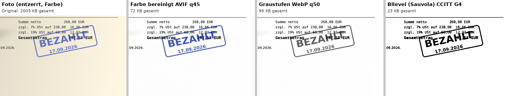
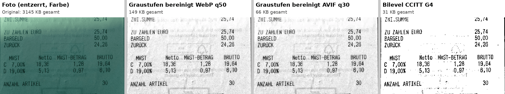
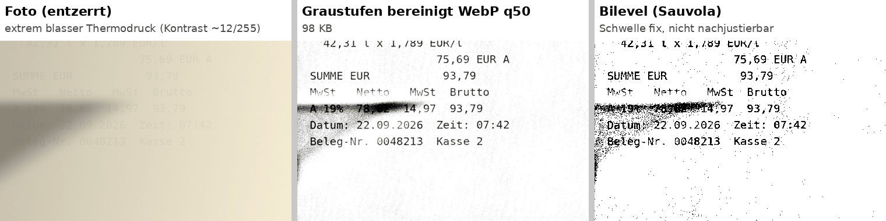
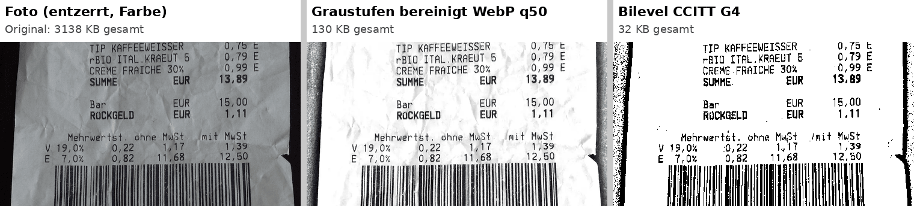

# Belegspeicherung: Kompression vs. Lesbarkeit (Experiment)

> **Status:** Experiment + Empfehlung, noch keine ADR · **Stand:** 08.10.2026
> **Frage:** Welches Speicherformat für fotografierte Belege (Kassenbon, Hotelrechnung, Tankquittung) ist am kleinsten und bleibt dabei für Menschen und OCR voll lesbar und GoBD-konform?
> **Reproduzierbar:** Skripte unter `docs/research/beleg-kompression/scripts/` (Arbeitsverzeichnis `B=/workspace/beleg-exp` in `exp.py` anpassen; benötigt tesseract, cwebp, avifenc, cjxl, jbig2enc, img2pdf, ocrmypdf, opencv-python, scikit-image), Rohdaten in `docs/research/beleg-kompression/ergebnisse.json`. Testbilder liegen nicht im Repo (Lizenzen/Größe), siehe Quellen unten.

## M4, 09.10.2026

Die Pipeline `2026.1` ist eingebaut (Normalisierung, Farb-AVIF, WebP-Vorschau, JPEG-Export). ADR 0005 bleibt **proposed**: die 15–20 echten Belege des Betreibers (O7) liegen nicht vor, die Ø 50–85 KB aus diesem Experiment sind deshalb nicht neu gemessen. Encoder bleiben per Umgebung einstellbar (`BELEG_AVIF_QUALITY`, `BELEG_AVIF_SPEED`, `BELEG_WEBP_QUALITY`, `BELEG_JPEG_QUALITY`, `BELEG_FORMAT`). Sobald ein Ordner mit Fotos da ist:

```
go run ./scripts/beleg-benchmark pfad/zu/fotos
```

## TL;DR

1. **Der größte Hebel ist nicht der Codec, sondern die Dokument-Aufbereitung:** Entzerren und Zuschneiden, auf 300 dpi-Äquivalent skalieren und den Hintergrund normalisieren (Schatten und Papierfarbe raus). Damit werden Belege ~25–50× kleiner als das Kamerabild, und die OCR wird **besser** (Schlüsselfelder 56 → 75–81 von 97; ein verblasster Thermobon 1/8 → 8/8).
2. **Farbe kostet nach der Normalisierung fast nichts** (Farbe AVIF q30 Ø 52 KB = Grau AVIF q30 Ø 52 KB; Farbe WebP q50 99 KB vs. Grau 96 KB). Damit entfällt die heikle Frage, ob Farbe bei einem Beleg Bedeutung hat: **immer in Farbe archivieren.**
3. **Bilevel (Schwarz-Weiß) ist am kleinsten (JBIG2 Ø 15 KB, CCITT G4 Ø 20 KB), aber als einziges Archivformat zu riskant:** Ein Stempel über dem Gesamtbetrag macht den Betrag unlesbar, und sehr blasser Thermodruck verliert Ziffern. Beides lässt sich nicht nachträglich korrigieren. Bilevel taugt nur als Ableitung für einen kompakten PDF-Export.
4. **Empfehlung:** Archiv-Master = **entzerrt, 300 dpi-Äquivalent, Hintergrund normalisiert, Farbe, AVIF (q≈35–45)**, **Ø ≈ 50–85 KB pro Beleg**, mit SHA-256 und unveränderlich. Dazu ein Vorschaubild (WebP 320 px, ~6 KB), der **verifizierte OCR-Text separat** (< 5 KB), und für den PDF-Export eine **JPEG-Ableitung** (Typst bettet JPEG 1:1 ein, AVIF gar nicht, WebP nur verlustfrei neu kodiert und damit 16× größer).
5. Gegenüber der bisherigen Spec (Q19: 2500 px, JPEG q85, Ø 383 KB) spart das **Faktor 5–7**, bei besserer OCR.

## 1. Rahmen: Was GoBD / RESISCAN verlangen (für dieses Thema)

| Anforderung | Quelle | Konsequenz für die App |
|---|---|---|
| Bildliches Erfassen per Smartphone ist zulässig, auch im Ausland; Verfahren muss in einer **Verfahrensdokumentation** beschrieben sein | GoBD Rz. 130, 136 ff. ([DATEV zur Neufassung](https://www.datev.de/web/de/aktuelles/gesetzliche-themen/gobd/neufassung-der-gobd-zum-28-11-2019/), [FGS](https://www.fgs.de/news-and-insights/blog/detail/gobd-2020-was-aendert-sich-fuer-die-praxis)) | Die Pipeline (Entzerren, Skalieren, Normalisieren, Codec) wird fest definiert und versioniert. Die Version kommt in die Metadaten jedes Belegs. |
| Ergebnis muss bei Lesbarmachung **bildlich und inhaltlich** mit dem Original übereinstimmen; Farbe nötig, wenn sie **Beweisfunktion** hat (z. B. rote Minusbeträge, Stempel) | GoBD Rz. 136; [BSI TR-03138 Anwendungshinweis F, 4.3](https://www.bsi.bund.de/SharedDocs/Downloads/DE/BSI/Publikationen/TechnischeRichtlinien/TR03138/TR-03138-Anwendungshinweis-F.pdf?__blob=publicationFile&v=5) | Farbe immer behalten, weil das praktisch nichts kostet (siehe 3.2). |
| Keine pauschale dpi-Vorgabe; Auflösung muss „zur Dokumentcharakteristik geeignet“ sein, Profile je Dokumenttyp definieren und testen. Das generische Scankonzept nennt **300 dpi, 24 bit Farbe** als Grundeinstellung | [TR-03138 Hauptdokument](https://www.bsi.bund.de/SharedDocs/Downloads/DE/BSI/Publikationen/TechnischeRichtlinien/TR03138/TR-03138.pdf?__blob=publicationFile&v=5), [Generisches Scankonzept](https://www.bsi.bund.de/SharedDocs/Downloads/DE/BSI/Publikationen/TechnischeRichtlinien/TR03138/TR-03138-generisches_Scankonzept.pdf?__blob=publicationFile&v=2) | Zwei Profile: **Bon** (Breite 80 mm) und **A4/Rechnung** (Breite 210 mm), beide 300 dpi-Äquivalent. |
| Nachbearbeitung (Kontrast, Helligkeit, Farbreduktion, Beschneiden, Rauschunterdrückung) nur **zur Erhöhung der Lesbarkeit**, sorgfältig und **protokolliert** | [TR-03138 Anlage P, A.NB.1](https://www.bsi.bund.de/SharedDocs/Downloads/DE/BSI/Publikationen/TechnischeRichtlinien/TR03138/TR-03138-Anlage-P_V1_4.pdf?__blob=publicationFile&v=4) | Normalisierung ist zulässig. Eckpunkte, Pipeline-Version und Parameter werden im Audit-Log gespeichert. |
| **Sichtkontrolle** bzw. Qualitätssicherung der Scanprodukte | TR-03138 (QS), GoBD Rz. 136 | Der Nutzer bestätigt die Vorschau des **Master**, nicht des Rohfotos, bevor gespeichert wird. |
| OCR-Ergebnisse sind **nach Verifikation und Korrektur ebenfalls aufzubewahren** | GoBD Rz. 131 i. d. F. der 2. Änderung, [BMF 14.07.2025](https://rsw.beck.de/docs/librariesprovider112/default-document-library/8_steu_bmf_2025-07-14-gobd-2-aenderung.pdf) | Den bestätigten OCR-Text bzw. die bestätigten Felder versioniert mit dem Beleg speichern. |
| Konvertierung in ein anderes Format ist zulässig, wenn **maschinelle Auswertbarkeit** erhalten bleibt und das Verfahren dokumentiert ist; dann muss das Ausgangsformat nicht zusätzlich aufbewahrt werden | GoBD Rz. 135 ([DATEV](https://www.datev.de/web/de/aktuelles/gesetzliche-themen/gobd/neufassung-der-gobd-zum-28-11-2019/)) | Das rohe Kamerabild muss nicht dauerhaft aufbewahrt werden, wenn der Master den Inhalt verlustfrei lesbar wiedergibt. |
| Elektronisch **empfangene** Belege (PDF, XML/E-Rechnung) im Empfangsformat aufbewahren | GoBD Rz. 131 n. F. | PDFs und XML **nie** durch die Bildpipeline schicken (wie in Q19 bereits festgelegt). |

*Kein Steuerrat. Die Verfahrensdokumentation muss die konkrete Pipeline beschreiben.*

## 2. Versuchsaufbau

**Testbelege (14):** 12 echte, 2 synthetische.

| # | Datei | Art | Quelle / Lizenz |
|---|---|---|---|
| 01 | Tankquittung HIT Rheinbach (2020) | Scan, Thermo, TSE-QR | [Commons](https://commons.wikimedia.org/wiki/File:Tankquittung_HIT-Tankstelle_Rheinbach_mit_Abschnitt_Technische_Sicherheitseinrichtung,_2020.jpg), gemeinfrei |
| 02 | Lidl Aurich (2019) | Handyfoto, dunkler Untergrund | [Commons](https://commons.wikimedia.org/wiki/File:Lidl_Emsstra%C3%9Fe_receipt,_Aurich_(2019)_01.jpg), CC BY-SA 4.0, Donald Trung |
| 03 | ALDI Hesel (2019) | Handyfoto, harter Schatten, Grünstich, Untergrund kaum vom Papier unterscheidbar | [Commons](https://commons.wikimedia.org/wiki/File:ALDI_Hesel_receipt,_Hesel_(2019)_01.jpg), CC BY-SA 4.0, Donald Trung |
| 04 | Central Café Agia Napa (2025) | Scan, sehr hoch aufgelöst (3705×7483) | [Commons](https://commons.wikimedia.org/wiki/File:Agia_Napa_Rechnung_Central_Cafe_2025-09-08.jpg), gemeinfrei |
| 05 | Biedronka (PL, 2020) | Foto, mehrere USt-Sätze | [Commons](https://commons.wikimedia.org/wiki/File:Polish_supermarket_receipt.jpg), CC BY-SA 4.0, Hippietrail |
| 06 | Berghotel Grosse Scheidegg (CH, 2007) | Handyfoto auf Holz, CHF + EUR | [Commons](https://commons.wikimedia.org/wiki/File:ReceiptSwiss.jpg), CC BY-SA 3.0, Audrius Meskauskas |
| 08 | E-Center/EDEKA (2007) | Scan, Knick, Durchschlag der Rückseite | [Commons](https://commons.wikimedia.org/wiki/File:Kassenbon.jpg), gemeinfrei |
| 09 | Fressnapf Köln (2020) | sauberer Scan, TSE-Daten | [Commons](https://commons.wikimedia.org/wiki/File:Kassenzettel_Fressnapf_mit_ausgewiesener_MwSt-Senkung_und_TSE_Transaktionsnummer_12_2020.png), gemeinfrei |
| 12 | real Emden (2019) | Handyfoto, stark zerknittert | [Commons](https://commons.wikimedia.org/wiki/File:Real_receipt,_Oude_Pekela_(2019)_01.jpg), CC BY-SA 4.0, Donald Trung |
| 13–15 | CORD v2, Test-Split Nr. 5, 14, 27 | Handyfotos (in der Hand gehalten, violetter Druck, Schräglage), Händlerdaten verpixelt | [naver-clova-ix/cord-v2](https://huggingface.co/datasets/naver-clova-ix/cord-v2), CC BY 4.0 |
| 16 | Hotelrechnung A4 (synthetisch) | 300-dpi-Rendering → simuliertes Handyfoto (Perspektive, Schattenkante, Lichtverlauf, Warmstich, Unschärfe, Rauschen, JPEG q92); **blauer „BEZAHLT“-Stempel überlappt den Gesamtbetrag**; 7 % und 19 % USt; graue 7-pt-Fußzeile | eigene Erzeugung (`scripts/synth.py`), exakte Ground Truth |
| 17 | Tankquittung Thermo (synthetisch) | nach unten zunehmend verblasster Thermodruck, Schatten | eigene Erzeugung, exakte Ground Truth |

Echte deutsche **Hotel-A4-Rechnungen** mit freier Lizenz gibt es kaum, daher der synthetische Beleg 16. Echte Bewirtungsbelege mit Unterschrift fehlen ebenfalls.

**Messgrößen**

* **Dateigröße** je Variante.
* **Schlüsselfeld-Trefferquote:** Je Beleg 3–10 manuell verifizierte Felder (Händler, Datum, Gesamtbetrag, USt-Sätze und -Beträge, Netto, Steuernummer/USt-IdNr.), insgesamt **97**. Gezählt wird, ob das Feld exakt (ohne Leerzeichen) im Tesseract-Text vorkommt. Das ist streng: `14.84` statt `14,84` gilt als Fehler.
* **CER** (Zeichenfehlerrate, Levenshtein) gegen die exakte Ground Truth, nur für die synthetischen Belege 16 und 17.
* OCR: **Tesseract 5.5.0**, `-l deu+eng --psm 4`, Debian-`tessdata` (= tessdata_fast). Die absoluten Werte sind bei Kassenbons mäßig; aussagekräftig ist der **Vergleich** der Varianten. Rauschen: ±3–5 Treffer zwischen benachbarten Qualitätsstufen ist Zufall (Tesseract reagiert nicht monoton).

**Pipeline-Varianten** (`scripts/exp.py`)

* **a)** Original unverändert
* **b)** längste Kante 2500 px, Farbe, JPEG q85 (= bisherige Spec Q19)
* **c)** wie b), Graustufen JPEG q78
* **d)** Dokument-Aufbereitung:
  1. Papier-Ecken erkennen (OpenCV: Helligkeit minus Sättigung → Otsu → größte Kontur → Viereck), perspektivisch entzerren. Ohne erkennbare Papierkante (Scans) auf die Textbox zuschneiden.
  2. Auf **300 dpi-Äquivalent** skalieren: Bon = 945 px Breite (80 mm), A4 = 2480 px Breite. Profil nach Seitenverhältnis > 1,6 oder manuell.
  3. Hintergrund normalisieren: Papierhintergrund per morphologischem Closing schätzen (Kernel ≈ 1/25 Bildbreite, Blur) → Bild ÷ Hintergrund → Kontrast strecken. Für Farbe pro Kanal.
  4. Kodieren als JPEG, WebP, AVIF, JPEG XL in mehreren Qualitätsstufen.
* **e)** Bilevel: Sauvola-Schwellwert (Fenster ≈ 1/30 Breite, k = 0,2) auf d) → PNG 1 bit, TIFF CCITT G4, PDF mit CCITT G4 (img2pdf), PDF mit **verlustfreiem** JBIG2 (jbig2enc generic region, kein Symbol-Matching).
* **f)** durchsuchbares PDF: Graustufen-JPEG + Tesseract-Textlayer bzw. Bilevel + `ocrmypdf --optimize 2`.

Zusätzlich: d) bei 200/300/400 dpi; Verblassungsreihe (Druckkontrast 88 → 12 Graustufen); Einbettungstest in **Typst 0.15.1**.

## 3. Ergebnisse

### 3.1 Übersicht über alle 14 Belege

| Variante | Median KB | Ø KB | Faktor ggü. Original (Ø) | Schlüsselfelder erkannt (von 97) | CER Hotel-A4 (synth.) | CER Thermo verblasst (synth.) |
|---|---:|---:|---:|---:|---:|---:|
| a) Original (Kamera/Scan, unverändert) | 1881 | 2476 | 1/1 | 56 | 11.7 % | 70.8 % |
| b) 2500 px, Farbe, JPEG q85 (bisherige Spec Q19) | 378 | 383 | 1/6 | 67 | 31.4 % | 57.2 % |
| c) 2500 px, Graustufen, JPEG q78 | 292 | 283 | 1/9 | 66 | 21.6 % | 55.3 % |
| d0) entzerrt+300 dpi, Farbe roh, JPEG q85 | 271 | 289 | 1/9 | 67 | – | – |
| d0) entzerrt+300 dpi, Farbe roh, JPEG q75 | 190 | 207 | 1/12 | 67 | – | – |
| d) bereinigt Grau JPEG q75 | 254 | 224 | 1/11 | 75 | 12.1 % | 0.7 % |
| d) bereinigt Grau JPEG q60 | 189 | 169 | 1/15 | 77 | 11.9 % | 0.5 % |
| d) bereinigt Grau WebP q75 | 126 | 125 | 1/20 | 74 | 12.0 % | 0.5 % |
| d) bereinigt Grau WebP q50 | 94 | 96 | 1/26 | 81 | 13.9 % | 0.5 % |
| d) bereinigt Grau WebP q30 | 70 | 73 | 1/34 | 77 | 11.9 % | 0.7 % |
| d) bereinigt Grau AVIF q60 | 126 | 131 | 1/19 | 73 | 12.1 % | 0.7 % |
| d) bereinigt Grau AVIF q45 | 74 | 83 | 1/30 | 77 | 11.9 % | 0.5 % |
| d) bereinigt Grau AVIF q30 | 46 | 52 | 1/48 | 76 | 14.1 % | 0.7 % |
| d) bereinigt Grau JPEG XL q70 | 145 | 135 | 1/18 | 76 | 12.1 % | 0.5 % |
| d) bereinigt **Farbe** JPEG q70 | 237 | 212 | 1/12 | 75 | 12.0 % | 0.7 % |
| d) bereinigt **Farbe** WebP q60 | 112 | 110 | 1/23 | 77 | 11.9 % | 0.7 % |
| d) bereinigt **Farbe** WebP q50 | 99 | 99 | 1/25 | 76 | – | – |
| d) bereinigt **Farbe** AVIF q45 | 75 | 83 | 1/30 | 75 | 12.0 % | 0.7 % |
| d) bereinigt **Farbe** AVIF q30 | 47 | 52 | 1/47 | 74 | – | – |
| e) Bilevel (Sauvola) PNG 1 bit | 26 | 28 | 1/89 | 75 | 17.4 % | 0.2 % |
| e) Bilevel TIFF CCITT G4 | 19 | 20 | 1/122 | 75 | 17.4 % | 0.2 % |
| e) Bilevel PDF (CCITT G4, img2pdf) | 21 | 21 | 1/115 | 75 | 17.4 % | 0.2 % |
| e) Bilevel PDF (JBIG2 verlustfrei, generic) | 14 | 15 | 1/160 | 75 | 17.4 % | 0.2 % |
| f) durchsuchbares PDF, Grau JPEG q60 + Textlayer | 197 | 181 | 1/14 | 73 | 11.9 % | 0.5 % |
| f) durchsuchbares PDF, Bilevel JBIG2 + Textlayer (ocrmypdf -O2) | 19 | 20 | 1/121 | 75 | 17.4 % | 0.2 % |
| Vorschaubild WebP 320 px | 5.9 | 6.7 | – | – | – | – |
| OCR-Text (UTF-8, nur Text) | 0.5 | 0.6 | – | – | – | – |

*„Faktor“ = Ø-Größe Original ÷ Ø-Größe Variante. Die CER beim Hotelbeleg liegt bei allen Varianten bei ≥ 12 %, weil Tabellenlinien und der Stempel als Zeichen gelesen werden. Entscheidend ist dort der Abstand zwischen den Varianten.*

### 3.2 Je Beleg (Größe · Schlüsselfelder)

| Beleg | Original | Bereinigt (px) | Orig. | b JPEG85 | d Grau WebP50 | d Farbe AVIF30 | d Farbe AVIF45 | e G4 |
|---|---|---|---|---|---|---|---|---|
| 01_tankquittung_hit | 1856x5808 | 945x2824 (nocrop) | 3414 KB · 7/7 | 346 KB · 7/7 | 188 KB · 7/7 | 120 KB · 7/7 | 176 KB · 6/7 | 40 KB · 7/7 |
| 02_lidl_aurich | 2736x4864 | 945x1971 (crop) | 3292 KB · 1/8 | 434 KB · 4/8 | 94 KB · 5/8 | 45 KB · 4/8 | 79 KB · 5/8 | 18 KB · 6/8 |
| 03_aldi_hesel | 2736x4864 | 945x2664 (crop-manuell) | 3145 KB · 1/9 | 404 KB · 1/9 | 149 KB · 6/9 | 67 KB · 5/9 | 125 KB · 3/9 | 31 KB · 6/9 |
| 04_cafe_agianapa | 3705x7483 | 945x2470 (nocrop) | 11733 KB · 2/5 | 503 KB · 5/5 | 108 KB · 3/5 | 55 KB · 2/5 | 93 KB · 3/5 | 21 KB · 3/5 |
| 05_supermarkt_pl | 2856x3879 | 945x1285 (nocrop) | 1531 KB · 5/6 | 400 KB · 5/6 | 70 KB · 6/6 | 42 KB · 6/6 | 64 KB · 6/6 | 15 KB · 5/6 |
| 06_receipt_ch | 2448x3264 | 945x1544 (crop) | 940 KB · 3/7 | 725 KB · 4/7 | 44 KB · 7/7 | 26 KB · 6/7 | 40 KB · 7/7 | 10 KB · 6/7 |
| 08_kassenbon | 952x2097 | 926x1938 (nocrop) | 911 KB · 7/9 | 474 KB · 7/9 | 167 KB · 9/9 | 99 KB · 8/9 | 150 KB · 8/9 | 35 KB · 7/9 |
| 09_fressnapf | 1804x5016 | 945x2664 (nocrop) | 1817 KB · 7/7 | 328 KB · 7/7 | 150 KB · 7/7 | 93 KB · 7/7 | 136 KB · 7/7 | 32 KB · 7/7 |
| 12_real_oudepekela | 2736x4864 | 945x1727 (crop) | 3138 KB · 3/9 | 405 KB · 6/9 | 130 KB · 5/9 | 66 KB · 4/9 | 115 KB · 4/9 | 32 KB · 4/9 |
| 13_cord_c05 | 2304x4096 | 1650x1826 (crop) | 492 KB · 4/4 | 357 KB · 4/4 | 31 KB · 4/4 | 14 KB · 4/4 | 23 KB · 4/4 | 5 KB · 4/4 |
| 14_cord_c14 | 1836x3264 | 945x1747 (crop) | 234 KB · 3/5 | 269 KB · 3/5 | 58 KB · 3/5 | 26 KB · 2/5 | 48 KB · 3/5 | 10 KB · 3/5 |
| 15_cord_c27 | 864x1296 | 861x1294 (crop) | 73 KB · 3/3 | 77 KB · 3/3 | 26 KB · 3/3 | 13 KB · 3/3 | 21 KB · 3/3 | 4 KB · 3/3 |
| 16_hotel_a4_synth | 3000x4000 | 2480x3379 (crop) | 2005 KB · 9/10 | 343 KB · 9/10 | 95 KB · 8/10 | 49 KB · 8/10 | 72 KB · 8/10 | 23 KB · 6/10 |
| 17_tank_thermo_faded_synth | 3000x4000 | 945x1580 (crop) | 1945 KB · 1/8 | 301 KB · 2/8 | 32 KB · 8/8 | 18 KB · 8/8 | 27 KB · 8/8 | 8 KB · 8/8 |

`crop-manuell` beim ALDI-Bon: Die automatische Kantenerkennung ist gescheitert, weil hellgrüner Untergrund und Papier mit Grünstich fast gleich aussehen. Im Test wurden die Ecken von Hand gesetzt, was dem Nachziehen der Ecken im UI entspricht. Bei CORD Nr. 5 (Beleg in der Hand) ist der Zuschnitt zu groß geraten (Hand im Bild), aber unkritisch. **Folge: Die UI muss die erkannten Ecken immer zur Korrektur anbieten.**

### 3.3 Auflösung

| Auflösung (Bon 80 mm / A4 210 mm Breite) | Grau WebP q50 Ø KB | Schlüsselfelder | Grau AVIF q30 Ø KB | Schlüsselfelder | Bilevel G4 Ø KB | Schlüsselfelder |
|---|---:|---:|---:|---:|---:|---:|
| 200 dpi | 56 | 76 | 32 | 75 | 12 | 78 |
| 300 dpi | 96 | 81 | 52 | 76 | 20 | 75 |
| 400 dpi | 133 | 76 | 69 | 70 | 26 | 79 |

Bei Kassenbons sind 200 dpi für die OCR erstaunlich ausreichend, da Thermodrucker selbst nur ~203 dpi drucken. Bei 400 dpi wird es nicht besser. **300 dpi** bleibt die Empfehlung: Das ist die Referenz in TR-03138 und gibt Reserve für kleine Schrift auf A4 (7-pt-Fußzeilen, Bankdaten) und für die menschliche Prüfung.

### 3.4 Verblassender Thermodruck (synthetisch, 13 Zeilen, 8 Schlüsselfelder)

| Druckkontrast (Papier 238, Tinte x) | Original-Foto | Grau bereinigt WebP q50 | Bilevel |
|---|---:|---:|---:|
| 88 (Tinte 150) | 1/8 | 8/8 | 8/8 |
| 58 (Tinte 180) | 0/8 | 8/8 | 8/8 |
| 38 (Tinte 200) | 0/8 | 8/8 | 7/8 |
| 26 (Tinte 212) | 0/8 | 6/8 | 7/8 |
| 18 (Tinte 220) | 0/8 | 6/8 | 4/8 |
| 12 (Tinte 226) | 0/8 | 4/8 | 3/8 |


Bilevel hält erstaunlich lange mit, solange vorher normalisiert wird, und verliert erst bei extrem blassem Druck mehr als Graustufen. Der eigentliche Unterschied: Graustufen lassen sich **später nachschärfen** (Kontrast, anderer Schwellwert, besseres OCR-Modell), Bilevel nicht. Ohne Normalisierung scheitert die OCR schon am Original-Foto.

### 3.5 Typst-Einbettung (PDF-Export), Hotelrechnung A4

| Eingabe | Datei | im PDF | Wie eingebettet |
|---|---:|---:|---|
| JPEG Farbe q70 | 368 KB | 371 KB | **1:1 durchgereicht** (DCT) |
| JPEG Grau q60 | 300 KB | 303 KB | 1:1 |
| WebP Farbe q50 | 105 KB | **1 688 KB** | dekodiert und **verlustfrei** (Flate, 8 bit RGB) neu kodiert |
| WebP Grau q50 | 97 KB | 1 228 KB | wie oben |
| AVIF Farbe q30 | 50 KB | – | **nicht unterstützt** („unknown image format“) |
| PNG 1 bit | 41 KB | 69 KB | als 8-bit-Grau Flate |
| PDF mit JBIG2 (als Bild eingebunden) | 17 KB | **20 KB** | **1:1 durchgereicht** (JBIG2) |
| PDF mit CCITT G4 | 25 KB | 27 KB | 1:1 (CCITT) |

Für den PDF-Export also **JPEG** (Farbe/Grau) oder ein **Ein-Seiten-PDF mit JBIG2/CCITT** als Bild einbinden, nie WebP oder AVIF direkt.

### 3.6 Beispielausschnitte

* **Stempel über dem Betrag:** `beleg-kompression/vergleich-stempel-hotelrechnung.png`. In Farbe ist „297,58 EUR“ unter dem blauen Stempel klar lesbar, in Graustufen schwerer, **in Bilevel praktisch nicht mehr**. OCR: Bilevel 6/10 statt 8/10 Feldern, zusätzlich fehlen der 7-%-USt-Betrag und die Bemessungsgrundlage. Den Gesamtbetrag unter dem Stempel findet Tesseract in **keiner** Variante, für Menschen ist er nur in Farbe eindeutig lesbar.
  
* **Schatten und Farbstich (ALDI):** `beleg-kompression/vergleich-schatten-aldi.png`. Nach der Normalisierung sind alle Varianten lesbar, AVIF q30 hat 66 KB statt 3,1 MB.
  
* **Extrem blasser Thermodruck:** `beleg-kompression/vergleich-verblasster-thermobon.png`. In Graustufen bleibt „78,82“ lesbar, Bilevel verliert es im Schattenbereich.
  
* **Zerknittert (real):** `beleg-kompression/vergleich-zerknittert-real.png`
  

## 4. Bewertung

**Bilevel als einzige Archivfassung: nein.**
* Der Gewinn ist real: JBIG2 Ø 15 KB, also ~3–5× kleiner als AVIF.
* Aber farbige Stempel und handschriftliche Vermerke über dem Text verschmelzen mit dem Druck. Das ist der GoBD-Fall „Farbe mit Beweisfunktion“, und gerade der Gesamtbetrag ist betroffen.
* Blasser Thermodruck, Bleistift und Kugelschreiber an der Schwelle gehen **irreversibel** verloren. Graustufen und Farbe lassen sich dagegen später neu auswerten.
* Die Schwelle wirkt global gleich. Ein schlechter Parameter für einen Belegtyp merkt man erst, wenn die Prüfung danach fragt.
* JBIG2 **nur verlustfrei** (generic region). Symbol-Matching bzw. „lossy JBIG2“ (z. B. `jbig2 -s`) kann Ziffern vertauschen, wie im Xerox-Fall 2013, bei dem 6 und 8 verwechselt wurden. Für Beträge ist das ein Ausschlusskriterium.

**Graustufen vs. Farbe:** Nach der Normalisierung ist der Unterschied ≤ 5 %. Der Gewinn durch Graustufen rechtfertigt nicht die Pflicht, je Beleg zu entscheiden, ob Farbe wichtig ist. → **Farbe.**

**Codec für den Master**

| | AVIF | WebP | JPEG | JPEG XL |
|---|---|---|---|---|
| Ø Größe (bereinigt, Farbe, OCR-gleichwertig) | **52 KB (q30) / 83 KB (q45)** | 99–110 KB (q50–60) | 212 KB (q70) | 135 KB (q70, Grau) |
| Anzeige im Browser | alle aktuellen | alle | alle | nur Safari |
| Encode im Browser | nur per WASM (`@jsquash/avif`, ~2,5 MB) | Chrome/Firefox nativ, **Safari/iOS nicht** (fällt still auf PNG zurück), sonst WASM (~0,9 MB) | überall nativ | nur WASM |
| Encode in Go ohne CGo | [`gen2brain/avif`](https://github.com/gen2brain/avif) (libavif/aom als WASM via wazero) | [`gen2brain/webp`](https://github.com/gen2brain/webp) (libwebp nach Go transpiliert) | Standardbibliothek | – |
| Typst-PDF | ✗ | ✗ (16× aufgebläht) | ✓ 1:1 | ✗ |
| Langzeit / PDF/A | jung, aber ISO-basiert, breit unterstützt | etabliert | Referenz | unklar |

→ **AVIF q≈35–45** als Master bietet bestes Verhältnis aus Größe und Lesbarkeit (visuell auch bei q30 ohne störende Artefakte, siehe Ausschnitte). Für den PDF-Export wird ohnehin eine JPEG-Ableitung gebraucht. **Fallback**, falls der AVIF-Encoder in Go zu langsam oder instabil ist: **WebP q50–60** (~100 KB). Konservativste Alternative: **JPEG q70** (~210 KB), dann ohne jede Konvertierung beim Export.

## 5. Empfohlene Pipeline

```
Kamera/Datei ─► [Client] Ecken erkennen ─► Nutzer korrigiert Ecken ─► Entzerren + 300-dpi-Skalierung
             ─► Upload "Erfassung" (JPEG q90, Farbe, ~0,3–0,5 MB statt 3–12 MB)
             ─► [Server] Hintergrund-Normalisierung (Farbe) ─► MASTER (AVIF q40, ~50–85 KB, SHA-256, unveränderlich)
             ─► [Client] Sichtkontrolle des Masters ─► Bestätigen (sonst: neu aufnehmen / Ecken korrigieren)
             ─► Ableitungen: Vorschau WebP 320 px (~6 KB), OCR-Text/Felder (<5 KB, nach Bestätigung versioniert)
             ─► beim Festschreiben der Abrechnung: Export-Ableitung JPEG q70 Farbe (~200 KB) bzw. optional Kompakt-Bilevel (JBIG2/CCITT ~15–25 KB)
PDF / XML / E-Rechnung: unverändert speichern (Empfangsformat), nur Vorschaubild erzeugen.
```

**Was ist das Archivoriginal?** Der **Master** (bereinigtes Farbbild). Das Erfassungs-JPEG wird nach der Bestätigung verworfen, optional erst nach einer Karenzzeit von z. B. 30 Tagen für den Fall „Normalisierung hat etwas verschluckt“. Das rohe Kamerabild verlässt das Handy nie. In den Belegmetadaten stehen Pipeline-Version, Eckpunkte, Profil (Bon/A4), Codec und Qualität, SHA-256 von Erfassung und Master, Zeitpunkt und Nutzer der Bestätigung. Das gehört in die Verfahrensdokumentation.

**Speicher pro Beleg:** Master Ø ≈ 50–85 KB, Vorschau ≈ 6 KB, OCR ≈ 1–5 KB, also **≈ 60–95 KB dauerhaft**, plus einmalig ~200 KB je Beleg im festgeschriebenen Export-PDF (bzw. ~20 KB bei Kompakt-Bilevel). Beispiel: 500 Belege/Jahr × 10 Jahre ≈ 0,4 GB Master + Export-PDFs. Zum Vergleich: Rohfotos ≈ 12 GB, Spec Q19 ≈ 1,9 GB.

### 5.1 Was läuft wo?

| Schritt | Browser (PWA) | Server (Go, distroless, CGo-frei) |
|---|---|---|
| Kamera, Datei-Auswahl | `<input capture>` / `getUserMedia` | – |
| Kantenerkennung | Eigene leichte Implementierung (Canvas verkleinern, Helligkeit−Sättigung, Schwellwert, größte Kontur; einige KB JS) **oder** `jscanify` + OpenCV.js (**~8,6 MB WASM**, nur lazy laden und per Service Worker cachen). In beiden Fällen manuelle Eckenkorrektur. | (optional serverseitige Nachprüfung) |
| Perspektivische Entzerrung + Skalierung | 2D-Canvas kann nur affin transformieren. Daher WebGL-Shader oder Pixel-Loop im Web Worker (2–3 MP in ~100–300 ms) | pure Go möglich (bilineare Projektivabbildung) |
| Hintergrund-Normalisierung | möglich (Hintergrund auf ⅛ verkleinert per Max-Filter + Blur schätzen, dann dividieren) | **empfohlen hier**: deterministisch, versioniert, testbar; pure Go mit `image` + `golang.org/x/image/draw` |
| Sauvola/Bilevel (nur Export-Ableitung) | möglich | pure Go per Integralbild (einfach). Ein **CCITT-G4-Encoder** existiert in Go nicht (`x/image/ccitt` kann nur dekodieren), ebenso kein JBIG2-Encoder. Alternativen: 1-bit-PNG/Flate-PDF (~40–70 KB/A4) oder `jbig2enc` als Binary, was distroless erschwert |
| Codec | JPEG nativ. WebP nicht auf iOS, AVIF nur per WASM | AVIF/WebP via `gen2brain/*` (CGo-frei), JPEG Standardbibliothek |
| OCR | **tesseract.js v6**: Core-WASM 2,7–3,3 MB + `deu` ~1,5–2 MB, lazy und gecacht. Native Tesseract braucht hier ~1 s je bereinigtem Bon (1 Thread), auf dem Handy grob 2–5 s (Schätzung, nicht gemessen) | Tesseract/Leptonica sind C-Bibliotheken (`gosseract` braucht CGo). Das passt **nicht** in ein statisches distroless-Image, es bräuchte einen separaten OCR-Sidecar. Alternative: der ohnehin geplante, **OpenAI-kompatible KI-Endpunkt** (Q6) liefert Felder und Volltext |

**Empfehlung OCR:** Primär der KI-Endpunkt (Q6) für die Felder, sofern konfiguriert. Optional tesseract.js im Client für Volltext/Suche, ohne Server-Abhängigkeit. Gespeichert wird immer der **vom Nutzer bestätigte** Text bzw. die bestätigten Felder (GoBD Rz. 131 n. F.). Den Textlayer im Export-PDF erzeugt Typst aus diesem Text, nicht neu per OCR.

## 6. Offene Punkte / Grenzen des Experiments

* Nur 14 Belege, nur 1 A4-Beleg (synthetisch). Ein Praxistest mit ~20 eigenen Belegen (Hotel, Bewirtung mit Unterschrift, Tankquittung, Parkschein) vor der finalen ADR wäre sinnvoll.
* Die automatische Kantenerkennung ist das schwächste Glied (ALDI, Beleg in der Hand). Im Browser mit realen Fotos testen, ggf. doch OpenCV.js lazy laden.
* Die Hintergrund-Normalisierung erzeugt an **harten** Schattenkanten einen dunklen Streifen (sichtbar im Thermo-Beispiel). Ein adaptiver Kernel oder ein zweistufiger Hintergrund würde helfen.
* Die Rückseite (AGB, Unterschrift bei Bewirtung) muss als zweite Seite desselben Belegs erfassbar sein.
* Encode-Zeit und Speicherbedarf von `gen2brain/avif` (WASM) im Container sind nicht gemessen. Erwartet werden < 1–2 s pro Bon, also unkritisch, weil asynchron.
* Tesseract mit `tessdata_best` oder einem Kassenbon-Modell würde absolut besser abschneiden. An der Rangfolge der Varianten sollte das nichts ändern.
